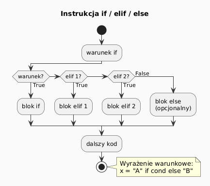
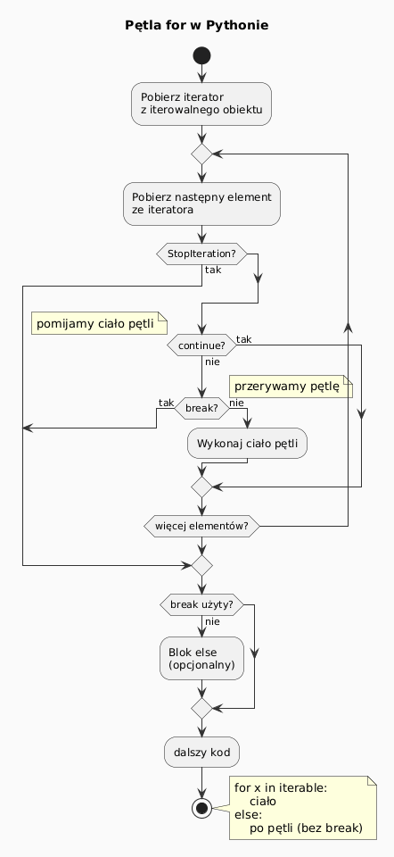
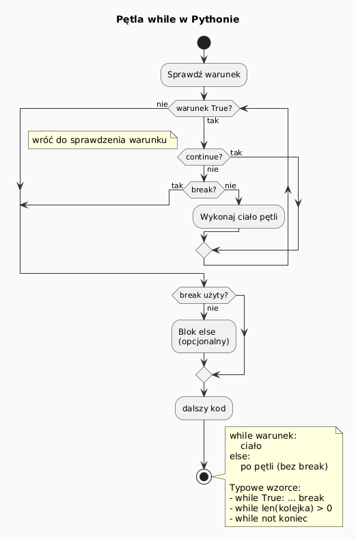
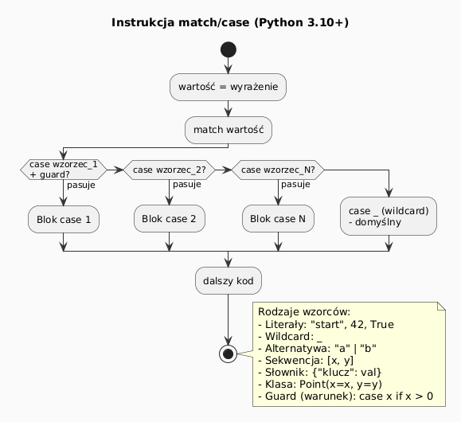

# Instrukcje sterujące w Pythonie 3

> **Cel:** Poznanie podstawowych instrukcji sterujących przepływem programu: warunków, pętli, dopasowania wzorców i wyrażeń listowych.

---

## Instrukcja warunkowa – `if / elif / else`

```python
x = 42

if x > 0:
    print("Dodatnia")
elif x == 0:
    print("Zero")
else:
    print("Ujemna")
```

Python używa **wcięć** (4 spacje) zamiast nawiasów klamrowych – to część składni.

Wyrażenie warunkowe (ternary / conditional expression):

```python
status = "dorosły" if wiek >= 18 else "niepełnoletni"
```



---

## Wartości logiczne i operatory

**Operatory porównania:** `==`, `!=`, `<`, `>`, `<=`, `>=`, `is`, `is not`, `in`, `not in`

**Operatory logiczne:** `and`, `or`, `not`

```python
# Łączenie warunków
x = 5
if 0 < x < 10:           # Python pozwala na łańcuchowanie!
    print("Jednocyfrowy")

# Wartości "falsy" – traktowane jako False
if not []:               # pusta lista
    print("Pusta lista!")
if not "" or not 0 or not None:
    print("Falsy values")
```

Wartości **falsy**: `False`, `0`, `0.0`, `""`, `[]`, `{}`, `set()`, `()`, `None`

---

## Pętla `for` – iteracja po sekwencji

```python
owoce = ["jabłko", "banan", "wiśnia"]

for owoc in owoce:
    print(owoc)
```

Z funkcją `range()`:

```python
for i in range(5):          # 0, 1, 2, 3, 4
    print(i)

for i in range(2, 10, 2):   # 2, 4, 6, 8
    print(i)
```

Z `enumerate()` – indeks i wartość:

```python
for i, owoc in enumerate(owoce, start=1):
    print(f"{i}. {owoc}")
```

Z `zip()` – iteracja po wielu sekwencjach równolegle:

```python
imiona = ["Ania", "Bartek"]
wieki  = [25, 30]
for imie, wiek in zip(imiona, wieki):
    print(f"{imie} ma {wiek} lat")
```



---

## Pętla `for` – `break`, `continue`, `else`

```python
for i in range(10):
    if i == 3:
        continue    # pomiń i=3
    if i == 7:
        break       # zatrzymaj pętlę przy i=7
    print(i)
else:
    # wykonuje się, jeśli pętla zakończyła się BEZ break
    print("Pętla zakończona normalnie")
```

> Blok `else` po pętli `for` wykonuje się tylko jeśli pętla **nie** została przerwana przez `break`.

---

## Pętla `while`

```python
licznik = 0
while licznik < 5:
    print(licznik)
    licznik += 1
```

Typowe wzorce:

```python
# Pętla nieskończona z break
while True:
    dane = input("Podaj liczbę (q=koniec): ")
    if dane == "q":
        break
    print(f"Podałeś: {dane}")
```



---

## `match / case` – dopasowanie wzorców (Python 3.10+)

Strukturalne dopasowanie wzorców – potężniejsze niż `switch/case` z C/Java.

```python
komenda = "wyjdź"

match komenda:
    case "start":
        print("Uruchamiam...")
    case "stop" | "wyjdź":
        print("Zatrzymuję.")
    case _:
        print(f"Nieznana komenda: {komenda}")
```

Dopasowanie struktury:

```python
punkt = (1, 0)

match punkt:
    case (0, 0):
        print("Środek układu")
    case (x, 0):
        print(f"Na osi X, x={x}")
    case (0, y):
        print(f"Na osi Y, y={y}")
    case (x, y):
        print(f"Punkt ({x}, {y})")
```



---

## List / Dict / Set Comprehensions

**List comprehension** – zwięzły sposób tworzenia list:

```python
kwadraty = [x ** 2 for x in range(1, 6)]
# [1, 4, 9, 16, 25]

parzyste = [x for x in range(20) if x % 2 == 0]
# [0, 2, 4, 6, 8, 10, 12, 14, 16, 18]

# Zagnieżdżone
macierz = [[i * j for j in range(1, 4)] for i in range(1, 4)]
```

**Dict comprehension:**

```python
kwadraty = {x: x ** 2 for x in range(1, 6)}
# {1: 1, 2: 4, 3: 9, 4: 16, 5: 25}
```

**Set comprehension:**

```python
podzielne_3 = {x for x in range(20) if x % 3 == 0}
# {0, 3, 6, 9, 12, 15, 18}
```

**Generator expression** (leniwa ewaluacja, oszczędność pamięci):

```python
suma = sum(x ** 2 for x in range(1_000_000))
```

---

## Obsługa wyjątków – `try / except`

```python
try:
    wynik = 10 / 0
except ZeroDivisionError:
    print("Dzielenie przez zero!")
except (TypeError, ValueError) as e:
    print(f"Błąd: {e}")
else:
    print("Sukces!")     # wykonuje się gdy NIE ma wyjątku
finally:
    print("Zawsze!")     # wykonuje się zawsze
```

---

## Przykłady algorytmów – instrukcje sterujące w praktyce

Poniższe przykłady pokazują, jak instrukcje sterujące współpracują ze sobą przy realizacji typowych algorytmów. Każdy program jest krótki i skupia się na jednym zagadnieniu.

### 1. Sprawdzanie pierwszości liczby (`if` + `for` + `break`/`else`)

```python
from math import isqrt

def jest_pierwsza(n: int) -> bool:
    """Sprawdza, czy n jest liczbą pierwszą."""
    if n < 2:
        return False
    for dzielnik in range(2, isqrt(n) + 1):
        if n % dzielnik == 0:
            break          # znaleziono dzielnik → nie jest pierwsza
    else:
        return True        # pętla zakończyła się BEZ break → jest pierwsza
    return False

# Test
for n in [1, 2, 3, 4, 17, 100, 97]:
    print(f"{n:3d}: {'pierwsza' if jest_pierwsza(n) else 'złożona'}")
```

> Wzorzec `for … else` jest tutaj kluczowy: blok `else` wykonuje się **tylko gdy pętla zakończyła się normalnie** (bez `break`).

---

### 2. Największy wspólny dzielnik – algorytm Euklidesa (`while`)

```python
def nwd(a: int, b: int) -> int:
    """NWD algorytmem Euklidesa (dzielenie z resztą)."""
    while b != 0:
        a, b = b, a % b   # zamiana z resztą
    return abs(a)

def nww(a: int, b: int) -> int:
    """Najmniejsza wspólna wielokrotność."""
    return abs(a * b) // nwd(a, b)

print(nwd(48, 18))       # 6
print(nwd(100, 75))      # 25
print(nww(4, 6))         # 12
print(nww(12, 18))       # 36
```

---

### 3. Ciąg Collatza – kiedy pętla się zatrzyma? (`while` + `if`)

Hipoteza Collatza: dla każdej liczby naturalnej > 0 ciąg:
- jeśli n parzyste: n = n / 2
- jeśli n nieparzyste: n = 3n + 1

…ostatecznie osiągnie 1 (nikt nie udowodnił tego dla wszystkich liczb!):

```python
def collatz(n: int) -> list[int]:
    """Zwraca ciąg Collatza od n do 1."""
    ciag = [n]
    while n != 1:
        if n % 2 == 0:
            n = n // 2
        else:
            n = 3 * n + 1
        ciag.append(n)
    return ciag

wynik = collatz(27)
print(f"Długość ciągu dla 27: {len(wynik)}")   # 112 kroków!
print(f"Maksymalna wartość:   {max(wynik)}")   # 9232
```

---

### 4. Konwersja liczby na system binarny (`while` + lista)

```python
def na_binarny(n: int) -> str:
    """Konwertuje nieujemną liczbę całkowitą na napis binarny."""
    if n == 0:
        return "0"
    bity = []
    while n > 0:
        bity.append(str(n % 2))   # reszta z dzielenia przez 2
        n //= 2
    return "".join(reversed(bity))

# Porównanie z wbudowaną funkcją
for liczba in [0, 1, 5, 10, 255, 1024]:
    wynik = na_binarny(liczba)
    wbudowane = bin(liczba)[2:]   # bin() zwraca "0b..."
    print(f"{liczba:5d} → {wynik:>12s}  (bin: {wbudowane})")
```

---

### 5. Wyszukiwanie binarne (`while` + `if/elif/else`)

```python
def wyszukiwanie_binarne(lista: list, cel: int) -> int:
    """Zwraca indeks celu w posortowanej liście lub -1."""
    lewy, prawy = 0, len(lista) - 1
    while lewy <= prawy:
        srodek = (lewy + prawy) // 2
        if lista[srodek] == cel:
            return srodek
        elif lista[srodek] < cel:
            lewy = srodek + 1    # szukaj w prawej połowie
        else:
            prawy = srodek - 1   # szukaj w lewej połowie
    return -1

posortowana = [2, 5, 8, 12, 16, 23, 38, 56, 72, 91]
print(wyszukiwanie_binarne(posortowana, 23))   # 5
print(wyszukiwanie_binarne(posortowana, 10))   # -1
```

---

### 6. Trójkąt Pascala (`for` + list comprehension)

```python
def trojkat_pascala(wierszy: int) -> list[list[int]]:
    """Generuje trójkąt Pascala z podaną liczbą wierszy."""
    trojkat = [[1]]
    for i in range(1, wierszy):
        poprzedni = trojkat[-1]
        # każdy element to suma dwóch sąsiednich z poprzedniego wiersza
        nowy = [1] + [poprzedni[j] + poprzedni[j+1]
                      for j in range(len(poprzedni) - 1)] + [1]
        trojkat.append(nowy)
    return trojkat

for wiersz in trojkat_pascala(6):
    print(wiersz)
# [1]
# [1, 1]
# [1, 2, 1]
# [1, 3, 3, 1]
# [1, 4, 6, 4, 1]
# [1, 5, 10, 10, 5, 1]
```

---

### 7. Klasyfikacja ocen z `match/case` (Python 3.10+)

```python
def klasyfikuj_ocene(ocena: int) -> str:
    match ocena:
        case 6:
            return "Celujący"
        case 5:
            return "Bardzo dobry"
        case 4:
            return "Dobry"
        case 3:
            return "Dostateczny"
        case 2:
            return "Dopuszczający"
        case 1:
            return "Niedostateczny"
        case _:
            return f"Nieznana ocena: {ocena}"

# Z użyciem wyrażenia warunkowego (guard)
def klasyfikuj_wynik(punkty: int) -> str:
    match punkty:
        case p if p >= 90:
            return "A"
        case p if p >= 75:
            return "B"
        case p if p >= 60:
            return "C"
        case p if p >= 50:
            return "D"
        case _:
            return "F"

print([klasyfikuj_wynik(p) for p in [95, 80, 65, 52, 30]])
# ['A', 'B', 'C', 'D', 'F']
```

---

### 8. Suma cyfr i redukcja do jednej cyfry (`while` + `for`)

```python
def suma_cyfr(n: int) -> int:
    """Suma cyfr liczby całkowitej."""
    return sum(int(c) for c in str(abs(n)))

def rdzen_cyfrowy(n: int) -> int:
    """Redukcja do jednej cyfry przez sumowanie cyfr (korzeń cyfrowy)."""
    while n >= 10:
        n = suma_cyfr(n)
    return n

# Współdziałanie while (zewnętrzna pętla) + for (wewnętrzna w suma_cyfr)
for liczba in [0, 9, 493, 1234, 99999]:
    print(f"{liczba:6d} → rdzeń: {rdzen_cyfrowy(liczba)}")
```

---

## Podsumowanie

| Instrukcja | Opis |
|---|---|
| `if/elif/else` | Warunkowe wykonanie bloków kodu |
| `for` | Iteracja po sekwencji / iterowalnym |
| `while` | Pętla z warunkiem logicznym |
| `break` | Przerwanie pętli |
| `continue` | Pominięcie bieżącej iteracji |
| `match/case` | Dopasowanie wzorców (Python 3.10+) |
| `[x for x in ...]` | Wyrażenia listowe |
| `try/except` | Obsługa wyjątków |

---

## Zadania do samodzielnego rozwiązania

Pliki zadań: [`exercises/tasks.py`](exercises/tasks.py) | Rozwiązania: [`exercises/solutions_control_flow.py`](exercises/solutions_control_flow.py)

```bash
pytest control-flow/exercises/test_solutions.py -v
```

### Zadanie 1 – Sito Eratostenesa

Znajdź wszystkie liczby pierwsze ≤ n klasycznym algorytmem z użyciem pętli `for` i `while`.

```python
def sito_eratostenesa(n: int) -> list[int]:
    # 1. [True]*(n+1), ustaw [0],[1]=False
    # 2. for p in range(2, isqrt(n)+1): if [p]: wyzeruj wielokrotności
    # 3. return [i for i, v in enumerate(lista) if v]
    ...

sito_eratostenesa(20)  # → [2, 3, 5, 7, 11, 13, 17, 19]
```

### Zadanie 2 – Sprawdzanie parowania nawiasów

Używając listy jako **stosu**, sprawdź czy nawiasy `()`, `[]`, `{}` są poprawnie sparowane.

```python
def spasuj_nawiasy(tekst: str) -> bool:
    stos = []
    pary = {")": "(", "]": "[", "}": "{"}
    for znak in tekst: ...
    return len(stos) == 0

spasuj_nawiasy("([{}])")  # → True
spasuj_nawiasy("([)]")    # → False
```

### Zadanie 3 – Tabliczka mnożenia (list comprehension)

Zbuduj macierz `n×n` jednym zagnieżdżonym wyrażeniem listowym.

```python
def generuj_tabliczke_mnozenia(n: int) -> list[list[int]]:
    return [[(i+1)*(j+1) for j in range(n)] for i in range(n)]
```

### Zadanie 4 – Grupowanie słów według długości

Pogrupuj słowa wg długości w słowniku `{długość: [posortowane_słowa]}`.

```python
def grupuj_po_dlugosci(slowa: list[str]) -> dict[int, list[str]]:
    # setdefault(), sorted(), dict comprehension
    ...

grupuj_po_dlugosci(["kot","pies","lis","ryba"])
# → {3: ["kot","lis"], 4: ["pies","ryba"]}
```

### Zadanie 5 – Interpreter wyrażeń RPN

Zaimplementuj kalkulator Odwrotnej Notacji Polskiej (stos + pętla `for` + `match/case`).

```python
def interpretuj_wyrazenie(wyrazenie: str) -> float:
    # Token liczba → stos.append, token operator → pop dwa, oblicz, push
    ...

interpretuj_wyrazenie("5 1 2 + 4 * + 3 -")  # → 14.0
```

### Zadanie 6 – FizzBuzz z konfigurowalnymi zasadami

Generuj listę FizzBuzz z dowolnymi zasadami podanymi w słowniku `{dzielnik: etykieta}`.

```python
def fizzbuzz_zaawansowany(n: int, zasady: dict[int, str]) -> list[str]:
    # sorted(zasady.items()) → join etykiet → lub str(liczba)
    ...

fizzbuzz_zaawansowany(15, {3: "Fizz", 5: "Buzz"})
# → ["1","2","Fizz","4","Buzz",...,"FizzBuzz"]
```

---

## Referencje

### Przykłady kodu w tym module
- [`examples/algorithms.py`](examples/algorithms.py) – algorytmy ilustrujące instrukcje sterujące: pierwszość, Euklides, Collatz, binarny, wyszukiwanie, Pascal, match/case, korzeń cyfrowy, Newton
- [`examples/loops.py`](examples/loops.py) – demonstracja pętli for/while, break/continue/else
- [`examples/conditionals.py`](examples/conditionals.py) – demonstracja if/elif/else i wyrażeń warunkowych
- [`examples/comprehensions.py`](examples/comprehensions.py) – wyrażenia listowe, słownikowe, zbiorowe i generatory

### Literatura
- Lutz, M. (2013). *Learning Python*, 5th ed. O'Reilly. Część III (Statements and Syntax).
- Beazley, D., Jones, B.K. (2013). *Python Cookbook*, 3rd ed. Rozdział 4 (Iterators).
- Ramalho, L. (2022). *Fluent Python*, 2nd ed. Rozdział 17 (Iterators, Generators).
- Sedgewick, R., Wayne, K. (2011). *Algorithms*, 4th ed. Addison-Wesley. (klasyczne algorytmy)

### Źródła internetowe
- [Python Tutorial – Control Flow](https://docs.python.org/3/tutorial/controlflow.html)
- [PEP 634 – Structural Pattern Matching](https://peps.python.org/pep-0634/)
- [Python Comprehensions (realpython.com)](https://realpython.com/list-comprehension-python/)
- [Python for Loops (realpython.com)](https://realpython.com/python-for-loop/)
- [Python Exceptions (realpython.com)](https://realpython.com/python-exceptions/)
- [for/else w Pythonie (realpython.com)](https://realpython.com/python-for-loop/#the-else-clause)
- [Binary Search – Visualgo](https://visualgo.net/en/bst)

