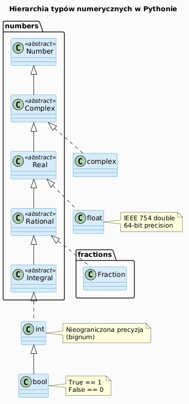
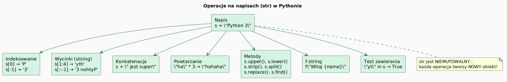
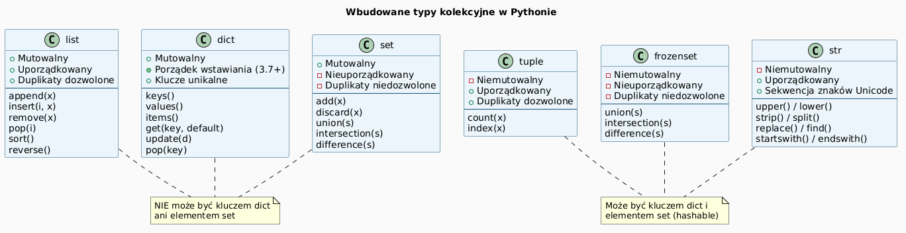

# Podstawowe typy danych w Pythonie 3

> **Cel:** Poznanie wbudowanych typów danych Pythona: liczb, napisów i typów strukturalnych (list, krotek, słowników, zbiorów) oraz operacji na nich.

---

## System typów w Pythonie

Python jest językiem **dynamicznie typowanym** – typ zmiennej jest określany w czasie wykonania, nie deklaracji.

```python
x = 42          # int
x = 3.14        # teraz float – ta sama zmienna!
x = "Python"    # teraz str
```

Każda wartość w Pythonie jest **obiektem** posiadającym:
- **typ** (`type(x)`)
- **tożsamość** (`id(x)`) – adres w pamięci
- **wartość**

```python
x = 42
print(type(x))   # <class 'int'>
print(id(x))     # np. 140710927381520
```



---

## Liczby całkowite – `int`

Typ `int` w Pythonie ma **nieograniczoną precyzję** (brak przepełnienia jak w C/Java).

```python
a = 42
b = -7
duza = 10 ** 100      # googol – działa!
szesnastkowy = 0xFF   # 255
osemkowy     = 0o17   # 15
binarny      = 0b1010 # 10

print(type(a))        # <class 'int'>
```

Operacje:

```python
print(17 // 5)   # 3   – dzielenie całkowite
print(17 % 5)    # 2   – reszta z dzielenia (modulo)
print(2 ** 10)   # 1024 – potęgowanie
print(abs(-5))   # 5
```

---

## Liczby zmiennoprzecinkowe – `float`

Standard **IEEE 754** (64-bit double precision):

```python
pi = 3.14159
e  = 2.71828
inf = float('inf')     # nieskończoność
nan = float('nan')     # Not a Number

print(0.1 + 0.2)       # 0.30000000000000004  (!)
print(round(0.1 + 0.2, 10))  # 0.3
```

> ⚠️ Zmiennoprzecinkowe **nie są dokładne** w systemie binarnym.

Dla obliczeń finansowych używaj `Decimal`:

```python
from decimal import Decimal
print(Decimal("0.1") + Decimal("0.2"))  # 0.3
```

---

## Liczby zespolone – `complex`

```python
z1 = 3 + 4j
z2 = complex(1, -2)

print(z1.real)   # 3.0
print(z1.imag)   # 4.0
print(abs(z1))   # 5.0  – moduł
print(z1 * z2)   # (11+2j)
```

---

## Typ logiczny – `bool`

`bool` jest podklasą `int`: `True == 1`, `False == 0`.

```python
print(True + True)    # 2
print(bool(0))        # False
print(bool(""))       # False
print(bool([]))       # False
print(bool("tekst"))  # True
print(bool([0]))      # True
```

---

## Napisy – `str`

Napisy (łańcuchy znaków) są **niemutowalne** i **sekwencjami znaków Unicode**.

```python
s1 = 'Witaj'
s2 = "Świecie"
s3 = """Tekst
wieloliniowy"""
raw = r"C:\nowy\folder"   # surowy napis (r-string)
```

Konkatenacja i powtarzanie:

```python
pełny = s1 + ", " + s2 + "!"
echo  = "ha" * 3          # "hahaha"
```



---

## Napisy – f-stringi i formatowanie

```python
imie = "Anna"
wiek = 30
pi   = 3.14159

# f-string (Python 3.6+)
print(f"Witaj, {imie}! Masz {wiek} lat.")
print(f"Pi ≈ {pi:.2f}")        # Pi ≈ 3.14
print(f"Szesnastkowo: {255:#x}")  # 0xff

# format()
print("Witaj, {}! Masz {} lat.".format(imie, wiek))

# %-formatowanie (stary styl)
print("Witaj, %s! Masz %d lat." % (imie, wiek))
```

---

## Napisy – przydatne metody

```python
s = "  Python 3 jest super!  "

print(s.strip())              # "Python 3 jest super!"
print(s.lower())              # "  python 3 jest super!  "
print(s.upper())              # "  PYTHON 3 JEST SUPER!  "
print(s.replace("super", "świetny"))
print(s.split())              # ['Python', '3', 'jest', 'super!']
print(",".join(["a", "b"]))   # "a,b"
print("Python".startswith("Py"))  # True
print("Python" in "Python 3")     # True
print(len("Python"))          # 6
```

Indeksowanie i wycinki:

```python
s = "Python"
print(s[0])     # 'P'
print(s[-1])    # 'n'
print(s[1:4])   # 'yth'
print(s[::-1])  # 'nohtyP'
```

---

## Lista – `list`

Lista to **mutowalna**, **uporządkowana** sekwencja obiektów dowolnego typu.

```python
owoce = ["jabłko", "banan", "wiśnia"]
mieszana = [1, "dwa", 3.0, True, [5, 6]]

owoce.append("mango")         # dodanie na koniec
owoce.insert(1, "agrest")     # wstawienie na pozycję
owoce.remove("banan")         # usunięcie pierwszego wystąpienia
usuniety = owoce.pop(0)       # usunięcie i zwrot elementu
owoce.sort()                  # sortowanie w miejscu
print(sorted(owoce))          # nowa posortowana lista
print(owoce[:2])              # wycinek – pierwsze 2 elementy
print(len(owoce))             # długość
```



---

## Krotka – `tuple`

Krotka to **niemutowalna**, **uporządkowana** sekwencja – "zamrożona lista".

```python
punkt   = (3, 4)
rgb     = (255, 128, 0)
jeden   = (42,)           # krotka jednoelementowa – WAŻNY przecinek!
pusta   = ()

# rozpakowywanie (unpacking)
x, y = punkt
print(f"x={x}, y={y}")

# swap
a, b = 1, 2
a, b = b, a

# jako klucz słownika (listy nie mogą!)
d = {(0, 0): "środek", (1, 0): "prawo"}
```

---

## Słownik – `dict`

Słownik to **mutowalny**, **nieuporządkowany** (od Python 3.7 – zachowuje kolejność wstawiania) zbiór par **klucz–wartość**.

```python
osoba = {"imie": "Ania", "wiek": 25, "miasto": "Kraków"}

print(osoba["imie"])              # "Ania"
print(osoba.get("email", "brak")) # bezpieczny dostęp
osoba["email"] = "ania@example.com"
del osoba["miasto"]

for klucz, wartosc in osoba.items():
    print(f"{klucz}: {wartosc}")

print(list(osoba.keys()))         # ['imie', 'wiek', 'email']
print(list(osoba.values()))
```

---

## Zbiór – `set`

Zbiór to **mutowalny**, **nieuporządkowany** zbiór **unikalnych** wartości.

```python
s1 = {1, 2, 3, 4}
s2 = {3, 4, 5, 6}

print(s1 | s2)   # suma:         {1, 2, 3, 4, 5, 6}
print(s1 & s2)   # część wspólna: {3, 4}
print(s1 - s2)   # różnica:       {1, 2}
print(s1 ^ s2)   # różnica sym.:  {1, 2, 5, 6}

s1.add(10)
s1.discard(1)    # usuwa, nie rzuca błędu gdy brak

# Usuwanie duplikatów z listy
unikalne = list(set([1, 2, 2, 3, 3, 3]))
```

`frozenset` – niemutowalna wersja zbioru.

---

## Przegląd wbudowanych typów

| Typ | Przykład | Mutowalny | Uporządkowany | Unikalność |
|---|---|---|---|---|
| `int`, `float`, `complex` | `42`, `3.14`, `2j` | ✗ | – | – |
| `str` | `"Python"` | ✗ | ✓ | – |
| `list` | `[1, 2, 3]` | ✓ | ✓ | – |
| `tuple` | `(1, 2, 3)` | ✗ | ✓ | – |
| `dict` | `{"a": 1}` | ✓ | ✓ (3.7+) | klucze |
| `set` | `{1, 2, 3}` | ✓ | ✗ | ✓ |
| `frozenset` | `frozenset({1})` | ✗ | ✗ | ✓ |
| `bool` | `True`, `False` | ✗ | – | – |
| `bytes` | `b"data"` | ✗ | ✓ | – |

---

## Zadania do samodzielnego rozwiązania

Pliki zadań: [`exercises/tasks.py`](exercises/tasks.py) | Rozwiązania: [`exercises/solutions_data_types.py`](exercises/solutions_data_types.py)

```bash
pytest data-types/exercises/test_solutions.py -v
```

### Zadanie 1 – Statystyki numeryczne

Oblicz min, max, sumę, średnią i zakres listy liczb. Rzuć `ValueError` dla pustej listy.

```python
def statystyki(liczby: list[float]) -> dict:
    # {"min": ..., "max": ..., "suma": ..., "srednia": ..., "zakres": ...}
    ...
```

### Zadanie 2 – Analiza napisu

Zbuduj słownik z metadanymi napisu: długość, lista słów, unikalne znaki, czy palindrom.

```python
def analizuj_napis(tekst: str) -> dict:
    # Wskazówka: tekst.split(), set comprehension, oczyszczony[::-1]
    ...

analizuj_napis("Kayak")["czy_palindrom"]  # → True
```

### Zadanie 3 – Zliczanie wystąpień (bez Counter)

Zbuduj słownik `{element: liczba_wystąpień}` posortowany malejąco po wartości.

```python
def zlicz_wystapienia(sekwencja: list) -> dict:
    # Nie używaj collections.Counter!
    ...

zlicz_wystapienia(["a","b","a","c","b","a"])  # → {"a":3, "b":2, "c":1}
```

### Zadanie 4 – Macierz 2D bez pułapki mutowalności

Utwórz macierz `wiersze × kolumny` z **niezależnymi** wierszami (nie `[[0]*n]*m`!).

```python
def zbuduj_macierz(wiersze: int, kolumny: int, wartosc=0) -> list[list]:
    # Użyj list comprehension: [[wartosc]*kolumny for _ in range(wiersze)]
    ...

m = zbuduj_macierz(3, 3)
m[0][0] = 99
assert m[1][0] == 0   # wiersze są niezależne!
```

### Zadanie 5 – Operacje teoriomnogościowe

Oblicz sumę, część wspólną, różnicę i różnicę symetryczną dwóch list jako zbiorów.

```python
def operacje_na_zbiorach(lista_a: list, lista_b: list) -> dict:
    # Użyj operatorów: |, &, -, ^, isdisjoint()
    ...
```

### Zadanie 6 – Precyzyjne obliczenia finansowe

Przelicz kwotę przez kurs używając `Decimal` (nie `float`!) z zaokrągleniem `ROUND_HALF_UP`.

```python
from decimal import Decimal, ROUND_HALF_UP

def konwersja_walut(kwota: str, kurs: str) -> str:
    # Decimal(kwota) * Decimal(kurs) → .quantize(Decimal("0.01"), ...)
    ...
```

---

## Referencje

### Literatura
- Lutz, M. (2013). *Learning Python*, 5th ed. O'Reilly. Część II: Types and Operations.
- Beazley, D., Jones, B.K. (2013). *Python Cookbook*, 3rd ed. O'Reilly. Rozdział 1 (Data Structures).
- Ramalho, L. (2022). *Fluent Python*, 2nd ed. O'Reilly. Rozdział 2 (Sequences).

### Źródła internetowe
- [Built-in Types – Python 3 docs](https://docs.python.org/3/library/stdtypes.html)
- [Python Data Types (realpython.com)](https://realpython.com/python-data-types/)
- [Python f-strings](https://realpython.com/python-f-strings/)
- [Floating Point Arithmetic: Issues and Limitations](https://docs.python.org/3/tutorial/floatingpoint.html)
- [decimal – Decimal fixed-point and floating-point arithmetic](https://docs.python.org/3/library/decimal.html)

