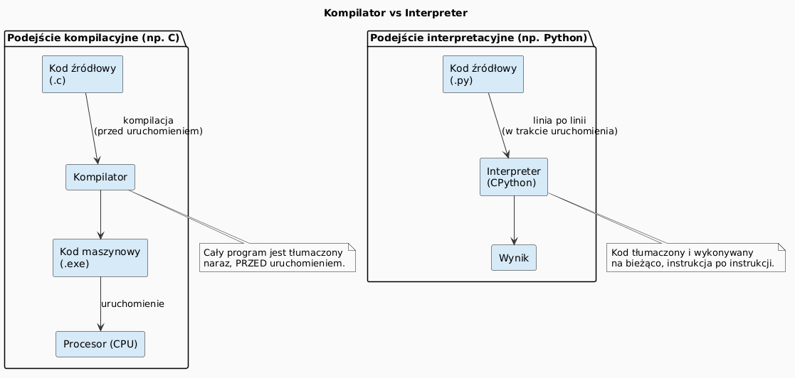
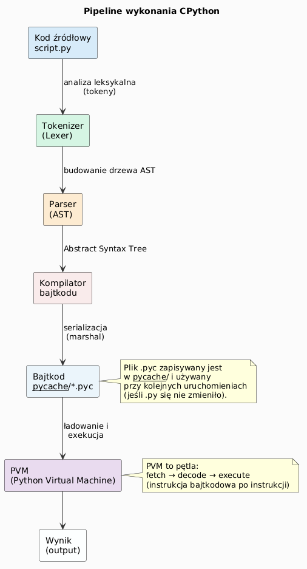

# Kompilatory i interpretery

> **Cel slajdu tytułowego:** Zrozumienie różnicy między kompilacją a interpretacją kodu źródłowego oraz poznanie modelu wykonania CPython.

---

## Czym jest kompilator?

**Kompilator** to program, który tłumaczy cały kod źródłowy na kod maszynowy (lub pośredni) *przed* uruchomieniem programu.

Etapy kompilacji (np. C/C++):

1. Analiza leksykalna (tokenizacja)
2. Analiza składniowa (AST)
3. Analiza semantyczna
4. Generowanie kodu pośredniego
5. Optymalizacja
6. Generowanie kodu maszynowego / łączenie (linking)

```
kod źródłowy (.c) → kompilator → plik obiektowy (.o) → linker → plik wykonywalny (.exe)
```

**Zalety:** wysoka wydajność, wczesne wykrycie błędów.  
**Wady:** dłuższy czas przygotowania, przenośność ograniczona do architektury docelowej.



---

## Czym jest interpreter?

**Interpreter** wykonuje kod źródłowy *bezpośrednio*, instrukcja po instrukcji, bez wcześniejszego generowania osobnego pliku wykonywalnego.

```
kod źródłowy → interpreter → wynik (linia po linii)
```

**Zalety:** natychmiastowe uruchamianie, przenośność, łatwiejsze debugowanie.  
**Wady:** wolniejsze wykonanie w porównaniu do kodu skompilowanego do kodu maszynowego.

Przykłady języków interpretowanych: Python, Ruby, PHP, JavaScript (w przeglądarce).

---

## Python – kompilacja czy interpretacja?

Python stosuje **podejście hybrydowe**:

1. Kod źródłowy (`.py`) jest kompilowany do **bajtkodu** (`.pyc`) – reprezentacji pośredniej.
2. Bajtkod jest następnie **interpretowany** przez **Python Virtual Machine (PVM)**.

```
skrypt.py  →  kompilator CPython  →  bajtkod (.pyc)  →  PVM  →  wynik
```

> To kompromis: bajtkod jest przenośny między platformami, a PVM wykonuje go szybciej niż przetwarzanie surowego tekstu.



---

## Pipeline wykonania CPython – szczegóły

```
┌─────────────┐    ┌───────────┐    ┌───────────┐    ┌─────────────┐    ┌────────┐
│  Kod źródł. │ →  │  Tokenizer│ →  │  Parser   │ →  │  Kompilator │ →  │  PVM   │
│  (.py)      │    │           │    │  (AST)    │    │  (bajtkod)  │    │        │
└─────────────┘    └───────────┘    └───────────┘    └─────────────┘    └────────┘
```

Podgląd bajtkodu w Pythonie:

```python
import dis

def add(a, b):
    return a + b

dis.dis(add)
```

Wynik (przykład):
```
  2           0 LOAD_FAST                0 (a)
              2 LOAD_FAST                1 (b)
              4 BINARY_ADD
              6 RETURN_VALUE
```

> Plik: [`examples/hello_world.py`](examples/hello_world.py)

---

## Implementacje Pythona

| Implementacja | Opis | Zastosowanie |
|---|---|---|
| **CPython** | Referencyjna, napisana w C | Domyślna, najszerzej używana |
| **PyPy** | JIT compiler, znacznie szybszy | Obliczenia intensywne |
| **Jython** | Działa na JVM (Java) | Integracja z Javą |
| **IronPython** | Działa na .NET CLR | Integracja z .NET |
| **MicroPython** | Minimalistyczny | Mikrokontrolery (ESP32, RP2040) |

---

## Bajtkod i pliki .pyc

Python automatycznie buforuje bajtkod w katalogu `__pycache__/`:

```
mymodule.py
__pycache__/
    mymodule.cpython-311.pyc
```

Możliwy ręczny podgląd:

```python
import py_compile
py_compile.compile("mymodule.py")   # generuje .pyc

import dis, marshal
with open("__pycache__/mymodule.cpython-311.pyc", "rb") as f:
    f.read(16)  # nagłówek magic number + timestamp
    code = marshal.loads(f.read())
dis.dis(code)
```

---

## Podsumowanie

- **Kompilator** – tłumaczy cały program naraz przed uruchomieniem.
- **Interpreter** – wykonuje program krok po kroku.
- **CPython** – kompiluje do bajtkodu, a następnie interpretuje go przez PVM.
- Bajtkod jest buforowany w `__pycache__/` dla przyspieszenia kolejnych uruchomień.

---

## Zadania do samodzielnego rozwiązania

Pliki zadań: [`exercises/tasks.py`](exercises/tasks.py) | Rozwiązania: [`exercises/solutions_interpreters.py`](exercises/solutions_interpreters.py)

Uruchomienie testów:
```bash
pytest interpreters/exercises/test_solutions.py -v
```

### Zadanie 1 – Analiza bajtkodu

Korzystając z `dis.get_instructions()`, zlicz liczbę **unikalnych** nazw instrukcji bajtkodowych (`opname`) w podanej funkcji.

```python
import dis

def policz_instrukcje_bajtkodu(func) -> int:
    # Wskazówka: dis.get_instructions(func) → iterator Instruction
    # Każdy obiekt Instruction ma atrybut .opname
    ...
```

### Zadanie 2 – Wykrywanie implementacji

Używając `sys.implementation.name`, zwróć `True` jeśli bieżący interpreter to CPython.

```python
def czy_cpython() -> bool: ...
```

### Zadanie 3 – Wersja interpretera

Zwróć krotkę `(major, minor, micro)` bieżącej wersji Pythona z `sys.version_info`.

```python
def wersja_pythona() -> tuple[int, int, int]: ...
# Python 3.11.2 → (3, 11, 2)
```

### Zadanie 4 – Stałe w bajtkodzie

Zwróć listę unikalnych wartości stałych (`LOAD_CONST`) z bajtkodu funkcji, pomijając `None`.

```python
def znajdz_stale_w_bajtkodzie(func) -> list[object]:
    # Filtruj: instr.opname == 'LOAD_CONST' and instr.argval is not None
    ...
```

### Zadanie 5 – Dynamiczna kompilacja

Użyj `compile()` i `exec()` do wykonania kodu podanego jako łańcuch znaków.

```python
def kompiluj_i_wykonaj(kod: str, zmienne: dict) -> dict:
    # compile(kod, "<string>", "exec") → exec(code_obj, zmienne)
    ...

# Przykład:
kompiluj_i_wykonaj("x = 2 ** 8", {})["x"]  # → 256
```

---

## Referencje

### Literatura
- Lutz, M. (2013). *Learning Python*, 5th ed. O'Reilly Media. Rozdział 2.
- Beazley, D., Jones, B.K. (2013). *Python Cookbook*, 3rd ed. O'Reilly. Sekcja 1.
- Shaw, Z. (2017). *Learn Python 3 the Hard Way*. Addison-Wesley.

### Źródła internetowe
- [Python Developer's Guide – Compiler design](https://devguide.python.org/internals/compiler/)
- [CPython Internals (realpython.com)](https://realpython.com/cpython-source-code-guide/)
- [dis – Disassembler for Python bytecode](https://docs.python.org/3/library/dis.html)
- [What is Python? (python.org)](https://www.python.org/doc/essays/blurb/)
- [PyPy – Speed](https://www.pypy.org/performance.html)

