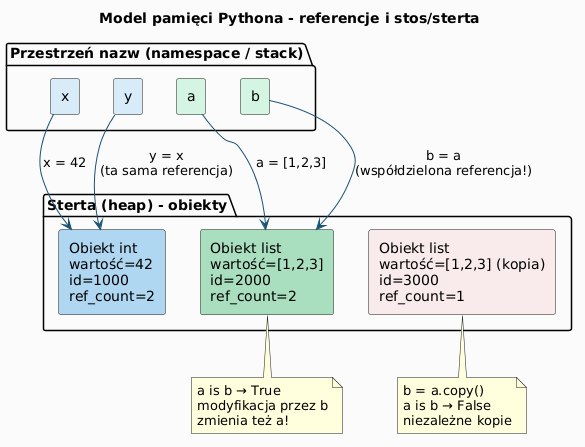
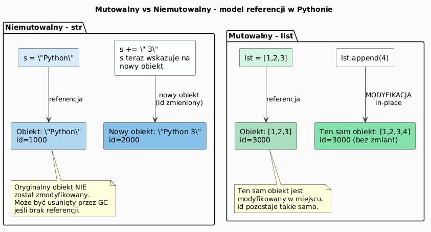

# Typy mutowalne i niemutowalne w Pythonie 3

> **Cel:** Zrozumienie modelu pamięci Pythona, różnicy między obiektami mutowalnymi a niemutowalnymi oraz konsekwencji dla pisania bezpiecznego i przewidywalnego kodu.

---

## Model obiektowy Pythona

W Pythonie **każda wartość jest obiektem**. Zmienna to tylko **etykieta (referencja)** przywiązana do obiektu w pamięci, nie pojemnik na wartość.

```python
x = 42
y = x       # y wskazuje NA TEN SAM obiekt co x

print(id(x) == id(y))   # True – ten sam obiekt!
print(x is y)           # True
```

Kluczowe funkcje:
- `id(obj)` – unikalny identyfikator obiektu (adres w pamięci)
- `type(obj)` – typ obiektu
- `obj is obj2` – czy to ten **sam obiekt** (nie: ta sama wartość!)
- `obj == obj2` – czy ta sama **wartość**



---

## Niemutowalne (immutable)

Obiekt **niemutowalny** po utworzeniu **nie może zostać zmieniony**. Każda "modyfikacja" tworzy **nowy obiekt**.

Typy niemutowalne:
- `int`, `float`, `complex`, `bool`
- `str`
- `tuple`
- `frozenset`
- `bytes`

```python
s = "Python"
print(id(s))       # np. 140234567890

s += " 3"          # NIE modyfikuje obiektu "Python" –
                   # tworzy NOWY napis "Python 3"
print(id(s))       # INNY id!
```



---

## Mutowalne (mutable)

Obiekt **mutowalny** może być zmieniany **w miejscu** (in-place) – bez tworzenia nowego obiektu.

Typy mutowalne:
- `list`
- `dict`
- `set`
- `bytearray`
- Instancje klas (domyślnie)

```python
lst = [1, 2, 3]
print(id(lst))       # np. 140234999000

lst.append(4)        # MODYFIKUJE istniejący obiekt
print(id(lst))       # TEN SAM id!
print(lst)           # [1, 2, 3, 4]
```

---

## Pułapka: współdzielone referencje

```python
a = [1, 2, 3]
b = a           # b wskazuje NA TEN SAM obiekt!

b.append(4)
print(a)        # [1, 2, 3, 4]  (!)
print(a is b)   # True
```

Rozwiązanie – płytka kopia:

```python
b = a.copy()        # lub a[:]  lub list(a)
b.append(4)
print(a)            # [1, 2, 3]  – niezmienione
print(a is b)       # False
```

Głęboka kopia (dla zagnieżdżonych struktur):

```python
import copy
b = copy.deepcopy(a)
```

---

## Niemutowalność a słowniki i zbiory

Klucze słownika i elementy zbioru muszą być **hashowalne** (co implikuje niemutowalność):

```python
d = {(1, 2): "punkt"}  # OK – krotka jest niemutowalna
# d = {[1, 2]: "lista"} # TypeError: unhashable type: 'list'

s = {frozenset({1, 2}), frozenset({3, 4})}  # OK
# s = {{1, 2}, {3, 4}}  # TypeError: unhashable type: 'set'
```

---

## Pułapka: mutowalny domyślny argument funkcji

To jeden z najczęstszych błędów w Pythonie:

```python
# ŹLE – domyślna lista tworzona RAZ przy definicji funkcji!
def dodaj(element, lista=[]):
    lista.append(element)
    return lista

print(dodaj(1))   # [1]
print(dodaj(2))   # [1, 2]  (!) – nie [2]
print(dodaj(3))   # [1, 2, 3]  (!)
```

Poprawna wersja – użyj `None` jako wartości domyślnej:

```python
# DOBRZE
def dodaj(element, lista=None):
    if lista is None:
        lista = []
    lista.append(element)
    return lista

print(dodaj(1))   # [1]
print(dodaj(2))   # [2]  ✓
```

---

## Internowanie obiektów (interning)

CPython optymalizuje pamięć przez **współdzielenie małych obiektów**:

```python
# Małe liczby całkowite (-5 do 256) są internowane
a = 256
b = 256
print(a is b)   # True  – ten sam obiekt

a = 257
b = 257
print(a is b)   # False – różne obiekty (poza CPython REPL może być True)

# Internowanie napisów (krótkie, identyfikatoropodobne)
s1 = "python"
s2 = "python"
print(s1 is s2)  # True – najczęściej (nie gwarantowane!)
```

> ⚠️ Nie polegaj na `is` do porównywania wartości – używaj `==`.

---

## Niemutowalność jako wzorzec projektowy

**Zalety niemutowalności:**
- Bezpieczeństwo w programowaniu wielowątkowym (thread-safe)
- Obiekty mogą być kluczami słownika / elementami zbioru
- Łatwiejsze rozumowanie o kodzie (brak ukrytych modyfikacji)
- Możliwość buforowania (memoizacja)

```python
from functools import lru_cache

@lru_cache(maxsize=None)
def fibonacci(n: int) -> int:
    if n < 2:
        return n
    return fibonacci(n - 1) + fibonacci(n - 2)

print(fibonacci(50))  # szybko, dzięki cache
```

---

## Podsumowanie

| Cecha | Niemutowalne | Mutowalne |
|---|---|---|
| Modyfikacja | Tworzy nowy obiekt | Zmiana w miejscu |
| Hashowalne (klucz dict) | ✓ | ✗ |
| Współdzielenie referencji | Bezpieczne | Wymaga ostrożności |
| Typy | `int`, `str`, `tuple`, `frozenset` | `list`, `dict`, `set` |

---

## Zadania do samodzielnego rozwiązania

Pliki zadań: [`exercises/tasks.py`](exercises/tasks.py) | Rozwiązania: [`exercises/solutions_mutability.py`](exercises/solutions_mutability.py)

```bash
pytest mutability/exercises/test_solutions.py -v
```

### Zadanie 1 – Aktualizacja bez mutacji oryginału

Zwróć **nowy** słownik z dodanym kluczem, nie zmieniając oryginału.

```python
def bezpieczna_aktualizacja(slownik: dict, klucz: str, wartosc) -> dict:
    # slownik.copy() → dodaj klucz → zwróć nowy
    ...

d = {"a": 1}
nowy = bezpieczna_aktualizacja(d, "b", 2)
assert d == {"a": 1}   # oryginał niezmieniony!
```

### Zadanie 2 – Usuwanie duplikatów z zachowaniem kolejności

Usuń duplikaty z listy zachowując kolejność pierwszego wystąpienia. Nie modyfikuj oryginału.

```python
def usun_duplikaty_zachowujac_kolejnosc(lista: list) -> list:
    # set() do śledzenia widzianych, lista do budowania wyniku
    ...

usun_duplikaty_zachowujac_kolejnosc([3,1,4,1,5,9,2,6,5,3])
# → [3, 1, 4, 5, 9, 2, 6]
```

### Zadanie 3 – Dekorator cache (memoizacja)

Zaimplementuj dekorator cachujący wyniki wywołań funkcji w słowniku `wrapper.cache`.

```python
def rozbuduj_cache(func):
    cache = {}
    def wrapper(*args):
        if args not in cache:
            cache[args] = func(*args)
        return cache[args]
    wrapper.cache = cache
    return wrapper
```

### Zadanie 4 – Głęboka aktualizacja słownika

Scal rekurencyjnie dwa słowniki: dla zagnieżdżonych słowników scalaj, dla pozostałych nadpisuj.

```python
def gleboka_aktualizacja(cel: dict, zrodlo: dict) -> dict:
    # isinstance(v, dict) → rekurencja, else → nadpisz
    ...

cel = {"b": {"x": 10, "y": 20}}
gleboka_aktualizacja(cel, {"b": {"y": 99, "z": 30}})
# → {"b": {"x": 10, "y": 99, "z": 30}}   # x ocalało!
```

### Zadanie 5 – Zamrożenie struktury danych

Przekształć rekurencyjnie: `list → tuple`, `dict → frozenset par`, `set → frozenset`.

```python
def zamroz_strukture(obj):
    # isinstance(obj, list) → tuple(...)
    # isinstance(obj, dict) → frozenset(...)
    # isinstance(obj, set)  → frozenset(...)
    ...

zamroz_strukture([1, [2, 3], {4, 5}])
# → (1, (2, 3), frozenset({4, 5}))
```

---

## Referencje

### Literatura
- Lutz, M. (2013). *Learning Python*, 5th ed. O'Reilly. Rozdział 6 (Mutable/Immutable).
- Ramalho, L. (2022). *Fluent Python*, 2nd ed. O'Reilly. Rozdział 2 i 8.
- Beazley, D., Jones, B.K. (2013). *Python Cookbook*, 3rd ed. Rozdział 8.

### Źródła internetowe
- [Python Data Model – objects, values, types](https://docs.python.org/3/reference/datamodel.html)
- [Mutable vs Immutable Objects in Python (realpython.com)](https://realpython.com/python-mutable-vs-immutable/)
- [Python's `is` vs `==` (realpython.com)](https://realpython.com/python-is-identity-vs-equality/)
- [Shallow vs Deep Copy (docs.python.org)](https://docs.python.org/3/library/copy.html)
- [Common Python gotchas – mutable default arguments](https://docs.python-guide.org/writing/gotchas/)

