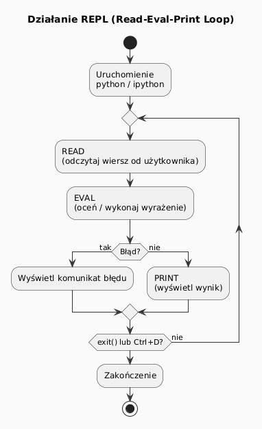
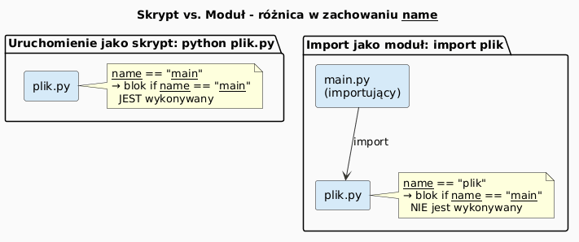

# Sposoby uruchamiania kodu w Pythonie

> **Cel:** Poznanie różnych metod wykonania kodu Python: REPL, skrypty, moduły, pakiety, Jupyter Notebook i IDE.

---

## REPL – interaktywna powłoka

**REPL** (Read–Eval–Print Loop) to tryb interaktywny: wpisujesz wyrażenie → Python je natychmiast oblicza i wyświetla wynik.

Uruchomienie:

```bash
python          # lub python3 na systemach Unix/macOS
```

Przykładowa sesja REPL:

```python
>>> 2 + 2
4
>>> name = "Python"
>>> f"Witaj, {name}!"
'Witaj, Python!'
>>> help(str.upper)
```

Wyjście z REPL: `exit()` lub `Ctrl+D` (Unix) / `Ctrl+Z` (Windows).



---

## IPython – rozszerzony REPL

**IPython** to zaawansowana powłoka interaktywna z podświetlaniem składni, historią i magicznymi komendami (`%timeit`, `%run`, `%debug`).

```bash
pip install ipython
ipython
```

Przydatne komendy magiczne:

```python
In [1]: %timeit sum(range(1000))
# mierzy czas wykonania

In [2]: %run myscript.py
# uruchamia skrypt w bieżącym kontekście

In [3]: ?str.split
# wyświetla dokumentację
```

---

## Uruchamianie skryptów

Skrypt to plik `.py` uruchamiany z linii poleceń:

```bash
python skrypt.py
python skrypt.py arg1 arg2   # z argumentami
```

Dostęp do argumentów:

```python
# skrypt.py
import sys

if __name__ == "__main__":
    print(f"Argumenty: {sys.argv}")
    # sys.argv[0] = nazwa skryptu
    # sys.argv[1:] = argumenty użytkownika
```

Konwencja `if __name__ == "__main__"`:
- Blok ten jest wykonywany **tylko** gdy plik jest uruchamiany bezpośrednio.
- Nie jest wykonywany gdy plik jest **importowany** jako moduł.

> Plik: [`examples/run_as_script.py`](examples/run_as_script.py)

---

## Moduły i importowanie

**Moduł** to każdy plik `.py`. Możemy importować z niego funkcje, klasy i zmienne.

```python
# matematyka.py
def kwadrat(x):
    return x ** 2

PI = 3.14159
```

```python
# main.py
import matematyka
print(matematyka.kwadrat(4))   # 16

from matematyka import PI
print(PI)                       # 3.14159
```

Typy importu:

| Forma | Opis |
|---|---|
| `import modul` | importuje cały moduł |
| `from modul import nazwa` | importuje konkretny element |
| `from modul import *` | importuje wszystko (niezalecane) |
| `import modul as m` | alias |



---

## Pakiety

**Pakiet** to katalog z plikiem `__init__.py` grupujący moduły.

```
moj_pakiet/
├── __init__.py
├── matematyka.py
└── napisy.py
```

```python
# import z pakietu
from moj_pakiet import matematyka
from moj_pakiet.napisy import odwroc
```

> Plik: [`examples/run_as_module/`](examples/run_as_module/)

---

## Jupyter Notebook

**Jupyter Notebook** to środowisko webowe łączące kod, tekst (Markdown) i wykresy w jednym dokumencie (`.ipynb`).

```bash
pip install jupyter
jupyter notebook       # otwiera przeglądarkę
# lub
jupyter lab
```

Typy komórek:
- **Code** – kod Python (wykonywany przez `Shift+Enter`)
- **Markdown** – tekst, wzory LaTeX, obrazki
- **Raw** – surowy tekst

Typowe zastosowania: analiza danych, wizualizacje, raporty, nauczanie.

---

## Środowiska wirtualne

Izolowanie zależności projektu:

```bash
python -m venv .venv           # tworzenie środowiska
.venv\Scripts\activate         # aktywacja (Windows)
source .venv/bin/activate      # aktywacja (Unix/macOS)

pip install requests           # instalacja w izolowanym środowisku
deactivate                     # dezaktywacja
```

---

## Popularne IDE i edytory

| Narzędzie | Opis |
|---|---|
| **PyCharm** | Pełne IDE, Community (darmowe) i Professional |
| **VS Code** | Lekki edytor z rozszerzeniem Pylance/Python |
| **Thonny** | Dla początkujących, wbudowany debugger |
| **IDLE** | Domyślny prosty edytor dołączony do CPython |
| **JupyterLab** | Notebooki + edytor plików |

---

## Podsumowanie

| Metoda | Kiedy używać? |
|---|---|
| REPL / IPython | Szybkie testy, eksploracja |
| Skrypt `.py` | Programy uruchamiane z CLI |
| Moduł / pakiet | Kod wielokrotnego użytku |
| Jupyter Notebook | Analiza danych, nauka, raporty |
| IDE | Większe projekty, refactoring |

---

## Zadania do samodzielnego rozwiązania

Pliki zadań: [`exercises/tasks.py`](exercises/tasks.py) | Rozwiązania: [`exercises/solutions_running_python.py`](exercises/solutions_running_python.py)

```bash
pytest running-python/exercises/test_solutions.py -v
```

### Zadanie 1 – Introspekcja modułu

Dla podanej nazwy modułu stdlib zwróć słownik z informacjami: `nazwa`, `plik`, `pakiet`, `atrybuty` (liczba publicznych nazw).

```python
def info_o_module(nazwa_modulu: str) -> dict:
    # importlib.import_module(nazwa)
    # getattr(modul, "__file__", None)
    # [a for a in dir(modul) if not a.startswith("_")]
    ...
```

### Zadanie 2 – Leniwy import

Zaimportuj moduł tylko jeśli nie ma go jeszcze w `sys.modules`. Zwróć obiekt modułu.

```python
def lazy_import(nazwa_modulu: str):
    # Sprawdź sys.modules najpierw
    ...
```

### Zadanie 3 – Tworzenie modułu w locie

Utwórz obiekt `types.ModuleType`, wykonaj w nim podany kod i zwróć jego `__dict__`.

```python
def uruchom_kod_jako_modul(kod: str, nazwa: str = "__dynamic__") -> dict:
    import types
    m = types.ModuleType(nazwa)
    exec(compile(kod, nazwa, "exec"), m.__dict__)
    ...
```

### Zadanie 4 – Wyszukiwanie w `sys.path`

Przeszukaj katalogi z `sys.path` i znajdź pełną ścieżkę do pliku o podanej nazwie.

```python
def znajdz_modul_w_sys_path(nazwa_pliku: str) -> str | None:
    # import pathlib
    # for katalog in sys.path: (pathlib.Path(katalog) / nazwa_pliku).is_file()
    ...
```

### Zadanie 5 – Moduły z prefiksem

Zwróć posortowaną listę nazw załadowanych modułów z `sys.modules` pasujących do prefiksu.

```python
def lista_modulow_z_prefiksem(prefiks: str) -> list[str]:
    # sys.modules.items() – pomiń wartości None
    ...
```

---

## Referencje

### Literatura
- Lutz, M. (2013). *Learning Python*, 5th ed. O'Reilly. Rozdziały 3–5.
- Pilgrim, M. (2009). *Dive into Python 3*. Apress. Rozdział 1.

### Źródła internetowe
- [Python Tutorial – Using the Python Interpreter](https://docs.python.org/3/tutorial/interpreter.html)
- [IPython documentation](https://ipython.readthedocs.io/)
- [Jupyter Project](https://jupyter.org/)
- [Python Modules and Packages (realpython.com)](https://realpython.com/python-modules-packages/)
- [Virtual Environments (docs.python.org)](https://docs.python.org/3/library/venv.html)

