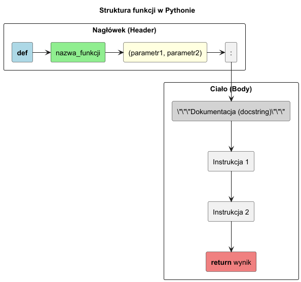

# Definicja funkcji w Pythonie

> **Cel:** Zrozumienie składni i struktury funkcji w Pythonie, w tym nagłówka, parametrów, dokumentacji i ciała funkcji.

---

## Czym jest funkcja?

Funkcja to wydzielony blok kodu, który można wielokrotnie wywoływać w różnych miejscach programu. Pozwala na:
- **Modularność**: Podział programu na mniejsze, logiczne części.
- **Wielokrotne użycie (DRY - Don't Repeat Yourself)**: Unikanie powtarzania tego samego kodu.
- **Czytelność**: Nadawanie nazw blokom kodu, co ułatwia zrozumienie ich działania.
- **Abstrakcję**: Ukrywanie szczegółów implementacyjnych.

## Struktura funkcji

W Pythonie funkcję definiujemy za pomocą słowa kluczowego `def`.

```python
def nazwa_funkcji(parametr1, parametr2):
    """Dokumentacja funkcji (docstring)."""
    # Ciało funkcji
    wynik = parametr1 + parametr2
    return wynik
```



### Elementy składowe:

1.  **Nagłówek (`def ...`):**
    *   Słowo kluczowe `def`.
    *   **Nazwa funkcji**: Zgodna z konwencją `snake_case` (małe litery, słowa oddzielone podkreślnikami). Powinna być czasownikiem opisującym działanie (np. `oblicz_sume`, `wyslij_email`).
    *   **Parametry**: Lista zmiennych w nawiasach `()`, które funkcja przyjmuje. Może być pusta.
    *   Dwukropek `:` na końcu linii.

2.  **Dokumentacja (`docstring`):**
    *   Pierwsza instrukcja w ciele funkcji będąca napisem (zwykle w potrójnych cudzysłowach `"""`).
    *   Opisuje co robi funkcja, jej parametry i zwracaną wartość.
    *   Dostępna przez atrybut `__doc__` lub funkcję `help()`.

3.  **Ciało funkcji:**
    *   Blok kodu wcięty (zwykle 4 spacje).
    *   Zawiera logikę funkcji.

4.  **Wartość zwracana (`return`):**
    *   Słowo kluczowe `return` kończy działanie funkcji i zwraca wartość do miejsca wywołania.
    *   Jeśli brakuje `return`, funkcja zwraca `None`.

---

## Typowanie statyczne (Type Hints)

Od Pythona 3.5 można (i warto!) dodawać podpowiedzi typów. Nie są one sprawdzane w czasie uruchomienia (chyba że użyjemy narzędzi jak `mypy`), ale pomagają IDE i programistom.

```python
def powitanie(imie: str, wiek: int) -> str:
    """Zwraca spersonalizowane powitanie."""
    return f"Cześć {imie}, masz {wiek} lat!"
```

---

## Przykłady

### 1. Prosta funkcja bez parametrów

```python
def powiedz_czesc():
    """Wypisuje powitanie na ekran."""
    print("Cześć!")

powiedz_czesc()  # Wywołanie
```

### 2. Funkcja z parametrami i zwracaniem wartości

```python
def dodaj(a: int, b: int) -> int:
    """Sumuje dwie liczby całkowite."""
    return a + b

wynik = dodaj(3, 5)
print(wynik)  # 8
```

### 3. Funkcja z pustym ciałem (`pass`)

Czasem definiujemy szkielet funkcji, którą uzupełnimy później. Używamy wtedy instrukcji `pass` (instrukcja pusta).

```python
def zrob_cos_pozniej():
    pass
```

---

## Większy przykład (dla studentów I stopnia)

Zobacz kompletny mini-projekt:
- [`examples/student_tools.py`](examples/student_tools.py) – walidacja ocen, średnia ważona ECTS, decyzja stypendialna i raport tekstowy.

Uruchomienie:

```bash
python 01-definition/examples/student_tools.py
```

---

## Zadania do samodzielnego rozwiązania

Pliki zadań:
- [`exercises/tasks.py`](exercises/tasks.py)
- [`exercises/solutions_definition.py`](exercises/solutions_definition.py)
- [`exercises/test_solutions.py`](exercises/test_solutions.py)

```bash
pytest 01-definition/exercises/test_solutions.py -v
```

### Lista zadań

1. `normalizuj_imie(imie)` – oczyszczanie i normalizacja zapisu imienia.
2. `bezpieczne_dzielenie(a, b, domyslna)` – obsługa dzielenia przez zero.
3. `policz_srednia(oceny)` – średnia arytmetyczna z walidacją wejścia.
4. `opisz_studenta(imie, indeks, kierunek)` – formatowanie opisu tekstowego.
5. `wyznacz_range(liczby)` – zwrot min, max i zakresu wartości.

---

## Referencje

### Literatura
- Lutz, M. (2013). *Learning Python*, 5th ed. O'Reilly. Część IV: Functions.
- Ramalho, L. (2022). *Fluent Python*, 2nd ed. O'Reilly. Rozdział 9 (Functions as Objects).
- "Clean Code" (Robert C. Martin) - rozdział o funkcjach (dobre praktyki nazewnictwa i rozmiaru).

### Źródła internetowe
- [Defining Functions (Python Docs)](https://docs.python.org/3/tutorial/controlflow.html#defining-functions)
- [PEP 257 – Docstring Conventions](https://peps.python.org/pep-0257/)
- [PEP 484 – Type Hints](https://peps.python.org/pep-0484/)
