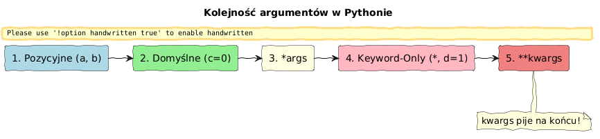

# Zmienna liczba argumentów w Pythonie

> **Cel:** Zrozumienie mechanizmów `*args` i `**kwargs`, pozwalających na tworzenie elastycznych funkcji przyjmujących dowolną liczbę argumentów.

---

## 1. Argumenty pozycyjne (`*args`)

Jeśli nie wiemy z góry, ile argumentów pozycyjnych zostanie przekazanych do funkcji, używamy parametru poprzedzonego gwiazdką `*`. Zwyczajowo nazywa się go `args`.

- Wszystkie nadmiarowe argumenty pozycyjne są pakowane w **krotkę (`tuple`)**.

```python
def suma(*args: int) -> int:
    """Sumuje dowolną liczbę liczb całkowitych."""
    wynik = 0
    for liczba in args:
        wynik += liczba
    return wynik

print(suma(1, 2, 3))       # 6
print(suma(10, 20))        # 30
print(suma())              # 0
```

## 2. Argumenty nazwane (`**kwargs`)

Jeśli chcemy przyjmować dowolną liczbę argumentów nazwanych (klucz=wartość), używamy parametru poprzedzonego dwiema gwiazdkami `**`. Zwyczajowo nazywa się go `kwargs` (keyword arguments).

- Wszystkie nadmiarowe argumenty nazwane są pakowane w **słownik (`dict`)**.

```python
def raport(**kwargs: str):
    """Generuje raport z przekazanych danych."""
    for klucz, wartosc in kwargs.items():
        print(f"{klucz.capitalize()}: {wartosc}")

raport(imie="Jan", dzial="IT", rola="Programista")
# Imię: Jan
# Dział: IT
# Rola: Programista
```

---

## 3. Kolejność parametrów

W Pythonie kolejność definicji parametrów jest ściśle określona:

1.  Standardowe argumenty pozycyjne (np. `a, b`)
2.  Argumenty z wartością domyślną (np. `c=10`)
3.  `*args` (zmienna liczba argumentów pozycyjnych)
4.  Argumenty tylko nazwane (Keyword-Only Arguments) - po `*` lub `*args`
5.  `**kwargs` (zmienna liczba argumentów nazwanych)

```python
def funkcja_wszystkiego(a, b, *args, c=10, **kwargs):
    pass
```

> ⚠️ **Uwaga:** `**kwargs` musi być **zawsze ostatni**.



---

## 4. Rozpakowywanie argumentów (`*` i `**`)

Możemy użyć gwiazdek, aby przekazać elementy listy/krotki jako oddzielne argumenty pozycyjne, lub elementy słownika jako argumenty nazwane.

```python
def pomnoz(x, y, z):
    return x * y * z

liczby = [2, 3, 4]
wynik = pomnoz(*liczby)  # Odpowiednik: pomnoz(2, 3, 4)
print(wynik)  # 24

dane = {"x": 2, "y": 3, "z": 4}
wynik2 = pomnoz(**dane)  # Odpowiednik: pomnoz(x=2, y=3, z=4)
print(wynik2)  # 24
```

---

## Referencje

### Literatura
- Ramalho, L. (2022). *Fluent Python*, 2nd ed. O'Reilly. Rozdział 9.
- "Python Cookbook" (David Beazley) - rozdział o funkcjach przyjmujących dowolną liczbę argumentów.

### Źródła internetowe
- [Arbitrary Argument Lists (Python Docs)](https://docs.python.org/3/tutorial/controlflow.html#arbitrary-argument-lists)
- [PEP 3102 – Keyword-Only Arguments](https://peps.python.org/pep-3102/)

