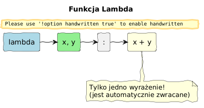

# Rachunek lambda i funkcje lambda w Pythonie

> **Cel:** Poznanie podstaw rachunku lambda (Lambda Calculus) oraz jego implementacji w języku Python w postaci funkcji anonimowych.

---

## 1. Czym są funkcje lambda (anonimowe)?

Funkcja lambda to skrócona forma zapisu funkcji, która nie posiada nazwy (jest anonimowa). W Pythonie tworzymy ją za pomocą słowa kluczowego `lambda`.

### Składnia

```python
# lambda parametry: wyrażenie
kwadrat = lambda x: x * x
```



Jest to równoważne (z grubsza) z:

```python
def kwadrat(x):
    return x * x
```

Główna różnica:
- **Tylko jedno wyrażenie**: Ciało lambdy musi składać się z pojedynczego wyrażenia. Nie może zawierać instrukcji złożonych (`if`, `for`, `print`), chyba że są to wyrażenia (np. `x if condition else y`).
- **Automatyczny return**: Wynik wyrażenia jest automatycznie zwracany.

---

## 2. Podstawy rachunku lambda (Lambda Calculus)

Lambda rachunek to system formalny w logice matematycznej, służący do badania definicji funkcji, ich zastosowania i rekurencji. Został wprowadzony przez **Alonzo Churcha** w latach 30. XX wieku.

Jest to **najmniejszy uniwersalny język programowania**. Każdy obliczalny algorytm można wyrazić w rachunku lambda (Równoważność Turinga).

Podstawowe operacje:
1.  **Abstrakcja lambda** definition funkcji):
    - $(\lambda x. M)$
    - Oznacza funkcję przyjmującą argument $x$ i zwracającą wynik $M$.
    - W Pythonie: `lambda x: M`

2.  **Aplikacja** (wywołanie funkcji):
    - $(M N)$
    - Oznacza zastosowanie funkcji $M$ do argumentu $N$.
    - W Pythonie: `M(N)`

### Przykład: Funkcja tożsamościowa (Identity)

- Lambda rachunek: $\lambda x. x$
- Python: `lambda x: x`

### Przykład: Funkcja stała

- Lambda rachunek: $\lambda x. y$
- Python: `lambda x: y` (zwraca `y` niezależnie od `x`)

### Ważne pojęcia

- **Funkcje anonimowe**: W rachunku lambda funkcje nie mają nazw. Są tylko definicjami.
- **Funkcje wyższego rzędu**: Funkcje mogą przyjmować inne funkcje jako argumenty i zwracać funkcje jako wynik.
- **Domknięcia (Closures)**: Funkcje mogą "pamiętać" zmienne ze swojego otoczenia.

---

## 3. Python a Lambda Calculus

Chociaż Python nie jest czysto funkcyjnym językiem (jak Haskell), czerpie z niego wiele inspiracji.

```python
# Funkcja wyższego rzędu
def aplikuj(funkcja, wsad):
    return funkcja(wsad)

wynik = aplikuj(lambda x: x + 1, 10)
print(wynik)  # 11
```

---

## Referencje

### Literatura
- "Introduction to Lambda Calculus" (H. P. Barendregt) - klasyk.
- "SICP (Structure and Interpretation of Computer Programs)" - rozdział o funkcyjnym podejściu.
- "Type Theory and Functional Programming" (Simon Thompson).

### Źródła internetowe
- [Lambda Expressions (Python Docs)](https://docs.python.org/3/tutorial/controlflow.html#lambda-expressions)
- [A Tutorial Introduction to the Lambda Calculus](http://www.inf.fu-berlin.de/lehre/WS03/alpi/lambda.pdf)
- [Functional Programming HOWTO (Python Docs)](https://docs.python.org/3/howto/functional.html)

