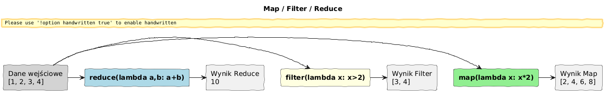

# Przykłady wykorzystania funkcji lambda w Pythonie

> **Cel:** Poznanie praktycznych zastosowań funkcji lambda, szczególnie w przetwarzaniu struktur danych i operacjach funkcyjnych (`map`, `filter`, `reduce`, `sorted`).

---

## 1. Sortowanie list i słowników (`key`)

Funkcja `lambda` jest często używana jako argument `key` w sortowaniu.

```python
studenci = [
    ("Jan", 3.0),
    ("Anna", 4.5),
    ("Piotr", 4.0)
]

# Sortowanie po średniej (drugi element krotki)
studenci.sort(key=lambda x: x[1], reverse=True)
print(studenci)  # [('Anna', 4.5), ('Piotr', 4.0), ('Jan', 3.0)]
```

## 2. Funkcje wyższego rzędu



### `map(funkcja, sekwencja)`

Aplikuje funkcję do każdego elementu sekwencji. Zwraca iterator (obiekt leniwy).

```python
liczby = [1, 2, 3, 4]
kwadraty = list(map(lambda x: x**2, liczby))
print(kwadraty)  # [1, 4, 9, 16]
```

### `filter(warunek, sekwencja)`

Zwraca elementy sekwencji, dla których `warunek(element)` zwraca `True` (lub wartość truthy).

```python
parzyste = list(filter(lambda x: x % 2 == 0, liczby))
print(parzyste)  # [2, 4]
```

### `reduce(funkcja, sekwencja, poczatek)`

Redukuje (zwija) sekwencję do jednej wartości. Wymaga importu z `functools`.

```python
from functools import reduce
suma = reduce(lambda a, b: a + b, liczby, 0)
print(suma)  # 10
```

> ⚠️ **Uwaga:** Choć `map` i `filter` są przydatne, w Pythonie często preferowane są **list comprehensions** ze względu na czytelność i wydajność.

## 3. Przykład: API Helper (Dive into Python)

Klasyczny przykład z książki *Dive into Python* Marka Pilgrima, pokazujący potęgę introspekcji i lambd. Służy do automatycznego wypisywania dokumentacji metod obiektu.

```python
def api_help(obj, spacing=10, collapse=1):
    """Wypisuje metody obiektu w sformatowanej tabeli."""
    metody = [attr for attr in dir(obj) if callable(getattr(obj, attr))]
    process_func = collapse and (lambda s: " ".join(s.split())) or (lambda s: s)
    print("\n".join(["%s %s" % (method.ljust(spacing),
                               process_func(str(getattr(obj, method).__doc__)))
                     for method in metody]))
```

Analiza:
- `getattr(obj, attr)`: Dynamiczne pobranie atrybutu/metody po nazwie.
- `callable(...)`: Sprawdzenie czy to funkcja/metoda.
- Lambda w `process_func`: Warunkowy wybór funkcji formatującej (jednolinijkowy `if/else` w starym stylu Pythona). Dziś zrobilibyśmy to wyrażeniem warunkowym `... if collapse else ...`.

---

## Referencje

### Literatura
- Pilgrim, M. (2004). *Dive Into Python*. Apress. Rozdział 4 (The Power of Introspection).
- Lutz, M. (2013). *Learning Python*, 5th ed. O'Reilly. Rozdział 19 (Advanced Function Topics).

### Źródła internetowe
- [Functional Programming HOWTO (Python Docs)](https://docs.python.org/3/howto/functional.html)
- [List Comprehensions vs Map/Filter (Real Python)](https://realpython.com/list-comprehension-python/#list-comprehensions-vs-map-and-filter)

