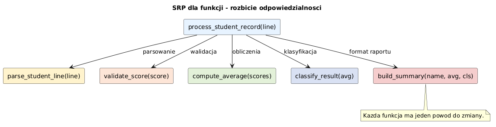

# 05 - SRP: Zasada pojedynczej odpowiedzialnosci dla funkcji

> **Cel:** Zrozumienie zasady SRP (Single Responsibility Principle) w kontekscie funkcji Pythona oraz umiejetnosc rozbijania zbyt zlozonych funkcji na mniejsze, latwiejsze do testowania elementy.

---

## Co to jest SRP?

**SRP (Single Responsibility Principle)** mowi, ze modul (tu: funkcja) powinien miec **jeden powod do zmiany**.

W praktyce dla funkcji oznacza to:
- funkcja powinna robic **jedna rzecz**,
- nazwa funkcji powinna jasno opisywac to jedno zadanie,
- logika walidacji, obliczen, I/O i formatowania nie powinna byc mieszana bez potrzeby.

Przyklad objawu naruszenia SRP:
- jedna funkcja jednoczesnie: wczytuje plik, parsuje dane, liczy statystyki, zapisuje raport i wysyla email.

---

## Dlaczego SRP jest wazna?

1. **Latwiejsze testowanie** - testujesz male funkcje zamiast monolitu.
2. **Lepsza czytelnosc** - kod jest podzielony na kroki, a nie na jeden dlugi blok.
3. **Latwiejsza modyfikacja** - zmiana jednego kroku nie psuje pozostalych.
4. **Ponowne uzycie kodu** - male funkcje da sie wykorzystac w innych scenariuszach.
5. **Mniej bledow** - ograniczasz efekty uboczne.



---

## Przyklad: antywzorzec (funkcja "wszystko-w-jednym")

```python
def przetworz_oceny(lines: list[str]) -> str:
    # 1) parsowanie
    parsed = []
    for line in lines:
        name, raw = line.split(",")
        parsed.append((name.strip(), float(raw.strip())))

    # 2) walidacja
    for name, grade in parsed:
        if grade < 2.0 or grade > 5.0:
            raise ValueError(f"Niepoprawna ocena: {name} -> {grade}")

    # 3) obliczenia
    avg = sum(g for _, g in parsed) / len(parsed)

    # 4) formatowanie raportu
    return f"Liczba ocen: {len(parsed)}\nSrednia: {avg:.2f}"
```

Problem: ta funkcja ma wiele odpowiedzialnosci (parsowanie, walidacja, obliczenia, formatowanie).

---

## Refaktoryzacja zgodna z SRP

```python
def parse_grade_line(line: str) -> tuple[str, float]:
    name, raw = line.split(",")
    return name.strip(), float(raw.strip())


def validate_grade(grade: float) -> None:
    if grade < 2.0 or grade > 5.0:
        raise ValueError("Ocena poza zakresem 2.0-5.0")


def average(grades: list[float]) -> float:
    if not grades:
        raise ValueError("Brak ocen")
    return sum(grades) / len(grades)


def format_report(count: int, avg: float) -> str:
    return f"Liczba ocen: {count}\nSrednia: {avg:.2f}"
```

Tu kazda funkcja odpowiada za jedno zadanie.

---

## Wieksze przyklady kodu

- [`examples/monolith_vs_srp.py`](examples/monolith_vs_srp.py) - porownanie wersji monolitycznej i rozbitej wg SRP.
- [`examples/grade_report_pipeline.py`](examples/grade_report_pipeline.py) - mini-pipeline: parse -> validate -> aggregate -> format.

Uruchomienie:

```bash
python 05-SRP/examples/monolith_vs_srp.py
python 05-SRP/examples/grade_report_pipeline.py
```

---

## Zadania do samodzielnego rozwiazania

Pliki zadan:
- [`exercises/tasks.py`](exercises/tasks.py)
- [`exercises/solutions_srp.py`](exercises/solutions_srp.py)
- [`exercises/test_solutions.py`](exercises/test_solutions.py)

```bash
pytest 05-SRP/exercises/test_solutions.py -v
```

### Lista zadan

1. `parse_student_line(line)` - parsowanie pojedynczej linii CSV.
2. `validate_score(score)` - walidacja punktow 0-100.
3. `compute_average(scores)` - obliczenie sredniej.
4. `build_summary(name, avg)` - formatowanie komunikatu wynikowego.
5. `classify_result(avg)` - klasyfikacja wyniku na progach.
6. `process_student_record(line)` - orkiestracja krokow przez male funkcje.

---

## Referencje

### Literatura
- Martin, R.C. (2008). *Clean Code*. Prentice Hall. (zasady projektowania funkcji)
- Martin, R.C. (2017). *Clean Architecture*. Prentice Hall. (SOLID, w tym SRP)
- Lutz, M. (2013). *Learning Python*, 5th ed. O'Reilly.

### Zrodla internetowe
- [The Single Responsibility Principle - Martin](https://en.wikipedia.org/wiki/Single-responsibility_principle)
- [SOLID Principles in Python (Real Python)](https://realpython.com/solid-principles-python/)
- [Python Testing with pytest](https://docs.pytest.org/)

