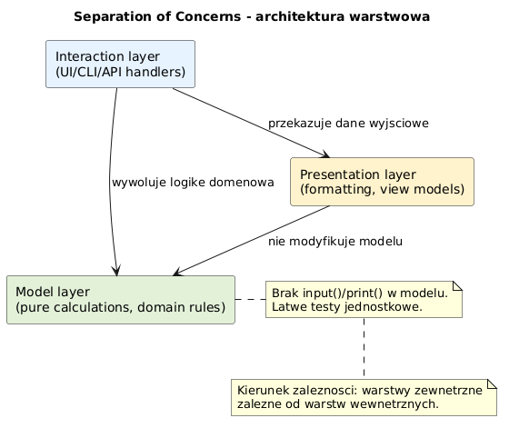
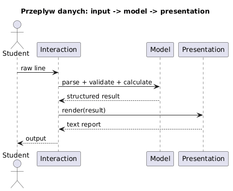
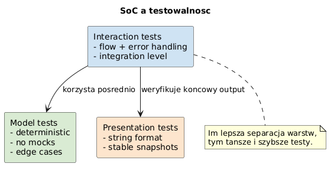

# 06 - Separation of Concerns (SoC)

> **Cel:** Pokazac, jak projektowac kod funkcyjny w Pythonie tak, aby byl czytelny, testowalny i odporny na zmiany dzieki wyraznemu rozdzieleniu odpowiedzialnosci.

---

## Kontekst i idea

Edsger W. Dijkstra podkreslal, ze przy zlozonych problemach trzeba swiadomie oddzielac aspekty, o ktorych myslimy. W praktyce programistycznej oznacza to wyznaczanie granic miedzy czesciami systemu.

To jest istota **Separation of Concerns**: inna czesc odpowiada za logike obliczen, inna za prezentacje, a jeszcze inna za interakcje z uzytkownikiem. Dzieki temu kazda warstwa moze byc analizowana i testowana niezaleznie.

> "The separation of concerns ... is the only available technique for effective ordering of one's thoughts."
> Edsger W. Dijkstra

---

## SoC a SRP

- **SRP (Single Responsibility Principle):** pojedyncza funkcja lub modul ma jeden powod do zmiany.
- **SoC (Separation of Concerns):** caly system ma oddzielone obszary odpowiedzialnosci.

SRP porzadkuje kod lokalnie (na poziomie funkcji), a SoC porzadkuje architekture globalnie (na poziomie warstw i przeplywu danych).

---

## Architektura warstwowa w tym rozdziale

Przyjmujemy 3 warstwy:

1. **Model obliczen** - logika domenowa i obliczenia bez I/O.
2. **Prezentacja** - formatowanie wyniku dla odbiorcy.
3. **Interakcja** - wejscie/wyjscie, orkiestracja przeplywu, obsluga bledow.

### Diagramy





Pliki zrodlowe diagramow PlantUML:
- [`diagrams/layered_architecture.puml`](diagrams/layered_architecture.puml)
- [`diagrams/request_flow.puml`](diagrams/request_flow.puml)
- [`diagrams/testability_map.puml`](diagrams/testability_map.puml)

---

## Przyklady kodu

- [`examples/monolith_vs_layers.py`](examples/monolith_vs_layers.py) - porownanie podejscia monolitycznego z warstwowym.
- [`examples/layered_grade_app.py`](examples/layered_grade_app.py) - aplikacja ocen z wyraznym podzialem na warstwy.

Uruchomienie:

```bash
python src/_02-functions/06-separation-of-concerns/examples/monolith_vs_layers.py
python src/_02-functions/06-separation-of-concerns/examples/layered_grade_app.py
```

---

## Zadania do samodzielnego rozwiazania

Pliki zadan:
- [`exercises/tasks.py`](exercises/tasks.py)
- [`exercises/solutions_separation_of_concerns.py`](exercises/solutions_separation_of_concerns.py)
- [`exercises/test_solutions.py`](exercises/test_solutions.py)

```bash
python -m pytest src/_02-functions/06-separation-of-concerns/exercises/test_solutions.py -v
```

Zakres zadan obejmuje m.in. parsowanie, walidacje, obliczenia, decyzje PASS/FAIL, prezentacje oraz orkiestracje przeplywu miedzy warstwami.

---

## Referencje

### Literatura
- Dijkstra, E. W. *On the role of scientific thought*.
- Martin, R. C. (2008). *Clean Code*. Prentice Hall.
- Martin, R. C. (2017). *Clean Architecture*. Prentice Hall.

### Zrodla internetowe
- [EWD Archive (UT Austin)](https://www.cs.utexas.edu/~EWD/)
- [Separation of Concerns - Wikipedia](https://en.wikipedia.org/wiki/Separation_of_concerns)
- [pytest documentation](https://docs.pytest.org/)
