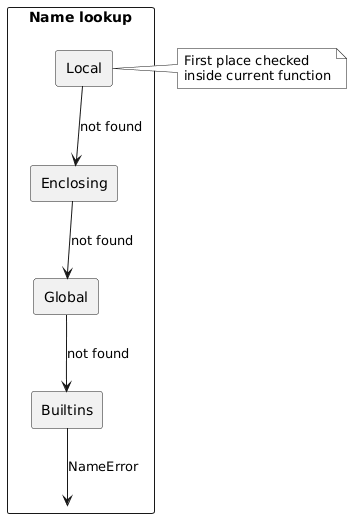

# 01 - Przestrzenie nazw

## Cel

Zrozumienie, czym są przestrzenie nazw (`namespaces`), jak działa reguła LEGB i dlaczego ten mechanizm porządkuje kod w dużych programach.

## Dlaczego namespace istnieje?

Bez namespaces identyfikator `count` z jednego fragmentu kodu mógłby przypadkowo nadpisać `count` z innego miejsca.

Przestrzeń nazw to **mapowanie**:
- klucz: nazwa symbolu (np. `count`, `print`, `VALUE`),
- wartość: obiekt Pythona (np. `int`, funkcja, klasa, moduł).

W praktyce w Pythonie osobnymi przestrzeniami nazw są m.in.:
- moduł,
- funkcja,
- klasa,
- wbudowany namespace `builtins`.

## LEGB w Pythonie

Kolejność szukania nazwy:
1. **L**ocal - bieżąca funkcja,
2. **E**nclosing - funkcja zewnętrzna (closure),
3. **G**lobal - moduł,
4. **B**uiltins - `len`, `sum`, `print` itd.

Diagram: `diagrams/legb_lookup.png`



## Krok po kroku na kodzie

Plik: `examples/namespace_demo.py`

```python
VALUE = "global-value"

def legb_demo() -> tuple[str, str, str]:
    value = "enclosing-value"

    def inner() -> tuple[str, str, str]:
        value = "local-value"
        return value, VALUE, str(len([1, 2, 3]))

    return inner()
```

Interpretacja:
- `value` w `inner()` to poziom **L**,
- `VALUE` jest znalezione na poziomie **G** (moduł),
- `len` pochodzi z **B** (builtins),
- poziom **E** istnieje (`value = "enclosing-value"`), ale tutaj jest przesłonięty przez lokalne `value`.

To zjawisko nazywamy **cieniowaniem** (shadowing): ta sama nazwa może występować na wielu poziomach, ale widoczna jest najbliższa.

## `locals()` i `globals()`

W tym samym pliku funkcja `snapshot_symbol_tables()` pokazuje, że:
- `locals()` zwraca symbole aktualnego scope,
- `globals()` zwraca symbole modułu.

To bardzo przydatne podczas diagnostyki błędów typu `NameError`.

## Mini-lab: LEGB w praktyce

### Cele
- utrwalić kolejność LEGB,
- rozpoznać cieniowanie nazw,
- zrozumieć różnicę między `globals()` a `locals()`.

### Kroki
1. Uruchom `examples/namespace_demo.py`.
2. Zmień nazwę lokalnej zmiennej `value` w `inner()` na `inner_value`.
3. Ponownie uruchom skrypt i porównaj wynik `legb_demo()`.
4. Dopisz `print("value" in globals())` i `print("value" in locals())` wewnątrz `legb_demo()`.

### Oczekiwany efekt
- Student potrafi wskazać, z którego poziomu LEGB pochodzi każda nazwa.

### Rozszerzenie
- Dodaj własną funkcję z `nonlocal` i sprawdź, jak zmienia się zachowanie zmiennej poziomu E.

## Zadania i rozszerzenia

- `exercises/tasks.py` - zadania do samodzielnego rozwiązania,
- `exercises/solutions_namespaces.py` - przykładowe rozwiązania,
- `exercises/test_solutions.py` - testy.

## Typowe pułapki

- oczekiwanie, że `globals()` zawiera symbole lokalne funkcji,
- przypadkowe cieniowanie nazw z `builtins` (np. `list = [...]`),
- mylenie „nazwa” z „obiektem” (nazwa wskazuje obiekt, nie przechowuje go fizycznie).

## Pytania kontrolne

1. Co się stanie, gdy usuniesz lokalne `value` z `inner()`?
2. Dlaczego `len` nie pojawia się w `globals()`, a mimo to działa?
3. Czym różni się scope funkcji od przestrzeni nazw modułu?

## Literatura

- https://docs.python.org/3/tutorial/classes.html#python-scopes-and-namespaces
- https://realpython.com/python-scope-legb-rule/
