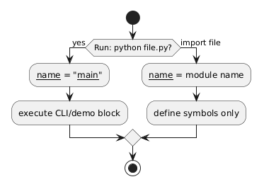

# 02 - Moduł vs skrypt i `__main__`

## Cel

Wyjaśnić, kiedy plik `.py` działa jako moduł importowany, a kiedy jako skrypt uruchamiany bezpośrednio.

## Kluczowa zasada

Każdy plik `.py` jest modułem. Różnica dotyczy sposobu uruchomienia:
- `python file.py` -> `__name__ == "__main__"`,
- `import file` -> `__name__ == "file"`.

Dzięki temu można oddzielić:
- API (funkcje do importu),
- kod uruchamiany interaktywnie lub z CLI.

Diagram: `diagrams/module_vs_script.png`



## Krok po kroku na kodzie

Plik: `examples/calc_module.py`

```python
def add(a: float, b: float) -> float:
    return a + b

def multiply(a: float, b: float) -> float:
    return a * b

def main() -> None:
    print("2 + 3 =", add(2, 3))

if __name__ == "__main__":
    main()
```

Dlaczego to jest dobre podejście:
- importując moduł w innym pliku, dostajesz tylko funkcje (`add`, `multiply`),
- kod demonstracyjny `main()` nie uruchamia się „sam” przy imporcie,
- testowanie jest prostsze, bo funkcje są czyste i niezależne od CLI.

## Drugi przykład: osobny plik uruchamiający

Plik: `examples/run_as_module.py` importuje `add` i uruchamia prosty scenariusz.
To symuluje sytuację, gdy masz wiele modułów i jeden punkt wejścia programu.

## Polecane uruchomienia

```bash
python src/_03-modules/02-module-vs-script/examples/calc_module.py
python src/_03-modules/02-module-vs-script/examples/run_as_module.py
```

## Mini-lab: rozdzielenie API i CLI

### Cele
- odróżnić kod biblioteczny od kodu uruchamialnego,
- utrwalić znaczenie `__name__`,
- sprawdzić wpływ na testowalność.

### Kroki
1. Dodaj funkcję `subtract(a, b)` do `examples/calc_module.py`.
2. Użyj jej w `main()`.
3. W osobnym pliku zaimportuj `subtract` i wywołaj ją bez uruchamiania `main()`.
4. Sprawdź, że import nie uruchamia kodu demonstracyjnego.

### Oczekiwany efekt
- Student umie zaprojektować moduł, który jest jednocześnie wygodny do importu i uruchamiania.

### Rozszerzenie
- Dodaj `argparse` w `main()` i obsłuż argumenty z wiersza poleceń.

## Zadania i rozszerzenia

- `exercises/tasks.py` - klasyfikacja trybu uruchomienia,
- `exercises/solutions_module_vs_script.py` - referencyjna implementacja,
- `exercises/test_solutions.py` - testy.

## Typowe pułapki

- umieszczanie całej logiki programu w bloku `if __name__ == "__main__":`,
- importowanie z plików, które mają efekty uboczne już przy imporcie,
- mieszanie kodu bibliotecznego i kodu prezentacyjnego w jednej funkcji.

## Pytania kontrolne

1. Co dokładnie oznacza wartość `__name__` podczas importu?
2. Dlaczego blok `if __name__ == "__main__":` poprawia testowalność?
3. Kiedy warto wydzielić oddzielny plik „runner”?

## Literatura

- https://docs.python.org/3/library/__main__.html
- https://docs.python.org/3/tutorial/modules.html

