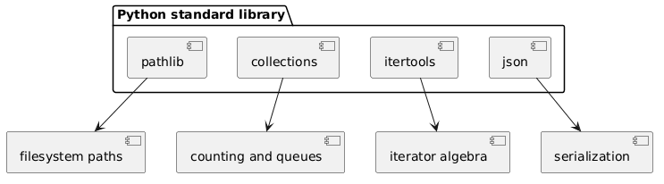

# 03 - Standardowa biblioteka (batteries included)

## Cel

Pokazać, że Python posiada bogaty zestaw gotowych narzędzi: pracę z plikami, strukturami danych, JSON, iteratorami i metadanymi.

## Co oznacza batteries included?

W wielu językach trzeba od razu instalować zewnętrzne biblioteki do podstawowych zadań.
W Pythonie dużą część tych potrzeb pokrywa biblioteka standardowa, co daje:
- mniej zależności,
- mniejsze ryzyko konfliktów wersji,
- szybszy start projektu.

## Krok po kroku na kodzie

Plik: `examples/stdlib_showcase.py`

### 1) Zliczanie słów przez `Counter`

```python
from collections import Counter

def count_words(text: str) -> Counter:
    words = [w.lower() for w in text.split()]
    return Counter(words)
```

Interpretacja: `Counter` to słownik „element -> liczba wystąpień”.
Dobry do histogramów, analizy logów i prostych statystyk.

### 2) Kombinacje przez `itertools`

```python
from itertools import combinations

def choose_pairs(items: list[str]) -> list[tuple[str, str]]:
    return list(combinations(items, 2))
```

Interpretacja: `itertools` pozwala pisać kod deklaratywnie i bez ręcznego zagnieżdżania pętli.

### 3) Serializacja danych przez `json`

```python
import json

def to_json(data: dict) -> str:
    return json.dumps(data, ensure_ascii=False, sort_keys=True)
```

Interpretacja: to podstawa przy API, konfiguracji i zapisie wyników eksperymentów.

### 4) Operacje na ścieżkach przez `pathlib`

`Path` daje obiektowy interfejs do ścieżek i jest czytelniejszy niż ręczne składanie stringów.

Diagram: `diagrams/stdlib_map.png`



## Mini-lab: narzędzia stdlib w jednym scenariuszu

### Cele
- dobrać moduł standardowy do zadania,
- przetworzyć dane tekstowe i zapisać wynik,
- porównać kod „ręczny” z kodem opartym o stdlib.

### Kroki
1. Użyj `count_words()` do policzenia słów w krótkim tekście.
2. Wygeneruj pary elementów przez `choose_pairs()`.
3. Zapisz wynik do JSON przez `to_json()`.
4. Porównaj czytelność z wersją napisaną bez `Counter` i `itertools`.

### Oczekiwany efekt
- Student umie uzasadnić, dlaczego użycie stdlib skraca i upraszcza kod.

### Rozszerzenie
- Dodaj obsługę pliku wejściowego i użyj `pathlib.Path.read_text()`.

## Jak dobierać moduł z biblioteki standardowej

- analiza tekstu -> `re`, `string`, `collections`,
- pliki i katalogi -> `pathlib`, `shutil`, `os`,
- daty i czas -> `datetime`, `zoneinfo`,
- formaty danych -> `json`, `csv`, `xml`.

Zasada praktyczna: najpierw sprawdź stdlib, dopiero potem PyPI.

## Powiązane zadania

- `exercises/tasks.py` - implementacja histogramu i par,
- `exercises/solutions_stdlib.py` - wzorcowe rozwiązanie,
- `exercises/test_solutions.py` - testy.

## Typowe pułapki

- implementowanie od zera tego, co już jest w stdlib,
- ignorowanie dokumentacji i parametrów funkcji,
- nadmierne importy `*` zamiast precyzyjnego importowania.

## Pytania kontrolne

1. Dlaczego `Counter` jest lepszy od ręcznego licznika w wielu przypadkach?
2. Czym różni się `itertools.combinations` od zagnieżdżonej pętli?
3. Kiedy `json.dumps` może zwrócić wynik inny niż oczekiwany bez `sort_keys=True`?

## Literatura

- https://docs.python.org/3/library/
- https://docs.python.org/3/library/pathlib.html
- https://docs.python.org/3/library/collections.html
- https://docs.python.org/3/library/itertools.html
- https://docs.python.org/3/library/json.html
