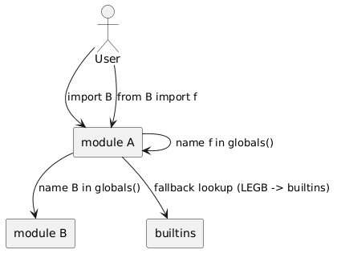

# 04 - Importy i tablice symboli

## Cel

Praktycznie porownac:
- `import modul` vs `from modul import symbol`,
- importy bezwzgledne i wzgledne,
- przestrzen `builtins`,
- dzialanie `globals()` i `locals()` oraz czas zycia nazw.

## Najwazniejsze obserwacje

1. `import math` tworzy nazwe `math` w module.
2. `from math import sqrt` tworzy bezposrednia nazwe `sqrt`.
3. `globals()` opisuje przestrzen modulu, `locals()` - biezacy scope.
4. W funkcji lokalne symbole znikaja po wyjsciu z funkcji (jesli nie sa domkniete przez closure).

Diagram: `diagrams/import_styles.png`

## Kod referencyjny

- `examples/import_styles.py`
- `examples/symbol_tables.py`
- `exercises/solutions_imports.py`

## Literatura

- https://docs.python.org/3/reference/import.html
- https://docs.python.org/3/library/functions.html#globals
- https://docs.python.org/3/library/functions.html#locals

