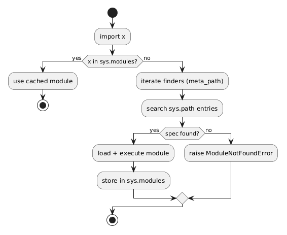

# 05 - Mechanizm importowania i PYTHONPATH

## Cel

Wyjaśnić, jak interpreter odnajduje moduł i pakiet, jaką rolę mają `sys.path`, katalog roboczy i zmienna `PYTHONPATH`.

## Jak Python szuka modułu?

W uproszczeniu:
1. sprawdza cache `sys.modules`,
2. przechodzi po wpisach `sys.meta_path`,
3. przeszukuje ścieżki w `sys.path` (m.in. katalog skryptu i katalogi z `PYTHONPATH`).

Diagram: `diagrams/import_resolution.png`



## Co oznacza to w praktyce

- Jeśli moduł był już załadowany, import jest szybki (z cache).
- Jeśli nie, Python szuka specyfikacji modułu (`ModuleSpec`).
- Brak specyfikacji kończy się `ModuleNotFoundError`.

To wyjaśnia, dlaczego ten sam kod może działać w jednym katalogu roboczym, a nie działać w innym.

## Krok po kroku na kodzie

Plik: `examples/path_inspector.py`

```python
def read_environment() -> dict[str, str]:
    return {
        "PYTHONPATH": os.environ.get("PYTHONPATH", "<not-set>"),
        "first_sys_path": sys.path[0] if sys.path else "<empty>",
    }
```

Interpretacja:
- `PYTHONPATH` rozszerza miejsca, gdzie Python szuka modułów,
- `sys.path[0]` zwykle wskazuje katalog uruchamianego skryptu.

Plik: `examples/find_module.py`

```python
def find_module_origin(module_name: str) -> str | None:
    spec = importlib.util.find_spec(module_name)
    if spec is None:
        return None
    return spec.origin
```

To wygodny sposób sprawdzenia, skąd faktycznie ładuje się moduł (plik, built-in, brak).

## Mini-lab: diagnoza `ModuleNotFoundError`

### Cele
- opanować procedurę diagnostyczną,
- rozróżniać problem ścieżki od problemu kodu,
- utrwalić rolę `sys.path`.

### Kroki
1. Uruchom `examples/path_inspector.py` i zapisz wynik.
2. Uruchom ten sam plik z innego katalogu roboczego.
3. Porównaj `first_sys_path`.
4. Użyj `examples/find_module.py` dla modułu istniejącego i nieistniejącego.
5. Opisz, kiedy pojawi się `None` i co to oznacza.

### Oczekiwany efekt
- Student potrafi metodycznie wyjaśnić źródło błędu importu.

### Rozszerzenie
- Tymczasowo ustaw `PYTHONPATH` na własny katalog i sprawdź, jak zmienia się wynik wyszukiwania.

## Diagnostyka `ModuleNotFoundError` - procedura

1. sprawdź katalog roboczy,
2. wypisz `sys.path`,
3. sprawdź `PYTHONPATH`,
4. użyj `find_spec` dla problematycznego modułu,
5. dopiero potem modyfikuj strukturę pakietu lub importy.

## Powiązane zadania

- `exercises/tasks.py` - klasyfikacja pochodzenia modułu i widoczności ścieżek,
- `exercises/solutions_import_mechanism.py` - rozwiązania,
- `exercises/test_solutions.py` - testy.

## Typowe pułapki

- ręczne dopisywanie niepoprawnych ścieżek do `sys.path`,
- zależność od konkretnego IDE bez rozumienia katalogu startowego,
- mylenie `PYTHONPATH` z instalacją pakietu przez `pip`.

## Pytania kontrolne

1. Co daje cache `sys.modules`?
2. Kiedy `find_spec` zwróci `None`?
3. Czym różni się widoczność modułu od poprawności samego kodu modułu?

## Literatura

- https://docs.python.org/3/reference/import.html
- https://docs.python.org/3/library/sys.html#sys.path
- https://docs.python.org/3/using/cmdline.html#envvar-PYTHONPATH
