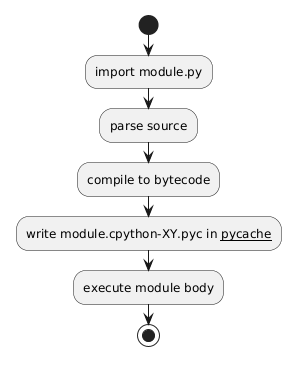

# 06 - Kompilacja modułów, __pycache__, .pyc

## Cel

Pokazać, co Python kompiluje podczas importu i jaki jest sens plików `.pyc`.

## Kluczowe fakty

- Python kompiluje kod źródłowy `.py` do bytecode.
- Bytecode trafia do cache: katalog `__pycache__/`.
- Nazwa pliku `.pyc` zawiera tag wersji interpretera, np. `module.cpython-313.pyc`.
- Cache przyspiesza kolejne importy, ale nie zmienia logiki programu.

Diagram: `diagrams/pycache_flow.png`



## Co to znaczy „kompilacja” w Pythonie

Python nie kompiluje domyślnie do kodu maszynowego jak C/C++.
Kompiluje do **bytecode**, który potem wykonuje maszyna wirtualna CPython.

Dlatego:
- start jest szybki,
- kod pozostaje przenośny,
- cache `pyc` jest zależny od wersji interpretera.

## Krok po kroku na kodzie

Plik: `examples/compile_demo.py`

```python
def compile_file(path: str) -> pathlib.Path:
    source = pathlib.Path(path)
    py_compile.compile(str(source), cfile=None, doraise=True)
    cache_dir = source.parent / "__pycache__"
    candidates = sorted(cache_dir.glob(f"{source.stem}*.pyc"))
    if not candidates:
        raise FileNotFoundError("Nie znaleziono pliku .pyc")
    return candidates[-1]
```

Interpretacja:
- funkcja wymusza kompilację,
- potem znajduje wygenerowany plik `.pyc`,
- można od razu zobaczyć, jak Python nazywa cache.

Plik: `examples/cache_info.py` pokazuje, jak listować wszystkie `.pyc` w katalogu.

## Mini-lab: obserwacja cache bytecode

### Cele
- sprawdzić, kiedy Python odświeża `.pyc`,
- odróżnić kod źródłowy od cache,
- zrozumieć wpływ wersji interpretera na nazwę pliku `.pyc`.

### Kroki
1. Uruchom `examples/compile_demo.py`.
2. Odszukaj wygenerowany plik w `__pycache__/`.
3. Zmień jedną linię kodu źródłowego i uruchom ponownie.
4. Porównaj datę modyfikacji pliku `.pyc`.
5. Uruchom `examples/cache_info.py` i wypisz wszystkie pliki cache.

### Oczekiwany efekt
- Student rozumie, że usunięcie `__pycache__` nie psuje programu, tylko wymusza ponowne wygenerowanie cache.

### Rozszerzenie
- Porównaj nazwę `.pyc` na dwóch różnych wersjach Pythona.

## Powiązane zadania

- `exercises/tasks.py` - budowanie nazwy `.pyc` i decyzja o rekompilacji,
- `exercises/solutions_compilation.py` - rozwiązania,
- `exercises/test_solutions.py` - testy.

## Typowe pułapki

- przekonanie, że usunięcie `__pycache__` psuje kod (nie psuje, Python odtworzy cache),
- kopiowanie `.pyc` między różnymi wersjami interpretera,
- mylenie bytecode z kodem maszynowym.

## Pytania kontrolne

1. Dlaczego plik `.pyc` zawiera tag wersji Pythona?
2. Co się stanie po usunięciu `__pycache__/`?
3. Czy `.pyc` zmienia wynik działania programu?

## Literatura

- https://docs.python.org/3/library/py_compile.html
- https://docs.python.org/3/reference/import.html

