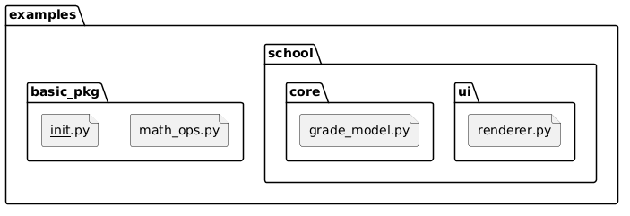

# 07 - Pakiety i `__init__.py`

## Cel

Wyjaśnić, czym jest pakiet, jak go budować i jak zmieniło się znaczenie pliku `__init__.py` po Python 3.3 (namespace packages).

## Definicje

- **Moduł**: pojedynczy plik `.py`.
- **Pakiet**: katalog grupujący moduły.
- **`__init__.py`**:
  - dawniej wymagany, aby katalog był pakietem,
  - dziś opcjonalny dla namespace packages (Python 3.3+, PEP 3147),
  - nadal przydatny do definiowania API pakietu.

Diagram: `diagrams/package_layout.png`



## Po co pakiety?

Pakiety rozwiązują trzy typowe problemy:
1. porządkują dużą bazę kodu,
2. ograniczają kolizje nazw,
3. pozwalają projektować publiczne API.

## Krok po kroku na kodzie

### Prosty pakiet: `examples/basic_pkg/`

Plik: `examples/basic_pkg/__init__.py`

```python
from .math_ops import add, mean

__all__ = ["add", "mean"]
```

Interpretacja:
- `__init__.py` definiuje, co jest „oficjalnym” API pakietu,
- `__all__` to lista nazw publicznych; określa, co ma być eksportowane przy `from basic_pkg import *`,
- elementy spoza `__all__` traktujemy jako wewnętrzne (nie są domyślnie eksportowane „gwiazdką”),
- użytkownik pakietu importuje wygodnie: `from basic_pkg import add`.

### Większy przykład: `examples/school/`

- `core/grade_model.py` - logika obliczeń,
- `ui/renderer.py` - formatowanie wyniku.

To mini-przykład separacji odpowiedzialności wewnątrz pakietu.

### Uruchomienie całości

Plik `examples/package_demo.py` łączy oba pakiety i pokazuje prosty przepływ:
1. obliczenia,
2. prezentacja,
3. wynik dla użytkownika.

## Mini-lab: własny pakiet z API

### Cele
- zbudować mały pakiet z czytelnym interfejsem,
- użyć `__init__.py` do kontrolowania eksportu,
- oddzielić logikę od warstwy prezentacji.

### Kroki
1. Dodaj w `examples/basic_pkg/math_ops.py` nową funkcję `median(values)`.
2. Wyeksportuj ją w `examples/basic_pkg/__init__.py`.
3. Użyj nowej funkcji w `examples/package_demo.py`.
4. Uruchom skrypt i sprawdź wynik.

### Oczekiwany efekt
- Student umie zaprojektować prosty pakiet i świadomie wystawić publiczne API.

### Rozszerzenie
- Rozbij `school/` na dodatkową warstwę usług i oceń wpływ na testowalność.

## Namespace packages (Python 3.3+)

Możliwe są pakiety bez `__init__.py`, ale:
- są bardziej zaawansowane,
- wymagają dobrego zrozumienia systemu importu,
- na początku kursu zwykle wygodniej stosować klasyczne pakiety z `__init__.py`.

### Minimalny przykład namespace package

Załóżmy, że ten sam pakiet logiczny `acme_tools` jest rozdzielony na dwa katalogi źródłowe.
**Ważne:** w katalogu `acme_tools/` nie ma pliku `__init__.py`.

```text
examples/namespace_demo/
  src_a/
    acme_tools/
      text_utils.py
  src_b/
    acme_tools/
      math_utils.py
  main.py
```

Plik: `examples/namespace_demo/src_a/acme_tools/text_utils.py`

```python
def shout(message: str) -> str:
    return message.upper() + "!"
```

Plik: `examples/namespace_demo/src_b/acme_tools/math_utils.py`

```python
def square(x: int) -> int:
    return x * x
```

Plik: `examples/namespace_demo/main.py`

```python
from acme_tools.text_utils import shout
from acme_tools.math_utils import square


def main() -> None:
    print(shout("python"))
    print(square(7))


if __name__ == "__main__":
    main()
```

Uruchomienie (PowerShell, z katalogu `examples/namespace_demo/`):

```powershell
$env:PYTHONPATH = "src_a;src_b"
python .\main.py
```

Interpretacja:
- interpreter przeszukuje wszystkie wpisy z `PYTHONPATH`,
- odnajduje dwa fragmenty tego samego namespace package `acme_tools`,
- import działa tak, jakby pakiet był „złożony” z wielu lokalizacji.

To mechanizm używany m.in. przy dużych projektach i wtyczkach, gdzie różne części pakietu dostarczane są niezależnie.

## Powiązane zadania

- `exercises/tasks.py` - API pakietu i rozpoznawanie namespace package,
- `exercises/solutions_packages.py` - rozwiązania,
- `exercises/test_solutions.py` - testy.

## Typowe pułapki

- brak jasnego API w `__init__.py`,
- importowanie z głębokich modułów zamiast z publicznej warstwy,
- mieszanie logiki domenowej i prezentacji w jednym module.

## Pytania kontrolne

1. Kiedy warto użyć `__all__`?
2. Dlaczego pakiet bez `__init__.py` może być trudniejszy dla początkujących?
3. Jak SRP wspiera projektowanie pakietów?

## Literatura

- https://docs.python.org/3/tutorial/modules.html#packages
- https://packaging.python.org/en/latest/guides/packaging-namespace-packages/
