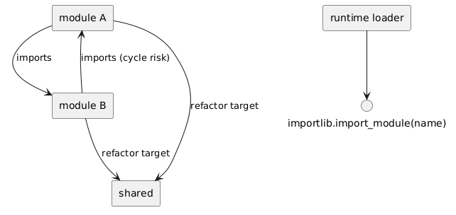

# 08 - Zaawansowane tematy importu i pułapki

## Cel

Pokazać trzy praktyczne obszary:
1. circular imports — rozpoznawanie, diagnoza i naprawa,
2. kontrola eksportu przez `__all__`,
3. dynamiczne importowanie przez `importlib`.

## Circular imports — skąd bierze się problem?

### Czym jest import cykliczny?

Import cykliczny (ang. *circular import*) pojawia się, gdy moduł A importuje B, a B importuje A **podczas inicjalizacji**. Tworzy się cykl zależności.

### Pełny przykład problemu

Załóżmy dwa pliki:

```python
# modul_a.py
from modul_b import oblicz_b    # ← próbuje załadować modul_b

def oblicz_a(x: int) -> int:
    return x + 1

def polacz(x: int) -> int:
    return oblicz_b(oblicz_a(x))
```

```python
# modul_b.py
from modul_a import oblicz_a    # ← próbuje załadować modul_a (ale on jeszcze się nie załadował!)

def oblicz_b(x: int) -> int:
    return oblicz_a(x) * 2
```

```python
# main.py
from modul_a import polacz
print(polacz(5))
```

**Co się dzieje krok po kroku:**

1. `main.py` importuje `modul_a`.
2. Python zaczyna wykonywać `modul_a.py` od góry.
3. Pierwsza linia: `from modul_b import oblicz_b` → Python zaczyna ładować `modul_b`.
4. `modul_b.py` pierwsza linia: `from modul_a import oblicz_a` → Python chce załadować `modul_a`, ale **modul_a nie jest jeszcze w pełni zainicjalizowany** (utknął w kroku 3!).
5. Python zwraca **częściowo zainicjalizowany** obiekt `modul_a` — w którym `oblicz_a` **jeszcze nie została zdefiniowana**.
6. Wynik: `ImportError: cannot import name 'oblicz_a' from partially initialized module 'modul_a'`.

### Objaw w komunikacie błędu

```
ImportError: cannot import name 'oblicz_a' from partially initialized module 'modul_a'
(most likely due to a circular import)
```

Słowo kluczowe: **"partially initialized module"** — to jednoznaczna wskazówka na cykliczny import.

### Rozwiązanie 1: Wydzielenie wspólnej logiki do trzeciego modułu

```python
# wspolne.py — wspólne funkcje
def oblicz_a(x: int) -> int:
    return x + 1
```

```python
# modul_a.py
from wspolne import oblicz_a
from modul_b import oblicz_b

def polacz(x: int) -> int:
    return oblicz_b(oblicz_a(x))
```

```python
# modul_b.py
from wspolne import oblicz_a

def oblicz_b(x: int) -> int:
    return oblicz_a(x) * 2
```

Teraz nie ma cyklu: `modul_a` → `wspolne`, `modul_b` → `wspolne` (graf zależności jest acykliczny).

### Rozwiązanie 2: Import lokalny (wewnątrz funkcji)

```python
# modul_b.py
def oblicz_b(x: int) -> int:
    from modul_a import oblicz_a   # import dopiero przy wywołaniu funkcji
    return oblicz_a(x) * 2
```

Import lokalny **odracza** ładowanie modułu do momentu wywołania funkcji — do tego czasu oba moduły są w pełni zainicjalizowane. Technika ta jest użyteczna jako szybka poprawka, ale w dłuższej perspektywie lepiej **przebudować zależności** (rozwiązanie 1).

### Rozwiązanie 3: Import na poziomie modułu zamiast `from ... import`

```python
# modul_b.py
import modul_a    # importujemy cały moduł — nie wymaga natychmiastowego dostępu do symbolu

def oblicz_b(x: int) -> int:
    return modul_a.oblicz_a(x) * 2   # dostęp przez kropkę — w momencie wywołania
```

Ta technika działa, ponieważ `import modul_a` nie wymaga, żeby `oblicz_a` istniał w momencie wykonania instrukcji `import` — potrzebna jest dopiero przy **wywołaniu** `modul_a.oblicz_a(x)`.

## `__all__` — kontrola eksportu

### Co robi `__all__`?

`__all__` to lista (lub krotka) stringów definiująca, które nazwy zostaną wyeksportowane przez `from module import *`:

```python
# utils.py
__all__ = ["publiczna_funkcja", "PublicznaKlasa"]

def publiczna_funkcja():
    return "widoczna"

def _prywatna_funkcja():
    return "ukryta (konwencja _)"

def pomocnicza():
    return "niewidoczna przy import * (nie ma w __all__)"
    
class PublicznaKlasa:
    pass
```

```python
# inny_plik.py
from utils import *

publiczna_funkcja()   # OK
PublicznaKlasa()      # OK
pomocnicza()          # NameError — nie została wyeksportowana
_prywatna_funkcja()   # NameError
```

### Dlaczego `__all__` jest ważne?

1. **Dokumentuje API** — jasno mówi, co jest publiczne.
2. **Kontroluje `import *`** — ogranicza zanieczyszczenie przestrzeni nazw.
3. **Wspiera IDE** — narzędzia analizy statycznej korzystają z `__all__`.
4. **Sygnalizuje intencje** — bez `__all__` Python przy `import *` eksportuje wszystkie nazwy nie zaczynające się od `_`.

### Gdzie stosować `__all__`?

- W każdym pliku `__init__.py` pakietu (definiuje publiczne API pakietu).
- W modułach bibliotecznych przeznaczonych do importowania.
- **Nie jest potrzebne** w skryptach uruchamianych bezpośrednio.

## Dynamiczne importy (`importlib`)

### `importlib.import_module(name)`

Pozwala załadować moduł, którego nazwa jest **stringiem** — przydatne do pluginów, konfiguracji i systemów rozszerzeń:

```python
import importlib

def zaladuj_plugin(nazwa: str):
    modul = importlib.import_module(nazwa)
    return modul

# Użycie:
plugin = zaladuj_plugin("json")
dane = plugin.loads('{"klucz": "wartość"}')
print(dane)   # {'klucz': 'wartość'}
```

### Przykład systemu pluginów

```python
import importlib

PLUGINS = ["plugin_pkg.math_plugin", "plugin_pkg.text_plugin"]

def run_all_plugins(value):
    results = {}
    for name in PLUGINS:
        try:
            module = importlib.import_module(name)
            results[name] = module.transform(value)
        except (ImportError, AttributeError) as e:
            results[name] = f"Błąd: {e}"
    return results
```

### Bezpieczeństwo dynamicznych importów

**Nigdy** nie importuj modułu, którego nazwa pochodzi bezpośrednio od użytkownika bez walidacji:

```python
# NIEBEZPIECZNE!
nazwa = input("Podaj moduł: ")
modul = importlib.import_module(nazwa)   # użytkownik może załadować dowolny moduł!
```

Zamiast tego — waliduj nazwę wobec dozwolonej listy:

```python
DOZWOLONE = {"math_plugin", "text_plugin"}

nazwa = input("Podaj plugin: ")
if nazwa not in DOZWOLONE:
    raise ValueError(f"Nieznany plugin: {nazwa}")
modul = importlib.import_module(f"plugin_pkg.{nazwa}")
```

### `importlib.resources` — ładowanie danych z pakietu

Od Pythona 3.9 `importlib.resources` umożliwia ładowanie plików danych (szablony, konfiguracje, pliki CSV) dołączonych do pakietu:

```python
from importlib.resources import files

# Odczyt pliku z katalogu pakietu:
dane = files("moj_pakiet.data").joinpath("config.json").read_text()
```

Jest to bezpieczniejsze i bardziej przenośne niż ręczne budowanie ścieżek.

Diagram: `diagrams/advanced_imports.png`



## Krok po kroku na kodzie

### Lokalny import jako obejście

Plik: `examples/circular_safe.py`

```python
def orchestrate(value: int) -> int:
    from circular_safe import from_a, from_b
    return from_b(from_a(value))
```

To pokazuje technikę lokalnego importu. Jest użyteczna, ale w dłuższej perspektywie zwykle lepiej przebudować zależności.

### Dynamiczne ładowanie pluginu

Plik: `examples/dynamic_loader.py`

```python
def call_transform(module_name: str, value: int) -> int:
    module = importlib.import_module(module_name)
    return int(module.transform(value))
```

Interpretacja:
- nazwa modułu jest parametrem,
- kod nie jest na sztywno związany z jednym pluginem,
- łatwiej budować architekturę rozszerzeń.

## Mini-lab: naprawa cyklicznego importu

### Cele
- rozpoznać objawy circular import,
- zastosować jedną z technik naprawy,
- utrwalić rolę `__all__` i `importlib`.

### Kroki
1. Utwórz dwa pliki importujące się wzajemnie (np. `lab_a.py` i `lab_b.py`).
2. Uruchom `import lab_a` i zanotuj komunikat błędu.
3. Zidentyfikuj słowa kluczowe w komunikacie: „partially initialized module", „circular import".
4. Przenieś wspólną funkcję do trzeciego modułu `lab_common.py`.
5. Powtórz uruchomienie i sprawdź, że błąd zniknął.
6. Opcjonalnie załaduj jeden z modułów dynamicznie przez `importlib.import_module`.

### Oczekiwany efekt
- Student potrafi zaproponować refaktoryzację zamiast „maskowania" problemu.

### Rozszerzenie
- Dodaj prosty mechanizm pluginów oparty na nazwach modułów z listy konfiguracyjnej.

## Powiązane zadania

- `exercises/tasks.py` — rozpoznawanie symptomów circular import i reguły `__all__`,
- `exercises/solutions_advanced_imports.py` — rozwiązania,
- `exercises/test_solutions.py` — testy.

## Typowe pułapki

- nadużywanie lokalnych importów zamiast refaktoryzacji struktury zależności,
- stosowanie `import *` bez kontroli `__all__`,
- dynamiczny import bez walidacji nazwy i obsługi błędów,
- ignorowanie komunikatu „partially initialized module" — zawsze oznacza cykl,
- tworzenie pliku `.py` o nazwie kolidującej z modułem standardowym (np. `email.py`).

## Pytania kontrolne

1. Co oznacza komunikat „partially initialized module"?
2. Wymień trzy sposoby rozwiązania cyklicznego importu.
3. Kiedy `__all__` poprawia czytelność API?
4. Jakie ryzyko niesie `importlib.import_module` przy nazwie z wejścia użytkownika?
5. Czym różni się import lokalny od importu na poziomie modułu?
6. Do czego służy `importlib.resources`?

## Literatura

- https://docs.python.org/3/library/importlib.html
- https://docs.python.org/3/library/importlib.html#importlib.resources
- https://docs.python.org/3/reference/import.html
- https://docs.python.org/3/faq/programming.html#what-are-the-best-practices-for-using-import-in-a-module
