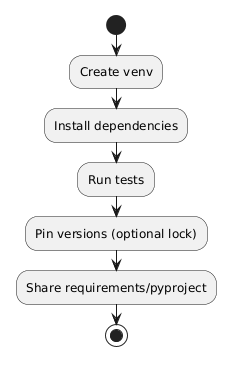

# 09 - Zarzadzanie zaleznosciami

## Cel

Wprowadzic praktyki ekosystemu Python:
- PyPI,
- izolacja srodowisk (`venv`, `conda`),
- narzedzia (`pip`, `poetry`, `pipenv`),
- roznica `requirements.txt` vs `pyproject.toml`.

## Dlaczego globalna instalacja to blad?

- konflikty wersji miedzy projektami,
- trudniejsza reprodukowalnosc,
- ryzyko "dziala u mnie".

## Minimalny workflow (pip + venv)

1. `python -m venv .venv`
2. aktywacja srodowiska
3. `python -m pip install -r requirements.txt`
4. `python -m pip freeze > requirements-lock.txt` (opcjonalnie)

Diagram: `diagrams/dependency_workflow.png`

## Kod referencyjny

- `examples/version_report.py` - raport wersji pakietow.
- `examples/spec_compare.py` - porownanie requirements i pyproject.

## Literatura

- https://pypi.org/
- https://packaging.python.org/en/latest/guides/installing-using-pip-and-virtual-environments/
- https://python-poetry.org/docs/
- https://pipenv.pypa.io/en/latest/

