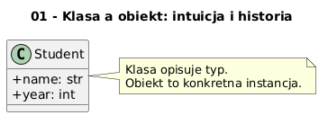

# 01 - Klasa a obiekt: intuicja i historia

## Cel

Zrozumieć różnicę między klasą (opis typu) a obiektem (konkretna instancja) oraz historyczne źródła OOP.

## Kontekst historyczny

Programowanie obiektowe narodziło się w **Simula 67** (Dahl & Nygaard, Norwegia), gdzie
pojęcie *klasy* służyło do modelowania procesów symulacyjnych. **Smalltalk** (Kay, lata 70.)
uczynił obiekt absolutną jednostką programu. **C++** i **Java** spopularyzowały OOP
w przemyśle w latach 80.–90. Python od wersji 2.2 ma ujednolicony model obiektów
(*new-style classes*): wszystko jest obiektem, nawet liczby i funkcje.

## Teoria

### Klasa jako przepis, obiekt jako egzemplarz

| Pojęcie | Analogia | W Pythonie |
|---|---|---|
| **Klasa** | Projekt domu, forma ciastek | `class Student:` |
| **Obiekt** | Konkretny dom, konkretne ciastko | `jan = Student("Jan", 1)` |
| **Instancja** | Synonim obiektu | `jan` jest instancją `Student` |
| **Atrybut** | Cecha egzemplarza | `jan.name`, `jan.year` |
| **Metoda** | Operacja na egzemplarzu | `jan.enroll()` |

Klasa definiuje *typ* — zestaw możliwych atrybutów i metod.
Obiekt jest *wartością* tego typu — z własnym, konkretnym stanem.

Diagram: `diagrams/topic_01.png`



## Krok po kroku na kodzie

Plik: `examples/class_object_story.py`

```python
from dataclasses import dataclass

@dataclass
class Student:
    name: str
    year: int

def describe_student(student: Student) -> str:
    return f"{student.name} (rok {student.year})"

if __name__ == "__main__":
    print(describe_student(Student("Jan", 1)))
```

Interpretacja:
- `Student` to klasa — definicja struktury,
- `Student("Jan", 1)` tworzy obiekt z konkretnym stanem (`name="Jan"`, `year=1`),
- `describe_student` działa na dowolnym obiekcie `Student` — to programowanie do *typu*.

### Dlaczego nie wystarczą funkcje i słowniki?

```python
# Wersja bez klas — szybko staje się krucha:
student = {"name": "Jan", "year": 1}
# Nic nie chroni przed błędnym kluczem ani brakującym polem.
```

Klasa daje:
- **enkapsulację** (pola + metody razem),
- **walidację** w konstruktorze,
- **czytelność** (typ mówi o intencji projektanta).

## Mini-lab (krok po kroku)

1. Uruchom `examples/class_object_story.py`.
2. Utwórz klasę `Course` z polami `name: str` i `ects: int`.
3. Stwórz 3 instancje i wstaw je na listę.
4. Napisz funkcję filtrującą kursy z `ects >= 5`.
5. Dodaj metodę `__str__` do `Course` i sprawdź `print(course)`.

### Oczekiwany efekt

- Student rozumie różnicę między definicją klasy a tworzeniem obiektu.
- Student potrafi napisać prostą klasę domenową i funkcję operującą na jej instancjach.

## Zadanie do samodzielnego rozwiązania

- szablon: `exercises/tasks.py`
- przykładowe rozwiązanie: `exercises/solutions_01.py`
- testy: `exercises/test_solutions.py`

Zadanie: napisz `count_first_year(students: list[Student]) -> int`.

## Pytania egzaminacyjne

1. Wyjaśnij różnicę semantyczną: klasa, obiekt, instancja.
2. Jaką przewagę daje klasa nad słownikiem w modelowaniu domeny?
3. Podaj przykład, gdzie OOP jest lepsze niż funkcje bez klas.
4. Czym różni się nazwa klasy od obiektu przez nią tworzonego?
5. Jak przetestować poprawność tworzenia obiektów?

## Literatura

- https://docs.python.org/3/tutorial/classes.html
- G. Booch, *Object-Oriented Analysis and Design with Applications*.
- B. Meyer, *Object-Oriented Software Construction*.
