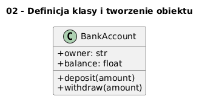

# 02 - Definicja klasy i tworzenie obiektu

## Cel

Opanować składnię klasy: atrybuty, konstruktor `__init__`, metody instancji i tworzenie obiektów.

## Teoria

### Anatomia klasy w Pythonie

```python
class BankAccount:
    # 1. Atrybut klasowy (wspólny dla wszystkich instancji)
    interest_rate: float = 0.05

    # 2. Konstruktor — inicjalizuje stan instancji
    def __init__(self, owner: str, balance: float = 0.0) -> None:
        self.owner = owner        # atrybut instancji
        self.balance = balance

    # 3. Metoda instancji — operacja na stanie obiektu
    def deposit(self, amount: float) -> None:
        if amount <= 0:
            raise ValueError("Kwota wpłaty musi być dodatnia")
        self.balance += amount
```

| Element | Rola |
|---|---|
| `class BankAccount:` | Definicja nowego typu |
| `__init__` | Inicjalizacja stanu przy tworzeniu |
| `self` | Referencja do bieżącej instancji |
| `self.balance` | Atrybut instancji — własność obiektu |
| `BankAccount.interest_rate` | Atrybut klasowy — wspólny dla wszystkich |

### Cykl życia obiektu

```
BankAccount("Jan", 100.0)
       ↓
  __new__()      ← tworzy pusty obiekt w pamięci
       ↓
  __init__()     ← wypełnia go atrybutami
       ↓
  Gotowy obiekt  ← użytkujemy przez metody
```

Diagram: `diagrams/topic_02.png`



## Krok po kroku na kodzie

Plik: `examples/class_definition.py`

```python
class BankAccount:
    def __init__(self, owner: str, balance: float = 0.0) -> None:
        self.owner = owner
        self.balance = balance

    def deposit(self, amount: float) -> None:
        if amount <= 0:
            raise ValueError("Kwota wpłaty musi być dodatnia")
        self.balance += amount
```

### Walidacja w konstruktorze

```python
class Temperature:
    def __init__(self, celsius: float) -> None:
        if celsius < -273.15:
            raise ValueError("Temperatura poniżej zera absolutnego")
        self._celsius = celsius
```

Walidacja w `__init__` gwarantuje, że **żaden obiekt nie istnieje w niepoprawnym stanie**.

### Dobre praktyki

- Wszystkie atrybuty instancji inicjalizuj **wyłącznie** w `__init__`.
- Nie przypisuj atrybutów poza `__init__` — utrudnia to statyczną analizę.
- Waliduj dane wejściowe w `__init__` i metodach mutujących stan.

## Mini-lab (krok po kroku)

1. Uruchom `examples/class_definition.py`.
2. Uzupełnij klasę o metodę `withdraw(amount)` sprawdzającą saldo.
3. Dodaj listę `history: list[str]` i zapisuj każdą operację.
4. Napisz metodę `statement()` drukującą historię.
5. Przetestuj przypadek: `withdraw` więcej niż saldo.

### Oczekiwany efekt

- Student potrafi napisać klasę z konstruktorem, atrybutami i metodami.
- Student rozumie, dlaczego walidacja w `__init__` jest ważna.

## Zadanie do samodzielnego rozwiązania

- szablon: `exercises/tasks.py`
- przykładowe rozwiązanie: `exercises/solutions_02.py`
- testy: `exercises/test_solutions.py`

Zadania:
1. Dopisz metodę `withdraw(amount)` zgłaszającą `ValueError` przy braku środków.
2. Napisz funkcję `safe_transfer(src, dst, amount)` wykonującą przelew.

## Pytania egzaminacyjne

1. Jaka jest rola `__init__` i kiedy jest wywoływana?
2. Dlaczego warto walidować dane wejściowe już w metodach klasy?
3. Czym różni się stan obiektu od zachowania obiektu?
4. Jakie ryzyko niesie brak walidacji w metodach biznesowych?
5. Jak zaprojektować klasę, by była łatwa do testowania?

## Literatura

- https://docs.python.org/3/tutorial/classes.html
- https://docs.python.org/3/reference/datamodel.html
- B. Meyer, *Object-Oriented Software Construction*.
