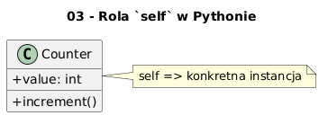

# 03 - Rola `self` w Pythonie

## Cel

Zrozumieć, że `self` wskazuje bieżący obiekt i wiąże metodę z konkretną instancją.

## Teoria i intuicja

`self` nie jest słowem kluczowym, ale kluczową konwencją. Oznacza bieżący obiekt i jego stan.

W praktyce warto myśleć o tym temacie na trzech poziomach:
1. model pojęciowy (co chcemy opisać),
2. składnia Pythona (jak to zapisać),
3. konsekwencje projektowe (testowalność, czytelność, rozszerzalność).

Diagram: `diagrams/topic_03.png`



## Krok po kroku na kodzie

Plik: `examples/self_usage.py`

```python
class Counter:
    def __init__(self) -> None:
        self.value = 0

    def increment(self) -> int:
        self.value += 1
        return self.value

if __name__ == "__main__":
    counter = Counter()
    print(counter.increment())
```

Uruchomienie:

```bash
python src/_04-classes/03-self-parameter/examples/self_usage.py
```

## Zadanie do samodzielnego rozwiązania

Napisz metodę `add_many(self, n)`, która zwiększa licznik o `n`.

- szablon: `exercises/tasks.py`
- przykładowe rozwiązanie: `exercises/solutions_03.py`
- testy: `exercises/test_solutions.py`

## Pytania kontrolne

1. Jaki problem projektowy rozwiązuje ten mechanizm?
2. Jak wyglądałaby wersja bez użycia klas?
3. Jak przetestować to zachowanie jednostkowo?

## Literatura

- https://docs.python.org/3/tutorial/classes.html
- https://docs.python.org/3/reference/datamodel.html

## Kontekst historyczny i projektowy (rozszerzenie)

W wielu językach istnieje ukryte odniesienie do bieżącego obiektu (`this` w C++/Java). Python czyni to odniesienie jawnym przez parametr `self`, co podnosi czytelność i ułatwia zrozumienie wiązania metod z obiektami.

## Dodatkowy przykład kodu

```python
counter_a = Counter()
counter_b = Counter()
print(counter_a.add_many(2))
print(counter_b.add_many(5))
print(counter_a.add_many(1))
```

## Mini-lab rozszerzony (krok po kroku)

1. Dodaj do klasy `Counter` metodę `reset()`.
2. Utwórz dwa liczniki i pokaż, że ich stan jest niezależny.
3. Dodaj test, który wykryłby przypadkowe współdzielenie stanu.
4. Wyjaśnij, co się stanie po usunięciu `self` z sygnatury metody.

### Kryteria zaliczenia mini-labu

- kod przechodzi testy jednostkowe,
- kod nie miesza warstwy logiki z warstwą wejścia/wyjścia,
- student umie uzasadnić wybór konstrukcji obiektowych,
- student potrafi wskazać miejsce potencjalnej refaktoryzacji.

## Pytania egzaminacyjne

1. Dlaczego `self` w Pythonie jest parametrem jawnym?
2. Co oznacza „wiązanie metody z instancją” w praktyce?
3. Jak odróżnić metodę instancyjną od klasowej po sygnaturze?
4. Dlaczego dwie instancje tej samej klasy mają osobny stan?
5. Jakie błędy typowo pojawiają się przy niewłaściwym użyciu `self`?

## Dodatkowa literatura

- B. Meyer, *Object-Oriented Software Construction*.
- G. Booch, *Object-Oriented Analysis and Design with Applications*.
- Python Docs - Classes: https://docs.python.org/3/tutorial/classes.html
- Python Docs - Data model: https://docs.python.org/3/reference/datamodel.html
