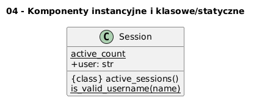

# 04 - Komponenty instancyjne i klasowe/statyczne

## Cel

Odróżniać atrybuty i metody instancji od atrybutów klasowych, metod klasowych (`@classmethod`) i statycznych (`@staticmethod`).

## Teoria

### Trzy poziomy przynależności

| Rodzaj | Dekorator | Pierwszy parametr | Dostęp |
|---|---|---|---|
| Metoda instancji | (brak) | `self` — obiekt | `obj.method()` |
| Metoda klasowa | `@classmethod` | `cls` — klasa | `Cls.method()` lub `obj.method()` |
| Metoda statyczna | `@staticmethod` | (brak) | `Cls.method()` lub `obj.method()` |

### Atrybuty klasowe a instancyjne

```python
class Session:
    active_count = 0      # ← atrybut KLASOWY — wspólny dla wszystkich

    def __init__(self, user: str) -> None:
        self.user = user  # ← atrybut INSTANCJI — każdy obiekt ma swój
        Session.active_count += 1
```

**Pułapka:** mutowalny atrybut klasowy (lista, słownik) jest współdzielony — modyfikacja
przez jeden obiekt wpływa na wszystkie inne!

```python
class Buggy:
    items = []   # BŁĄD: ta lista jest wspólna dla całej klasy

class Fixed:
    def __init__(self) -> None:
        self.items = []  # POPRAWNIE: osobna lista dla każdego obiektu
```

### `@classmethod` vs `@staticmethod`

```python
class Session:
    active_count = 0

    @classmethod
    def active_sessions(cls) -> int:
        return cls.active_count     # dostęp do klasy przez cls

    @staticmethod
    def is_valid_username(name: str) -> bool:
        return len(name) >= 3       # brak dostępu do klasy ani instancji
```

Diagram: `diagrams/topic_04.png`



## Krok po kroku na kodzie

Plik: `examples/members_demo.py`

```python
class Session:
    active_count = 0

    def __init__(self, user: str) -> None:
        self.user = user
        Session.active_count += 1

    @classmethod
    def active_sessions(cls) -> int:
        return cls.active_count

    @staticmethod
    def is_valid_username(name: str) -> bool:
        return len(name) >= 3
```

Przykłady wywołań:

```python
s1 = Session("adam")
s2 = Session("ewa")
print(Session.active_sessions())          # 2
print(Session.is_valid_username("xy"))    # False
```

## Mini-lab (krok po kroku)

1. Uruchom `examples/members_demo.py`.
2. Utwórz 3 sesje i sprawdź licznik klasowy.
3. Dodaj metodę klasową `reset_counter()` zerującą licznik.
4. Pokaż pułapkę z mutowalnym atrybutem klasowym (lista).
5. Napisz test sprawdzający, że `reset_counter` faktycznie zeruje stan.

### Oczekiwany efekt

- Student odróżnia metody instancji, klasowe i statyczne.
- Student zna pułapkę mutowalnych atrybutów klasowych.

## Zadanie do samodzielnego rozwiązania

- szablon: `exercises/tasks.py`
- przykładowe rozwiązanie: `exercises/solutions_04.py`
- testy: `exercises/test_solutions.py`

Zadanie: dopisz metodę klasową `reset_counter(cls)` zerującą `active_count`.

## Pytania egzaminacyjne

1. Kiedy atrybut powinien być instancyjny, a kiedy klasowy?
2. Czym różni się `@classmethod` od `@staticmethod`?
3. Jakie ryzyko niesie mutowalny atrybut klasowy (np. lista)?
4. Jak zaprojektować licznik tworzonych obiektów?
5. Dlaczego stan współdzielony wymaga ostrożności projektowej?

## Literatura

- https://docs.python.org/3/tutorial/classes.html
- https://docs.python.org/3/library/functions.html#classmethod
- https://docs.python.org/3/library/functions.html#staticmethod
