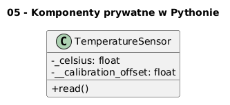

    # 05 - Komponenty prywatne w Pythonie

    ## Cel

    Wyjaśnić konwencje prywatności (`_name`) i name mangling (`__name`).

    ## Teoria i intuicja

    Python preferuje konwencje prywatności. `__name` uruchamia name mangling i ogranicza przypadkowy dostęp.

    W praktyce warto myśleć o tym temacie na trzech poziomach:
    1. model pojęciowy (co chcemy opisać),
    2. składnia Pythona (jak to zapisać),
    3. konsekwencje projektowe (testowalność, czytelność, rozszerzalność).

    Diagram: `diagrams/topic_05.png`

    

    ## Krok po kroku na kodzie

    Plik: `examples/private_members.py`

    ```python
    class TemperatureSensor:
def __init__(self, celsius: float) -> None:
    self._celsius = celsius
    self.__calibration_offset = 0.0

def set_calibration(self, delta: float) -> None:
    self.__calibration_offset = delta

def read(self) -> float:
    return self._celsius + self.__calibration_offset
    ```

    Uruchomienie:

    ```bash
    python src/_04-classes/05-private-members/examples/private_members.py
    ```

    ## Zadanie do samodzielnego rozwiązania

    Dodaj metodę `is_overheated(threshold)` opartą o odczyt z `read()`.

    - szablon: `exercises/tasks.py`
    - przykładowe rozwiązanie: `exercises/solutions_05.py`
    - testy: `exercises/test_solutions.py`

    ## Pytania kontrolne

    1. Jaki problem projektowy rozwiązuje ten mechanizm?
    2. Jak wyglądałaby wersja bez użycia klas?
    3. Jak przetestować to zachowanie jednostkowo?

    ## Literatura

    - https://docs.python.org/3/tutorial/classes.html
    - https://docs.python.org/3/reference/datamodel.html
