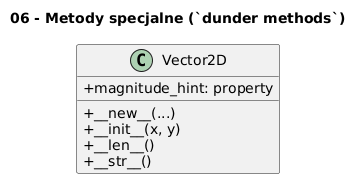

# 06 - Metody specjalne (`dunder methods`)

## Cel

Praktycznie używać `__init__`, `__new__`, `__len__`, `__str__`, getter/setter przez `property`.

## Teoria i intuicja

Metody specjalne integrują klasy z protokołami języka (`len`, `str`, iteracja, porównania, kontekst).

W praktyce warto myśleć o tym temacie na trzech poziomach:
1. model pojęciowy (co chcemy opisać),
2. składnia Pythona (jak to zapisać),
3. konsekwencje projektowe (testowalność, czytelność, rozszerzalność).

Diagram: `diagrams/topic_06.png`



## Krok po kroku na kodzie

Plik: `examples/dunder_demo.py`

```python
class Vector2D:
    def __new__(cls, *args, **kwargs):
        return super().__new__(cls)

    def __init__(self, x: float, y: float) -> None:
        self.x = x
        self.y = y

    def __len__(self) -> int:
        return 2

    def __str__(self) -> str:
        return f"Vector2D(x={self.x}, y={self.y})"

    @property
    def magnitude_hint(self) -> float:
        return abs(self.x) + abs(self.y)
```

Uruchomienie:

```bash
python src/_04-classes/06-special-methods/examples/dunder_demo.py
```

## Zadanie do samodzielnego rozwiązania

Dodaj metodę `__repr__` zwracającą jednoznaczny zapis obiektu.

- szablon: `exercises/tasks.py`
- przykładowe rozwiązanie: `exercises/solutions_06.py`
- testy: `exercises/test_solutions.py`

## Pytania kontrolne

1. Jaki problem projektowy rozwiązuje ten mechanizm?
2. Jak wyglądałaby wersja bez użycia klas?
3. Jak przetestować to zachowanie jednostkowo?

## Literatura

- https://docs.python.org/3/tutorial/classes.html
- https://docs.python.org/3/reference/datamodel.html

## Kontekst historyczny i projektowy (rozszerzenie)

Model danych Pythona definiuje protokoły, dzięki którym obiekty integrują się z mechanizmami języka (`len`, iteracja, porównania, kontekst). Metody specjalne rozwijały się stopniowo wraz z dojrzewaniem języka i dziś stanowią fundament idiomatycznego Pythona.

## Dodatkowy przykład kodu

```python
v = Vector2D(3, -4)
print(len(v))
print(str(v))
print(v.magnitude_hint)
print(repr(v))
```

## Mini-lab rozszerzony (krok po kroku)

1. Dodaj `__eq__` i porównywanie dwóch wektorów.
2. Dodaj `__add__` dla sumy wektorów.
3. Zaimplementuj walidację typu argumentów w `__init__`.
4. Sprawdź, jak zachowuje się `len` po zmianie klasy.

### Kryteria zaliczenia mini-labu

- kod przechodzi testy jednostkowe,
- kod nie miesza warstwy logiki z warstwą wejścia/wyjścia,
- student umie uzasadnić wybór konstrukcji obiektowych,
- student potrafi wskazać miejsce potencjalnej refaktoryzacji.

## Pytania egzaminacyjne

1. Jaka jest różnica między `__str__` i `__repr__`?
2. W jakich sytuacjach trzeba nadpisać `__new__`?
3. Dlaczego metody specjalne zwiększają ergonomię API?
4. Jakie ryzyko niesie niepoprawna implementacja `__eq__`?
5. Jak `property` pomaga ukryć szczegóły implementacji?

## Dodatkowa literatura

- B. Meyer, *Object-Oriented Software Construction*.
- G. Booch, *Object-Oriented Analysis and Design with Applications*.
- Python Docs - Classes: https://docs.python.org/3/tutorial/classes.html
- Python Docs - Data model: https://docs.python.org/3/reference/datamodel.html
