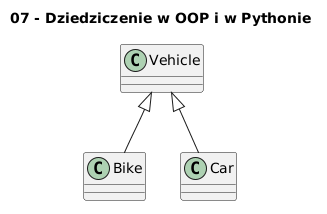

        # 07 - Dziedziczenie w OOP i w Pythonie

        ## Cel

        Wyjaśnić relację „jest-rodzajem” oraz nadpisywanie metod w klasach pochodnych.

        ## Teoria i intuicja

        Dziedziczenie umożliwia ponowne użycie kodu i modelowanie hierarchii pojęć domenowych.

        W praktyce warto myśleć o tym temacie na trzech poziomach:
        1. model pojęciowy (co chcemy opisać),
        2. składnia Pythona (jak to zapisać),
        3. konsekwencje projektowe (testowalność, czytelność, rozszerzalność).

        Diagram: `diagrams/topic_07.png`

        

        ## Krok po kroku na kodzie

        Plik: `examples/inheritance_demo.py`

        ```python
        class Vehicle:
    def move(self) -> str:
        return "Pojazd przemieszcza się"


class Bike(Vehicle):
    def move(self) -> str:
        return "Rower jedzie"


class Car(Vehicle):
    def move(self) -> str:
        return "Samochód jedzie"
        ```

        Uruchomienie:

        ```bash
        python src/_04-classes/07-inheritance-basics/examples/inheritance_demo.py
        ```

        ## Zadanie do samodzielnego rozwiązania

        Dodaj klasę `Train(Vehicle)` i nadpisz `move()`.

        - szablon: `exercises/tasks.py`
        - przykładowe rozwiązanie: `exercises/solutions_07.py`
        - testy: `exercises/test_solutions.py`

        ## Pytania kontrolne

        1. Jaki problem projektowy rozwiązuje ten mechanizm?
        2. Jak wyglądałaby wersja bez użycia klas?
        3. Jak przetestować to zachowanie jednostkowo?

        ## Literatura

        - https://docs.python.org/3/tutorial/classes.html
        - https://docs.python.org/3/reference/datamodel.html
