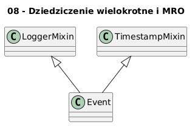

        # 08 - Dziedziczenie wielokrotne i MRO

        ## Cel

        Pokazać mechanizm MRO i bezpieczne użycie `super()` przy wielu klasach bazowych.

        ## Teoria i intuicja

        W Pythonie porządek rozwiązywania metod (MRO) jest deterministyczny i opiera się o algorytm C3.

        W praktyce warto myśleć o tym temacie na trzech poziomach:
        1. model pojęciowy (co chcemy opisać),
        2. składnia Pythona (jak to zapisać),
        3. konsekwencje projektowe (testowalność, czytelność, rozszerzalność).

        Diagram: `diagrams/topic_08.png`

        

        ## Krok po kroku na kodzie

        Plik: `examples/multiple_inheritance.py`

        ```python
        class LoggerMixin:
    def describe(self) -> str:
        return "logger"


class TimestampMixin:
    def describe(self) -> str:
        return "timestamp"


class Event(LoggerMixin, TimestampMixin):
    @classmethod
    def describe_chain(cls) -> list[str]:
        return [c.__name__ for c in cls.mro()]
        ```

        Uruchomienie:

        ```bash
        python src/_04-classes/08-multiple-inheritance/examples/multiple_inheritance.py
        ```

        ## Zadanie do samodzielnego rozwiązania

        Zaimplementuj `source()` zwracające pierwszą klasę mixin z MRO.

        - szablon: `exercises/tasks.py`
        - przykładowe rozwiązanie: `exercises/solutions_08.py`
        - testy: `exercises/test_solutions.py`

        ## Pytania kontrolne

        1. Jaki problem projektowy rozwiązuje ten mechanizm?
        2. Jak wyglądałaby wersja bez użycia klas?
        3. Jak przetestować to zachowanie jednostkowo?

        ## Literatura

        - https://docs.python.org/3/tutorial/classes.html
        - https://docs.python.org/3/reference/datamodel.html
