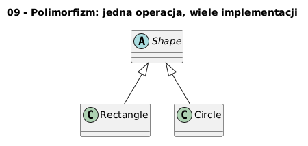

        # 09 - Polimorfizm: jedna operacja, wiele implementacji

        ## Cel

        Zrozumieć polimorfizm dynamiczny i ideę „programuj do interfejsu, nie implementacji”.

        ## Teoria i intuicja

        Polimorfizm oznacza, że ten sam komunikat (`area`) może mieć różne implementacje zależnie od typu obiektu.

        W praktyce warto myśleć o tym temacie na trzech poziomach:
        1. model pojęciowy (co chcemy opisać),
        2. składnia Pythona (jak to zapisać),
        3. konsekwencje projektowe (testowalność, czytelność, rozszerzalność).

        Diagram: `diagrams/topic_09.png`

        

        ## Krok po kroku na kodzie

        Plik: `examples/polymorphism_demo.py`

        ```python
        class Shape:
    def area(self) -> float:
        raise NotImplementedError


class Rectangle(Shape):
    def __init__(self, w: float, h: float) -> None:
        self.w = w
        self.h = h

    def area(self) -> float:
        return self.w * self.h


class Circle(Shape):
    def __init__(self, r: float) -> None:
        self.r = r

    def area(self) -> float:
        return 3.14159 * self.r * self.r
        ```

        Uruchomienie:

        ```bash
        python src/_04-classes/09-polymorphism/examples/polymorphism_demo.py
        ```

        ## Zadanie do samodzielnego rozwiązania

        Dodaj klasę `Triangle` z metodą `area`.

        - szablon: `exercises/tasks.py`
        - przykładowe rozwiązanie: `exercises/solutions_09.py`
        - testy: `exercises/test_solutions.py`

        ## Pytania kontrolne

        1. Jaki problem projektowy rozwiązuje ten mechanizm?
        2. Jak wyglądałaby wersja bez użycia klas?
        3. Jak przetestować to zachowanie jednostkowo?

        ## Literatura

        - https://docs.python.org/3/tutorial/classes.html
        - https://docs.python.org/3/reference/datamodel.html
