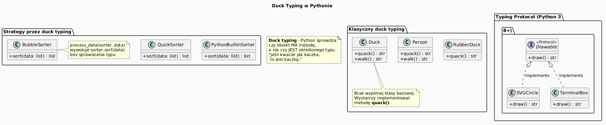

# 09 – Polimorfizm i Duck Typing

## Cel

Zrozumieć dwa komplementarne mechanizmy elastyczności kodu w Pythonie:

1. **Polimorfizm** – jedna operacja, wiele implementacji (oparty na hierarchii klas).
2. **Duck typing** – abstrakcja bez dziedziczenia (oparta na obecności metod/atrybutów).

---

## 1. Polimorfizm – historia i intuicja

### Skąd pochodzi termin?

Termin pochodzi z greki: *poly* (wiele) + *morphe* (kształt).
W programowaniu obiektowym oznacza, że ten sam **komunikat** (`area()`, `draw()`, `speak()`)
może mieć różne **implementacje** zależnie od faktycznego typu obiektu —
wybranego dopiero w czasie wykonania (*late binding*, *dynamic dispatch*).

> Alan Kay (twórca Smalltalka, lata 70.): „OOP to przesyłanie komunikatów".
> Polimorfizm jest fundamentem tej idei.

**Rodzaje polimorfizmu:**

| Rodzaj | Przykład | Python |
|---|---|---|
| **Podtypowy** (dziedziczenie) | `shape.area()` – różne figury | tak |
| **Parametryczny** (generyki) | `list[T]`, `Optional[T]` | tak (`typing`) |
| **Ad-hoc** (przeciążenie) | `+` dla `int` i `str` | tak (`__add__`) |
| **Duck typing** | cokolwiek z `.read()` | tak (domyślny styl Pythona) |

### Klasyczny przykład – figury geometryczne

```python
import math

class Shape:
    def area(self) -> float:
        raise NotImplementedError

class Rectangle(Shape):
    def __init__(self, w: float, h: float) -> None:
        self.w, self.h = w, h

    def area(self) -> float:
        return self.w * self.h

class Circle(Shape):
    def __init__(self, r: float) -> None:
        self.r = r

    def area(self) -> float:
        return math.pi * self.r ** 2
```

Funkcja `total_area` działa dla **dowolnej** podklasy `Shape`, nawet jeszcze
nieistniejącej:

```python
def total_area(shapes: list[Shape]) -> float:
    return sum(s.area() for s in shapes)
```

To jest zasada **Open/Closed** (Bertrand Meyer, 1988):
> *Klasa powinna być otwarta na rozszerzenie i zamknięta na modyfikację.*

Diagram: `diagrams/topic_09.png`


### Krok po kroku na kodzie

Plik: `examples/polymorphism_demo.py`

```python
shapes: list[Shape] = [
    Rectangle(3, 4),
    Circle(2),
    Triangle(6, 4, 6, 5, 5),
]
for shape in shapes:
    print(shape.describe())   # każdy wie, jak się opisać
print(f"Łączna powierzchnia: {total_area(shapes):.2f}")
```

---

## 2. Duck Typing – historia i filozofia

### Skąd nazwa?

Pochodzi od powiedzenia przypisywanego poecie Jamesowi Whitcombowi Rileyowi (XIX w.):

> *"If it walks like a duck and it quacks like a duck, then it must be a duck."*
> („Jeśli chodzi jak kaczka i kwacze jak kaczka, to jest kaczką.")

W informatyce termin spopularyzował Alex Martelli w liście do comp.lang.python
w 2000 roku, opisując filozofię Pythona:

> *„Don't check whether it IS-a duck: check whether it QUACKS-like-a duck,
> WALKS-like-a duck, etc."*

### Polimorfizm nominalny vs. strukturalny

| | Polimorfizm nominalny | Duck typing (strukturalny) |
|---|---|---|
| **Język** | Java, C++ | Python, Go, Ruby |
| **Sprawdzanie** | hierarchia typów | obecność metod |
| **Wymóg** | `class Dog extends Animal` | brak – wystarczy `def bark()` |
| **Zaleta** | jawna umowa, IDE, statyczna analiza | elastyczność, mniej hierarchii |
| **Wada** | sztywna hierarchia | błędy widoczne w runtime |

### Klasyczny przykład

```python
class Duck:
    def quack(self) -> str:
        return "Quack!"

class Person:
    def quack(self) -> str:
        return "Jestem człowiekiem, ale potrafię kwakać!"

class RubberDuck:
    def quack(self) -> str:
        return "Piiiip!"

def make_it_quack(obj) -> None:
    """Nie pyta o typ – pyta o umiejętność kwakania."""
    print(obj.quack())

for obj in [Duck(), Person(), RubberDuck()]:
    make_it_quack(obj)  # działa dla wszystkich!
```

`Duck`, `Person` i `RubberDuck` **nie mają wspólnej klasy bazowej** –
wystarczy, że mają metodę `quack()`.

### Duck typing z wbudowanymi protokołami

Python definiuje wiele *protokołów* opartych na metodach specjalnych:

| Protokół | Metoda(y) | Przykład użycia |
|---|---|---|
| Iterowalny | `__iter__`, `__next__` | `for x in obj` |
| Długość | `__len__` | `len(obj)` |
| Kontekst | `__enter__`, `__exit__` | `with obj:` |
| Porównywalny | `__eq__`, `__lt__` | `sort()`, `==` |
| Wywoływalny | `__call__` | `obj()` |

Implementując te metody, własna klasa **automatycznie** współpracuje
z wbudowanymi funkcjami Pythona:

```python
class NumberRange:
    def __init__(self, start: int, stop: int) -> None:
        self._start, self._stop = start, stop

    def __len__(self) -> int:
        return max(0, self._stop - self._start)

    def __iter__(self):
        current = self._start
        while current < self._stop:
            yield current
            current += 1

    def __contains__(self, item: int) -> bool:
        return self._start <= item < self._stop

r = NumberRange(5, 10)
print(len(r))         # 5   – __len__
print(list(r))        # [5, 6, 7, 8, 9] – __iter__
print(sum(r))         # 35  – sum() używa __iter__!
print(7 in r)         # True – __contains__
```

### Duck typing z plikami

Funkcja `save_report` przyjmuje *cokolwiek* z metodą `write()`:

```python
import io

def save_report(dest, data: list[str]) -> None:
    for line in data:
        dest.write(line + "\n")

# Zapis do pliku na dysku
with open("raport.txt", "w") as f:
    save_report(f, ["Wiersz 1", "Wiersz 2"])

# Zapis do bufora w pamięci – ta sama funkcja!
buf = io.StringIO()
save_report(buf, ["Wiersz 1", "Wiersz 2"])
print(buf.getvalue())
```

### Duck typing jako wzorzec Strategy

Wzorzec Strategy bez żadnego dziedziczenia – wystarczy, że każdy sorter
ma metodę `sort()`:

```python
class BubbleSorter:
    def sort(self, data: list) -> list: ...

class QuickSorter:
    def sort(self, data: list) -> list: ...

class PythonBuiltinSorter:
    def sort(self, data: list) -> list:
        return sorted(data)

def process_data(sorter, data: list) -> list:
    return sorter.sort(data)   # nie obchodzi nas typ sortera

data = [5, 2, 9, 1, 7, 3]
for sorter in [BubbleSorter(), QuickSorter(), PythonBuiltinSorter()]:
    print(process_data(sorter, data))
```

---

## 3. Typing Protocol – formalne duck typing (Python 3.8+)

Moduł `typing` wprowadza `Protocol` – sposób na **statyczną weryfikację**
duck typingu przez narzędzia takie jak `mypy` lub `pyright`, bez konieczności
tworzenia hierarchii klas:

```python
from typing import Protocol

class Drawable(Protocol):
    def draw(self) -> str: ...

class SVGCircle:
    def draw(self) -> str:
        return '<circle .../>'

class TerminalBox:
    def draw(self) -> str:
        return '+----+\n|    |\n+----+'

def render_all(drawables: list[Drawable]) -> None:
    for d in drawables:
        print(d.draw())

render_all([SVGCircle(), TerminalBox()])  # mypy nie zgłasza błędu!
```

`SVGCircle` i `TerminalBox` **nie dziedziczą** po `Drawable` – wystarczy, że
implementują metodę `draw()`. `Protocol` pełni rolę *strukturalnej umowy*
weryfikowalnej statycznie.

Diagram: `diagrams/duck_typing.png`



---

## 4. Kiedy używać dziedziczenia, a kiedy duck typing?

| Sytuacja | Zalecenie |
|---|---|
| Wspólna logika do współdzielenia | dziedziczenie / klasa bazowa |
| Tylko wspólny interfejs (kontrakt) | `Protocol` lub ABC |
| Szybki prototyp, skrypt | duck typing bez adnotacji |
| Duży projekt, praca zespołowa | `Protocol` + adnotacje typów |
| Integracja z bibliotekami zewnętrznymi | duck typing (nie możesz zmienić klasy bazowej) |

---

## 5. Pliki z przykładami

| Plik | Zawartość |
|---|---|
| `examples/polymorphism_demo.py` | figury geometryczne, `total_area`, `describe` |
| `examples/duck_typing_demo.py` | kaczka, NumberRange, Strategy, Protocol |

---

## Mini-lab (krok po kroku)

1. Uruchom `examples/polymorphism_demo.py`.  
   Dodaj klasę `Square(Rectangle)` – czy `total_area` działa bez zmian?
2. Uruchom `examples/duck_typing_demo.py`.  
   Dodaj klasę `Robot` z metodą `quack()` i przekaż do `make_it_quack()`.
3. Zaimplementuj własną kolekcję `Stack` z metodami `__len__`, `__iter__`, `__contains__`.  
   Sprawdź, że `len()`, `for`, `in` działają na niej bez żadnej klasy bazowej.
4. Napisz `Protocol` o nazwie `Serializable` z metodami `serialize()` i `deserialize()`.  
   Zaimplementuj go w dwóch niezwiązanych klasach.
5. Zamień `raise NotImplementedError` w `Shape` na `@abstractmethod` z `abc`.  
   Sprawdź, co się stanie przy próbie bezpośredniego tworzenia instancji `Shape`.

---

## Zadania do samodzielnego rozwiązania

- szablon: `exercises/tasks.py`
- przykładowe rozwiązanie: `exercises/solutions_09.py`
- testy: `exercises/test_solutions.py`

**Zadanie 1.** Napisz klasę `Triangle(Shape)` z metodą `area()` i konstruktorem `(base, height)`.

**Zadanie 2.** Napisz funkcję `largest_shape(shapes: list) -> Shape` zwracającą figurę o największym polu.
Funkcja powinna działać dla dowolnych obiektów mających metodę `area()` (duck typing).

**Zadanie 3.** Stwórz `Protocol` o nazwie `Printable` z metodą `pretty_print() -> str`.
Zaimplementuj go w klasach `Invoice` (faktura) i `Report` (raport) bez wspólnej klasy bazowej.
Napisz funkcję `print_all(items: list[Printable]) -> None`.

**Zadanie 4.** Zaimplementuj wzorzec Strategy dla formatowania tekstu:
- `UpperCaseFormatter` – zamienia na wielkie litery
- `TitleCaseFormatter` – każde słowo wielką literą
- `ReverseFormatter` – odwraca każde słowo

Funkcja `format_text(formatter, text: str) -> str` nie powinna znać konkretnego formattera.

---

## Pytania egzaminacyjne

1. Zdefiniuj polimorfizm i podaj trzy jego rodzaje w Pythonie.
2. Co to jest duck typing i jak różni się od polimorfizmu nominalnego?
3. Kiedy warto używać `typing.Protocol` zamiast ABC?
4. Dlaczego polimorfizm redukuje liczbę instrukcji `if/elif`?
5. Jak testować kod oparty na duck typingu? (wskazówka: `unittest.mock`)
6. Na czym polega zasada Open/Closed i jak wiąże się z polimorfizmem?
7. Jakie metody specjalne należy zaimplementować, aby własna klasa działała z `for`, `len()` i `in`?

---

## Literatura

- [Python Glossary: duck-typing](https://docs.python.org/3/glossary.html#term-duck-typing)
- [Python Docs: `typing.Protocol`](https://docs.python.org/3/library/typing.html#typing.Protocol)
- [Python Docs: `abc` – Abstract Base Classes](https://docs.python.org/3/library/abc.html)
- [PEP 544 – Protocols: Structural subtyping](https://peps.python.org/pep-0544/)
- Alex Martelli – *Duck Typing* (comp.lang.python, 2000)
- B. Meyer, *Object-Oriented Software Construction* (1988, 1997), rozdz. „Polymorphism" i „Open-Closed Principle"
- Luciano Ramalho, *Fluent Python* (2022), rozdz. 13 „Interfaces, Protocols, and ABCs"
- David M. Beazley & Brian K. Jones, *Python Cookbook* (2013), rozdz. 8 „Classes and Objects"
