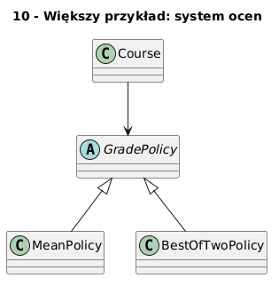

# 10 - Większy przykład: system ocen

## Cel

Pokazać współdziałanie dziedziczenia, polimorfizmu i wzorca Strategy w mini-architekturze systemu uczelnianego.

## Teoria

### Wzorzec Strategy w pigułce

System oceniania musi wspierać różne metody obliczania wyniku końcowego.
Zamiast używać serii `if/elif`, delegujemy algorytm do osobnego obiektu — **strategii**.

Klasa `Course`:
- nie wie, jak liczyć wynik,
- zna tylko interfejs `GradePolicy.final_score`.

Dzięki temu:
- zmiana polityki oceniania nie wymaga modyfikacji `Course`,
- każdą politykę można testować niezależnie,
- nowa polityka to nowa klasa, nie nowa gałąź `if`.

### Diagram architektury

Diagram: `diagrams/topic_10.png`



### Kluczowe klasy

```python
class GradePolicy:
    def final_score(self, points: list[float]) -> float:
        raise NotImplementedError

class MeanPolicy(GradePolicy):
    def final_score(self, points: list[float]) -> float:
        return sum(points) / len(points)

class BestOfTwoPolicy(GradePolicy):
    def final_score(self, points: list[float]) -> float:
        top = sorted(points, reverse=True)[:2]
        return sum(top) / len(top)

class Course:
    def __init__(self, name: str, policy: GradePolicy) -> None:
        self.name = name
        self.policy = policy

    def evaluate(self, points: list[float]) -> float:
        return self.policy.final_score(points)
```

## Krok po kroku na kodzie

Plik: `examples/grading_system.py`

```python
course_mean = Course("Analiza", MeanPolicy())
course_best = Course("Algebra", BestOfTwoPolicy())
print(course_mean.evaluate([3.0, 4.0, 5.0]))   # 4.0
print(course_best.evaluate([3.0, 4.0, 5.0]))   # 4.5
```

### Porównanie wersji bez wzorca i z wzorcem

```python
# BEZ wzorca — trudne do rozszerzenia
def evaluate(policy_name: str, points: list[float]) -> float:
    if policy_name == "mean":
        return sum(points) / len(points)
    elif policy_name == "best_of_two":
        ...   # kolejny elif przy każdej nowej polityce

# Z wzorcem — Open/Closed
def evaluate(policy: GradePolicy, points: list[float]) -> float:
    return policy.final_score(points)
```

## Mini-lab (krok po kroku)

1. Uruchom `examples/grading_system.py`.
2. Dodaj `WeightedPolicy(w1, w2)` obliczającą: `points[0]*w1 + points[1]*w2`.
3. Napisz test porównujący 3 strategie na tych samych danych.
4. Przeanalizuj, które klasy spełniają SRP, a które nie.
5. Dodaj walidację: polityki nie powinny akceptować pustych list.

### Oczekiwany efekt

- Student rozumie, jak strategia oddziela algorytm od kontekstu.
- Student potrafi zaprojektować małą architekturę z testowalną logiką domenową.

## Zadanie do samodzielnego rozwiązania

- szablon: `exercises/tasks.py`
- przykładowe rozwiązanie: `exercises/solutions_10.py`
- testy: `exercises/test_solutions.py`

Zadanie: napisz klasę `WeightedPolicy(w1, w2)` z metodą `final_score(points)`.

## Pytania egzaminacyjne

1. Dlaczego wzorzec Strategy poprawia rozszerzalność systemu?
2. Jak oddzielić logikę domenową od prezentacji wyników?
3. Które elementy tego przykładu są polimorficzne?
4. Jak dodać nową politykę bez modyfikacji klasy `Course`?
5. Jak zaprojektować testy dla wielu strategii jednocześnie?

## Literatura

- E. Gamma i in., *Design Patterns*, wzorzec Strategy.
- https://docs.python.org/3/tutorial/classes.html
