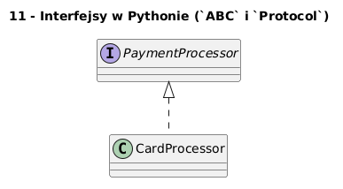

# 11 - Interfejsy w Pythonie (`ABC` i `Protocol`)

## Cel

Pokazać dwa sposoby modelowania interfejsów: nominalnie (`ABC`) i strukturalnie (`Protocol`).

## Teoria i intuicja

`ABC` wymusza implementację metod, a `Protocol` wspiera duck typing i statyczną analizę typów.

W praktyce warto myśleć o tym temacie na trzech poziomach:
1. model pojęciowy (co chcemy opisać),
2. składnia Pythona (jak to zapisać),
3. konsekwencje projektowe (testowalność, czytelność, rozszerzalność).

Diagram: `diagrams/topic_11.png`



## Krok po kroku na kodzie

Plik: `examples/interfaces_demo.py`

```python
from abc import ABC, abstractmethod
from typing import Protocol

class PaymentProcessor(ABC):
    @abstractmethod
    def pay(self, amount: float) -> str:
        raise NotImplementedError

class SupportsPay(Protocol):
    def pay(self, amount: float) -> str:
        ...

class CardProcessor(PaymentProcessor):
    def pay(self, amount: float) -> str:
        return f"card:{amount:.2f}"
```

Uruchomienie:

```bash
python src/_04-classes/11-interfaces-in-python/examples/interfaces_demo.py
```

## Zadanie do samodzielnego rozwiązania

Dodaj `BlikProcessor` zgodny z interfejsem płatności.

- szablon: `exercises/tasks.py`
- przykładowe rozwiązanie: `exercises/solutions_11.py`
- testy: `exercises/test_solutions.py`

## Pytania kontrolne

1. Jaki problem projektowy rozwiązuje ten mechanizm?
2. Jak wyglądałaby wersja bez użycia klas?
3. Jak przetestować to zachowanie jednostkowo?

## Literatura

- https://docs.python.org/3/tutorial/classes.html
- https://docs.python.org/3/reference/datamodel.html

## Kontekst historyczny i projektowy (rozszerzenie)

Pojęcie interfejsu wywodzi się z języków statycznie typowanych. Python oferuje dwa podejścia: nominalne (`ABC`) i strukturalne (`Protocol`). To pozwala łączyć zalety formalnego kontraktu z elastycznym duck typingiem.

## Dodatkowy przykład kodu

```python
processor = CardProcessor()
print(processor.pay(19.99))

blik = BlikProcessor()
print(blik.pay(7.50))
```

## Mini-lab rozszerzony (krok po kroku)

1. Dodaj drugi procesor płatności i zunifikuj API.
2. Napisz funkcję przyjmującą obiekt zgodny z `SupportsPay`.
3. Porównaj zachowanie z klasą dziedziczącą po `ABC`.
4. Sprawdź, jak IDE i mypy wspierają `Protocol`.

### Kryteria zaliczenia mini-labu

- kod przechodzi testy jednostkowe,
- kod nie miesza warstwy logiki z warstwą wejścia/wyjścia,
- student umie uzasadnić wybór konstrukcji obiektowych,
- student potrafi wskazać miejsce potencjalnej refaktoryzacji.

## Pytania egzaminacyjne

1. Czym różni się `ABC` od `Protocol`?
2. Kiedy warto stosować nominalny interfejs?
3. Co daje typowanie strukturalne w praktyce projektowej?
4. Jak interfejsy wspierają testowanie i mockowanie?
5. Dlaczego interfejs zmniejsza sprzężenie między modułami?

## Dodatkowa literatura

- B. Meyer, *Object-Oriented Software Construction*.
- G. Booch, *Object-Oriented Analysis and Design with Applications*.
- Python Docs - Classes: https://docs.python.org/3/tutorial/classes.html
- Python Docs - Data model: https://docs.python.org/3/reference/datamodel.html
