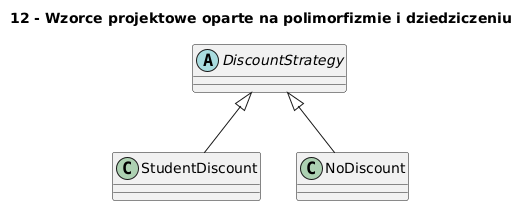

# 12 - Wzorce projektowe oparte na polimorfizmie i dziedziczeniu

## Cel

Przedstawić wzorce Strategy, Template Method i Factory Method na konkretnych przykładach w Pythonie.

## Teoria

### Czym są wzorce projektowe?

Wzorce projektowe (ang. *design patterns*) to sprawdzone, wielokrotnie stosowane rozwiązania
typowych problemów projektowych. Zostały usystematyzowane przez „Gang of Four" (Gamma, Helm, Johnson, Vlissides)
w książce *Design Patterns* (1994).

Nie są to gotowe fragmenty kodu — to **nazwy i schematy** rozwiązań, które ułatwiają
komunikację w zespole i dokumentację architektury.

### Wzorzec Strategy

**Problem:** algorytm powinien być wymienny bez modyfikacji klasy, która go używa.

```python
from abc import ABC, abstractmethod

class DiscountStrategy(ABC):
    @abstractmethod
    def apply(self, price: float) -> float: ...

class StudentDiscount(DiscountStrategy):
    def apply(self, price: float) -> float:
        return price * 0.8

class VipDiscount(DiscountStrategy):
    def apply(self, price: float) -> float:
        return price * 0.7

def checkout(price: float, strategy: DiscountStrategy) -> float:
    return strategy.apply(price)
```

### Wzorzec Factory Method

**Problem:** tworzenie obiektu o konkretnym typie zależy od danych wejściowych.

```python
def build_discount(kind: str) -> DiscountStrategy:
    registry = {"student": StudentDiscount, "vip": VipDiscount}
    if kind not in registry:
        raise ValueError(f"Nieznany typ: {kind!r}")
    return registry[kind]()
```

### Wzorzec Template Method

**Problem:** algorytm ma stałą strukturę, ale pewne kroki są wymienne.

```python
class ReportTemplate(ABC):
    def generate(self, name: str, score: float) -> str:
        return "\n".join([
            self._header(name),
            self._body(score),    # krok wymienny
            self._footer(),
        ])

    def _header(self, name: str) -> str:
        return f"=== Raport: {name} ==="

    @abstractmethod
    def _body(self, score: float) -> str: ...

    def _footer(self) -> str:
        return "=== Koniec raportu ==="
```

Diagram: `diagrams/topic_12.png`



## Krok po kroku na kodzie

Plik: `examples/patterns_demo.py` — zawiera wszystkie trzy wzorce z funkcją `main()`.

```python
for kind in ("student", "vip", "none"):
    strategy = build_discount(kind)
    print(f"{kind}: {checkout(100.0, strategy):.2f}")

for report_cls in (PassFailReport, GradedReport):
    print(report_cls().generate("Jan Kowalski", 73.5))
```

## Mini-lab (krok po kroku)

1. Uruchom `examples/patterns_demo.py`.
2. Dodaj strategię `SeasonalDiscount` z 15% rabatem i wpisz ją do rejestru.
3. Stwórz `HtmlReport(ReportTemplate)` — `_body` generuje `<p>Wynik: {score}</p>`.
4. Porównaj kod przed wzorcem (`if/elif`) i po — co jest łatwiejsze do testowania?
5. Napisz test sprawdzający, że `build_discount("brak")` zgłasza `ValueError`.

### Oczekiwany efekt

- Student potrafi rozpoznać i zastosować trzy wzorce w małym programie.
- Student wie, jak wzorce zmniejszają liczbę `if/elif` i ułatwiają rozszerzanie.

## Zadanie do samodzielnego rozwiązania

- szablon: `exercises/tasks.py`
- przykładowe rozwiązanie: `exercises/solutions_12.py`
- testy: `exercises/test_solutions.py`

Zadania:
1. Napisz klasę `VipDiscount` ze zniżką 30%.
2. Napisz funkcję `build_discount(kind: str) -> DiscountStrategy` jako fabrykę.

## Pytania egzaminacyjne

1. Na czym polega wzorzec Strategy i kiedy go stosować?
2. Czym różni się Factory Method od prostego `if/elif`?
3. Jak Template Method wiąże się z dziedziczeniem?
4. Jak polimorfizm redukuje złożoność kodu klienta?
5. Jakie koszty wprowadza nadmierna liczba klas wzorców?

## Literatura

- E. Gamma i in., *Design Patterns*, Addison-Wesley 1994.
- https://refactoring.guru/design-patterns/strategy
- https://refactoring.guru/design-patterns/template-method
- https://refactoring.guru/design-patterns/factory-method
