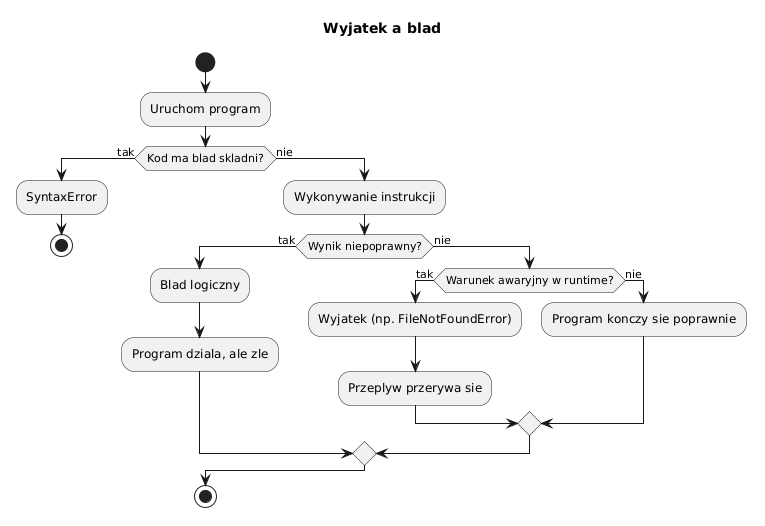

# 01 - Wyjątek a błąd

## Cel

Zrozumieć, czym jest wyjątek, czym różni się od innych rodzajów błędów i kiedy należy go obsługiwać.

## Kontekst historyczny

Mechanizm wyjątków (ang. *exceptions*) pojawił się w językach programowania w latach 60. XX wieku.
Wczesne podejścia (Lisp, PL/I) polegały na kodach błędów zwracanych przez funkcje, co zaśmiecało logikę programu.

W Pythonie wyjątki są **pierwszoklasowymi obiektami**: klasy wyjątków dziedziczą po `BaseException`,
można je przechowywać w zmiennych, przekazywać jako argumenty i łączyć w łańcuchy (`raise ... from ...`).

## Teoria i intuicja

W praktyce student spotyka trzy różne sytuacje:

| Rodzaj problemu | Kiedy się pojawia | Przykład |
|---|---|---|
| **Błąd składni** (`SyntaxError`) | Zanim program ruszy | `def f(` bez zamknięcia |
| **Błąd logiczny** | Program działa, wynik zły | Zła formuła matematyczna |
| **Wyjątek** (`Exception`) | W trakcie działania | `FileNotFoundError`, `ZeroDivisionError` |

Wyjątek nie musi oznaczać katastrofy. W dobrze zaprojektowanym programie jest to
**mechanizm komunikacji**: „nie mogę kontynuować tej operacji w aktualnych warunkach".

Diagram: `diagrams/topic_01.png`



## Hierarchia wyjątków w Pythonie

```
BaseException
├── SystemExit
├── KeyboardInterrupt
└── Exception
    ├── ValueError
    ├── TypeError
    ├── IOError / OSError
    │   └── FileNotFoundError
    ├── ZeroDivisionError
    └── ... (i wiele innych)
```

Klasa `Exception` jest punktem startowym przy tworzeniu własnych wyjątków.
`BaseException` zawiera też `SystemExit` i `KeyboardInterrupt`, które zwykle **nie** powinny być łapane.

## Krok po kroku na kodzie

Plik: `examples/exception_vs_error_demo.py`

```python
from pathlib import Path


def read_first_line(path: Path) -> str:
    with path.open("r", encoding="utf-8") as handle:
        return handle.readline().strip()
```

Wywołanie z brakującym plikiem:

```python
>>> read_first_line(Path("nie_ma_mnie.txt"))
Traceback (most recent call last):
  File "...", line 2, in read_first_line
FileNotFoundError: [Errno 2] No such file or directory: 'nie_ma_mnie.txt'
```

Interpretacja:
- gdy plik nie istnieje, Python zgłasza `FileNotFoundError` (dziedzicy po `OSError`),
- składnia funkcji jest całkowicie poprawna — to wyjątek **czasu wykonania**,
- takie przypadki obsługujemy zwykle **wyżej**, w warstwie wywołującej, bo ona wie jak reagować.

### Wersja z obsługą

```python
def safe_read_first_line(path: Path) -> str:
    try:
        return read_first_line(path)
    except FileNotFoundError:
        return f"Brak pliku: {path}"
```

Teraz zamiast awarii dostajemy czytelny komunikat.

### Przykład błędu logicznego (nie wyjątek)

```python
def is_even(n: int) -> bool:
    return n % 2 == 1  # Błąd logiczny: powinno być == 0
```

Python nie zgłosi tu żadnego wyjątku — funkcja działa, ale zwraca błędne wyniki.
Błędy logiczne wykrywa się testami jednostkowymi, nie obsługą wyjątków.

## Mini-lab (krok po kroku)

1. Uruchom `examples/exception_vs_error_demo.py` i zaobserwuj różnicę dla istniejącej
   i nieistniejącej ścieżki.
2. Wywołaj celowo `int("abc")` w interpreterze i przeczytaj traceback.
3. Napisz funkcję `parse_or_default(value: str, default: int) -> int`, która korzysta z `try-except`.
4. Zastanów się: w której warstwie kodu najlepiej obsłużyć wyjątek?
   - w funkcji czytającej dane,
   - w funkcji wywołującej,
   - w głównym punkcie wejścia `main()`?

### Oczekiwany efekt mini-labu

- Student potrafi odróżnić komunikat błędu składni od tracebacku wyjątku.
- Student wie, że łapanie wyjątku zbyt nisko ukrywa problem.

## Zadanie do samodzielnego rozwiązania

- szablon: `exercises/tasks.py`
- przykładowe rozwiązanie: `exercises/solutions_01.py`
- testy: `exercises/test_solutions.py`

Zadanie: napisz funkcję `parse_positive_int(value: str) -> int`, która:
- zwraca dodatnią liczbę całkowitą,
- zgłasza `ValueError` dla łańcuchów nie będących liczbami,
- zgłasza `ValueError` dla wartości ≤ 0.

## Pytania egzaminacyjne

1. Dlaczego wyjątek nie jest tym samym co błąd logiczny?
2. Kiedy warto obsługiwać wyjątek, a kiedy pozwolić mu „propagować się wyżej"?
3. Dlaczego nie należy łapać `BaseException` ani `KeyboardInterrupt`?
4. Czym różni się `SyntaxError` od `RuntimeError`?
5. Jak wyjątki pomagają utrzymać czytelny podział odpowiedzialności (SRP)?

## Literatura

- https://docs.python.org/3/tutorial/errors.html
- https://docs.python.org/3/library/exceptions.html
- M. Lutz, *Learning Python*, rozdz. „Exception Basics"
- L. Ramalho, *Fluent Python*, rozdz. „Exceptions and Context Managers"
