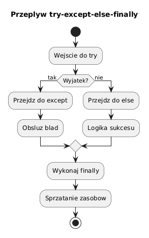

# 02 - `try-except-else-finally`

## Cel

Opanować pełny schemat obsługi wyjątków i rozumieć, kiedy wykonywany jest każdy blok: `try`, `except`, `else`, `finally`.

## Teoria

`try-except-else-finally` to narzędzie do **sterowania przepływem w sytuacjach awaryjnych**.

| Blok | Kiedy się wykonuje |
|---|---|
| `try` | zawsze — tu jest ryzykowny kod |
| `except` | gdy w `try` pojawi się pasujący wyjątek |
| `else` | tylko gdy `try` zakończyło się **bez** wyjątku |
| `finally` | **zawsze**, nawet jeśli był `return` lub `raise` |

Ważna reguła: logikę sukcesu umieszczamy w `else`, a nie w `try`.
Dzięki temu jasno widać, co jest ryzykowne, a co jest efektem udanej operacji.

Diagram: `diagrams/topic_02.png`



## Krok po kroku na kodzie

Plik: `examples/flow_demo.py`

### Minimalny przykład

```python
def divide(a: float, b: float) -> float:
    return a / b
```

Pełna obsługa:

```python
def safe_division_message(a: float, b: float) -> str:
    result = None
    try:
        result = divide(a, b)
    except ZeroDivisionError:
        return "Błąd: dzielenie przez zero"
    else:
        return f"Wynik: {result}"
    finally:
        # Miejsce na zwalnianie zasobów (plik, połączenie, blokada)
        pass
```

Interpretacja:
- `except ZeroDivisionError` łapie **tylko** ten konkretny wyjątek,
- `else` wykona się wyłącznie gdy dzielenie się powiedzie,
- `finally` jest gwarancją sprzątania — wykona się nawet gdy `return` jest w `except`.

### Kilka bloków `except`

```python
def parse_element(data: list[str], index: int) -> int:
    try:
        raw = data[index]
        return int(raw)
    except IndexError:
        print(f"Brak elementu o indeksie {index}")
        return 0
    except ValueError:
        print(f"Nie można zamienić '{raw}' na int")
        return 0
```

### Przechwycenie obiektu wyjątku

```python
try:
    int("abc")
except ValueError as exc:
    print(f"Szczegóły: {exc}")       # invalid literal for int() with base 10: 'abc'
    print(f"Typ: {type(exc).__name__}")
```

### Łańcuch wyjątków (`raise ... from ...`)

```python
class ConfigError(Exception):
    pass

def load_config(path: str) -> dict:
    try:
        with open(path) as f:
            return __import__("json").load(f)
    except FileNotFoundError as exc:
        raise ConfigError(f"Brak pliku konfiguracyjnego: {path}") from exc
```

Dzięki `from exc` Python zachowuje oryginalny traceback, co znacznie ułatwia debugowanie.

### `finally` w praktyce (zamykanie zasobów)

```python
import sqlite3

conn = sqlite3.connect(":memory:")
try:
    cursor = conn.cursor()
    cursor.execute("SELECT 1")
except Exception as exc:
    print(f"Błąd bazy: {exc}")
finally:
    conn.close()   # wykona się zawsze
```

> **Uwaga:** w nowszym Pythonie zamiast `try-finally` przy zasobach lepiej używać `with`.
> Blok `finally` nadal jest ważny przy własnych zasobach bez menedżera kontekstu.

## Typowe zastosowania

- walidacja i konwersja danych wejściowych od użytkownika,
- bezpieczny I/O (pliki, sieć, bazy danych),
- logowanie błędów z zachowaniem tracebacku,
- sprzątanie zasobów jako ostatnia deska ratunku.

## Częste błędy

```python
# ŹLE: za szerokie łapanie — ukrywa wszystkie błędy
try:
    process()
except Exception:
    pass   # cichy brak reakcji

# DOBRZE: łap konkretny typ, reaguj i loguj
try:
    process()
except ValueError as exc:
    logger.error("Niepoprawna wartość: %s", exc)
    raise
```

## Mini-lab (krok po kroku)

1. Uruchom `examples/flow_demo.py` dla `(10, 2)` i `(10, 0)`.
2. Dodaj drugi `except` obsługujący `TypeError` (gdy `a` lub `b` to tekst).
3. Dopisz `finally` z komunikatem `"operacja zakończona"` i sprawdź, kiedy się wypisuje.
4. Zamień `return` w `except` na `raise` — obserwuj co dzieje się z `finally`.

### Oczekiwany efekt mini-labu

- Student rozumie kolejność wykonania bloków we wszystkich przypadkach.
- Student wie, dlaczego logika sukcesu powinna być w `else`, a nie w `try`.

## Zadanie do samodzielnego rozwiązania

- szablon: `exercises/tasks.py`
- przykładowe rozwiązanie: `exercises/solutions_02.py`
- testy: `exercises/test_solutions.py`

Zadanie: napisz funkcję `to_float_or_none(value: str) -> float | None`, która:
- próbuje zamienić `value` na `float`,
- zwraca wynik w `else`,
- zwraca `None` jeśli konwersja się nie uda,
- ma blok `finally` jako komentarz wyjaśniający intencję.

## Pytania egzaminacyjne

1. Dlaczego logika sukcesu powinna trafić do bloku `else`, a nie do `try`?
2. Co powinno znaleźć się w `finally`? Podaj dwa przykłady.
3. Jakie ryzyko niesie `except Exception: pass`?
4. Czym jest łańcuch wyjątków (`raise ... from ...`) i kiedy go stosować?
5. Czy `finally` wykona się jeśli w `try` jest instrukcja `return`?

## Literatura

- https://docs.python.org/3/tutorial/errors.html
- https://docs.python.org/3/reference/compound_stmts.html#the-try-statement
- M. Lutz, *Learning Python*, rozdz. „Exception Coding Details"
