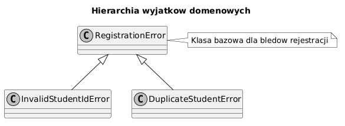

# 03 - Własne wyjątki

## Cel

Nauczyć się tworzyć własne klasy wyjątków i używać ich do czytelnej komunikacji błędów domenowych.

## Teoria

### Po co własne wyjątki?

Wyjątki wbudowane (`ValueError`, `TypeError`, `KeyError`) są **ogólne** — pasują do wielu sytuacji,
ale nie niosą informacji domenowej. Własny wyjątek sprawia, że kod mówi językiem problemu:

```python
# Ogólny — co właściwie się stało?
raise ValueError("Błąd rejestracji")

# Domenowy — przyczyna jest jasna bez czytania treści komunikatu
raise DuplicateStudentError("s101")
```

Własne wyjątki są też **precyzyjnie łapalne** — można reagować inaczej na różne awarie:

```python
try:
    register(student_id)
except DuplicateStudentError:
    print("Student już istnieje, pomiń")
except InvalidStudentIdError:
    print("Niepoprawny format ID, sprawdź dane")
```

### Definicja własnego wyjątku

```python
class RegistrationError(Exception):
    """Bazowy wyjątek domeny rejestracji."""

class InvalidStudentIdError(RegistrationError):
    """Identyfikator ma niepoprawny format."""

class DuplicateStudentError(RegistrationError):
    """Student o tym identyfikatorze już istnieje."""
```

Diagram: `diagrams/topic_03.png`



### Wyjątek z dodatkowymi atrybutami

```python
class InsufficientFundsError(Exception):
    def __init__(self, balance: float, amount: float) -> None:
        self.balance = balance
        self.amount = amount
        super().__init__(
            f"Niewystarczające środki: masz {balance:.2f}, potrzebujesz {amount:.2f}"
        )

# Użycie:
try:
    withdraw(account, 500.0)
except InsufficientFundsError as exc:
    print(f"Różnica: {exc.amount - exc.balance:.2f} zł")
```

Dodatkowe atrybuty umożliwiają **programową reakcję** — nie tylko wypisanie komunikatu.

### Kiedy własny wyjątek, a kiedy wbudowany?

| Sytuacja | Zalecenie |
|---|---|
| Zła wartość parametru ogólnego | `ValueError` |
| Zły typ argumentu | `TypeError` |
| Awaria specyficzna dla domeny | własny wyjątek |
| Pakiet/biblioteka — API publiczne | **zawsze** własny wyjątek |

### Dobre praktyki

- Dziedzicz po `Exception`, nie po `BaseException`.
- Stwórz **jedną klasę bazową** dla całej domeny (np. `AppError`).
- Nazwy klas wyjątków kończ na `Error`.
- Podaj sensowny komunikat w `__init__`.

## Krok po kroku na kodzie

Plik: `examples/custom_exception_demo.py`

```python
class RegistrationError(Exception):
    """Bazowy wyjątek dla domeny rejestracji studentów."""

class InvalidStudentIdError(RegistrationError):
    """Identyfikator ma niepoprawny format."""

class DuplicateStudentError(RegistrationError):
    """Student o tym identyfikatorze już istnieje."""


def register_student(student_id: str, existing_ids: set[str]) -> str:
    if not student_id.startswith("s") or not student_id[1:].isdigit():
        raise InvalidStudentIdError(f"Niepoprawny identyfikator: {student_id}")
    if student_id in existing_ids:
        raise DuplicateStudentError(f"Duplikat identyfikatora: {student_id}")
    existing_ids.add(student_id)
    return student_id
```

Uruchomienie:

```bash
python src/_05-exceptions/03-custom-exceptions/examples/custom_exception_demo.py
```

## Mini-lab (krok po kroku)

1. Uruchom `examples/custom_exception_demo.py` i zaobserwuj wyniki dla `"x12"`, `"s100"`, `"s101"`.
2. Dodaj klasę `ForbiddenDomainError(RegistrationError)`.
3. Napisz funkcję `validate_email(email: str)`, która zgłasza `ForbiddenDomainError`
   jeśli domena nie kończy się na `".edu"`.
4. Napisz test sprawdzający, że `exc.args[0]` zawiera adres e-mail.

### Oczekiwany efekt mini-labu

- Student potrafi zaprojektować prostą hierarchię wyjątków dla dowolnej domeny.
- Student wie, jak dodawać atrybuty i jak je odczytywać w `except`.

## Zadanie do samodzielnego rozwiązania

- szablon: `exercises/tasks.py`
- przykładowe rozwiązanie: `exercises/solutions_03.py`
- testy: `exercises/test_solutions.py`

Zadanie: napisz klasę `InvalidAgeError(Exception)` i funkcję `validate_age(age: int) -> int`, która:
- zwraca wiek, gdy mieści się w przedziale 1–130,
- zgłasza `InvalidAgeError` dla wartości spoza zakresu z czytelnym komunikatem.

## Pytania egzaminacyjne

1. Kiedy warto definiować własny wyjątek, a kiedy wystarczy wbudowany `ValueError`?
2. Dlaczego własne wyjątki poprawiają czytelność testów?
3. Jak zaprojektować hierarchię wyjątków: płaską czy wielopoziomową?
4. Dlaczego klasę bazową wyjątków domenowych dziedziczymy po `Exception`, nie `BaseException`?
5. Jak dodać do wyjątku dodatkowe atrybuty i dlaczego jest to przydatne?

## Literatura

- https://docs.python.org/3/tutorial/errors.html#user-defined-exceptions
- https://docs.python.org/3/library/exceptions.html
- M. Lutz, *Learning Python*, rozdz. „Exception Objects"
