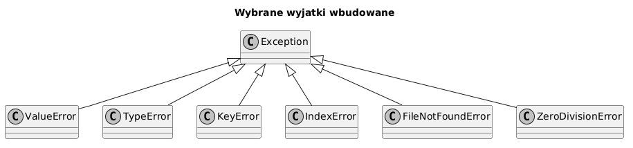

# 04 - Wyjątki wbudowane

## Cel

Poznać najczęściej spotykane wyjątki wbudowane, rozumieć ich hierarchię oraz nauczyć się poprawnej interpretacji tracebacków.

## Teoria

### Hierarchia wyjątków wbudowanych

Wszystkie wbudowane wyjątki dziedziczą po `Exception`. Python 3 dostarcza kilkadziesiąt klas.
Poniżej najważniejsze dla początkujących:

```
Exception
├── ArithmeticError
│   └── ZeroDivisionError
├── LookupError
│   ├── IndexError
│   └── KeyError
├── ValueError
├── TypeError
├── NameError
├── AttributeError
├── OSError / IOError
│   ├── FileNotFoundError
│   ├── PermissionError
│   └── FileExistsError
├── StopIteration
└── RuntimeError
    └── RecursionError
```

Diagram: `diagrams/topic_04.png`



### Przegląd najważniejszych wyjątków

| Wyjątek | Typowa przyczyna | Przykład |
|---|---|---|
| `ValueError` | Poprawny typ, zła wartość | `int("abc")` |
| `TypeError` | Zły typ argumentu | `"a" + 1` |
| `KeyError` | Brak klucza w `dict` | `d["brak"]` |
| `IndexError` | Indeks poza zakresem | `lst[100]` |
| `AttributeError` | Brak atrybutu obiektu | `None.strip()` |
| `NameError` | Niezdefiniowana nazwa | `print(niezdefiniowana)` |
| `ZeroDivisionError` | Dzielenie przez zero | `10 / 0` |
| `FileNotFoundError` | Brak pliku | `open("x.txt")` |
| `RecursionError` | Zbyt głęboka rekurencja | nieskończona pętla rekurencyjna |
| `StopIteration` | Koniec iteratora | `next(iter([]))` |

## Krok po kroku na kodzie

Plik: `examples/builtin_exceptions_demo.py`

### `ValueError`

```python
def demo_value_error() -> str:
    try:
        int("abc")
    except ValueError as exc:
        return f"ValueError: {exc}"
    return "OK"
```

### `ZeroDivisionError`

```python
def demo_zero_division_error() -> str:
    try:
        _ = 10 / 0
    except ZeroDivisionError as exc:
        return f"ZeroDivisionError: {exc}"
    return "OK"
```

### `KeyError`

```python
def demo_key_error() -> str:
    data = {"name": "Ada"}
    try:
        _ = data["age"]
    except KeyError as exc:
        return f"KeyError: {exc}"
    return "OK"
```

### Czytanie tracebacku

```
Traceback (most recent call last):
  File "demo.py", line 12, in main
    result = safe_ratio("x", "3")
  File "demo.py", line 6, in safe_ratio
    top = float(numerator)
ValueError: could not convert string to float: 'x'
```

Traceback czytamy **od dołu do góry**:
1. Ostatnia linia: typ wyjątku i komunikat — tu `ValueError`.
2. Linia `File`, `line X`, `in function` — gdzie wyjątek się pojawił.
3. Kolejne bloki w górę — ścieżka wywołań prowadząca do awarii.

### Łapanie grupy wyjątków

```python
try:
    value = float(numerator) / float(denominator)
except (ValueError, ZeroDivisionError) as exc:
    print(f"Błąd obliczenia: {exc}")
```

Składnia `except (Typ1, Typ2)` pozwala reagować tak samo na kilka wyjątków.

### `AttributeError` — typowa pułapka z `None`

```python
def get_upper(value: str | None) -> str:
    # ŹLE — gdy value jest None, dostaniemy AttributeError
    return value.upper()

def get_upper_safe(value: str | None) -> str:
    if value is None:
        return ""
    return value.upper()
```

## Mini-lab (krok po kroku)

1. Uruchom `examples/builtin_exceptions_demo.py` i przeczytaj wyniki.
2. Dopisz funkcję `demo_index_error()` — próba dostępu do `lst[99]` dla `lst = [1, 2, 3]`.
3. Wywołaj `None.strip()` i przeczytaj traceback — który wyjątek się pojawia?
4. Napisz funkcję, która zamienia każdy wyjątek w czytelny komunikat dla użytkownika.

### Oczekiwany efekt mini-labu

- Student szybko lokalizuje źródło błędu czytając traceback.
- Student poprawnie dobiera typ wyjątku do sytuacji.

## Zadanie do samodzielnego rozwiązania

- szablon: `exercises/tasks.py`
- przykładowe rozwiązanie: `exercises/solutions_04.py`
- testy: `exercises/test_solutions.py`

Zadanie: napisz funkcję `safe_ratio(numerator: str, denominator: str) -> float | None`, która:
- konwertuje oba argumenty na `float` i zwraca iloraz,
- zwraca `None` dla złych danych lub dzielenia przez zero,
- poprawnie obsługuje oba wyjątki jednocześnie.

## Pytania egzaminacyjne

1. Jak odróżnić `TypeError` od `ValueError`? Podaj przykład każdego.
2. Dlaczego `KeyError` może być wartościową informacją projektową?
3. Kiedy `except Exception:` jest uzasadnione, a kiedy nie?
4. Czym jest `LookupError` i po co istnieje taka klasa pośrednia?
5. Jak czytać traceback — od dołu czy od góry? Uzasadnij.

## Literatura

- https://docs.python.org/3/library/exceptions.html
- https://docs.python.org/3/tutorial/errors.html
- M. Lutz, *Learning Python*, rozdz. „Built-in Exception Classes"
