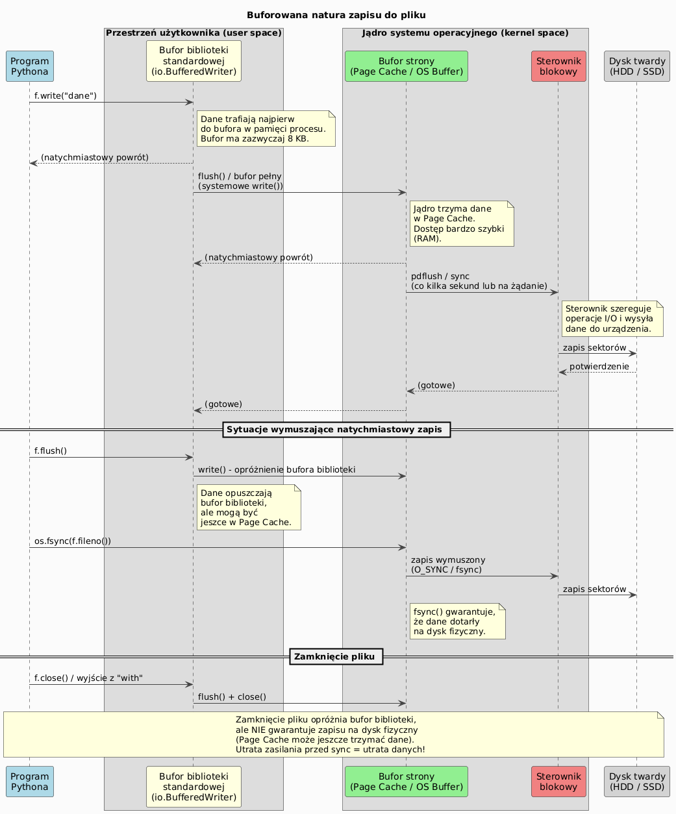
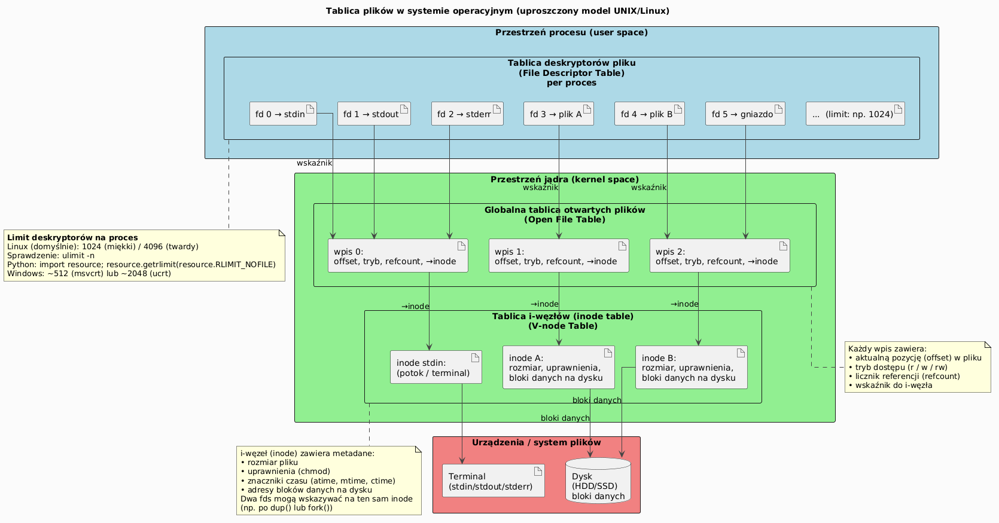

# 05 - Obsługa plików i szyfr Cezara

## Cel

Opanować pracę z plikami tekstowymi i binarnymi oraz zbudować kompletny przykład programu szyfrującego plik.

## Teoria

### Dlaczego pliki trzeba otwierać i zamykać?

Plik to zasób systemu operacyjnego. Kiedy otwieramy plik, system przydziela:
- **deskryptor pliku** (ograniczony zasób: typowo 1024 jednocześnie otwartych plików na proces — zależy od ustawień
  systemu operacyjnego),
- **bufor danych w pamięci** (bufor biblioteki standardowej i bufor strony jądra),
- **blokadę** (zależnie od systemu i trybu dostępu).

Niezamknięty plik może prowadzić do:
- utraty danych (dane w buforze nie zostają zapisane na dysk),
- wyczerpania deskryptorów,
- blokady pliku dla innych procesów.

Menedżer kontekstu `with` gwarantuje zamknięcie pliku nawet przy wyjątku:

```python
# Bezpieczna wersja z automatycznym zamknięciem:
with open("dane.txt", "r", encoding="utf-8") as f:
    content = f.read()
# Tu plik jest już zamknięty — nawet jeśli read() rzucił wyjątek
```

---

### Buforowana natura zapisu do pliku

Zapis do pliku **nie oznacza natychmiastowego wylądowania danych na dysku**. Python
i system operacyjny stosują kilka warstw buforowania, by zmniejszyć liczbę kosztownych
operacji I/O.

#### Warstwy buforowania

```
Program Python
    │  f.write("dane")
    ▼
Bufor biblioteki standardowej (io.BufferedWriter)
    │  flush() lub bufor pełny (~8 KB)
    ▼
Bufor strony jądra (Page Cache)
    │  pdflush / sync (co kilka sekund lub na żądanie)
    ▼
Sterownik blokowy
    │  zapis sektorów
    ▼
Dysk (HDD / SSD)
```

**Konsekwencje:**
- `f.write()` zwraca natychmiast — dane mogą być tylko w pamięci RAM.
- `f.flush()` opróżnia bufor biblioteki → dane trafiają do Page Cache jądra.
- `os.fsync(f.fileno())` wymusza zapis Page Cache na dysk fizyczny.
- `f.close()` (lub wyjście z bloku `with`) wywołuje `flush()`, ale **nie** `fsync()`.
- Utrata zasilania przed `fsync()` może → utrata danych.

```python
import os

with open("ważne.txt", "w", encoding="utf-8") as f:
    f.write("dane krytyczne")
    f.flush()            # opróżnia bufor biblioteki
    os.fsync(f.fileno()) # gwarantuje zapis na dysk
```

#### Kiedy buforowanie jest problematyczne?

| Sytuacja | Ryzyko | Rozwiązanie |
|---|---|---|
| Awaria zasilania po `write()` bez `fsync()` | Utrata danych | `os.fsync()` lub `open(..., mode="wb", buffering=0)` |
| Dwa procesy czytają ten sam plik | Nieaktualne dane w Page Cache | `os.fsync()` + advisory locks |
| Logi aplikacji nie pojawiają się w czasie rzeczywistym | Dane tkwią w buforze | `f.flush()` po każdym wierszu lub `buffering=1` (line-buffered) |

#### Sterowanie buforowaniem w Pythonie

```python
# Bez buforowania (tylko dla trybów binarnych):
f = open("surowe.bin", "wb", buffering=0)

# Buforowanie liniowe (tryb tekstowy, stdout):
f = open("logi.txt", "w", buffering=1, encoding="utf-8")

# Domyślne buforowanie blokowe (~8 KB):
f = open("dane.txt", "w", encoding="utf-8")  # buffering=-1
```

Diagram: `diagrams/file_buffering.png`



---

### Tablica plików w systemie operacyjnym — deskryptory i ich limit

#### Czym jest deskryptor pliku?

Gdy wywołujesz `open()`, system operacyjny zwraca **deskryptor pliku** (ang. *file
descriptor*, w skrócie fd) — małą, nieujemną liczbę całkowitą, która jest indeksem
w wewnętrznej **tablicy deskryptorów pliku** procesu.

Każdy nowo uruchomiony proces w systemie UNIX/Linux otrzymuje automatycznie trzy
standardowe deskryptory:

| fd | Nazwa | Opis |
|---|---|---|
| 0 | `stdin`  | standardowe wejście |
| 1 | `stdout` | standardowe wyjście |
| 2 | `stderr` | standardowe wyjście błędów |

Każde następne `open()` przydziela kolejny fd (3, 4, …).

#### Trójpoziomowy model tablic (UNIX)

System operacyjny używa trzech poziomów struktur danych:

1. **Tablica deskryptorów pliku procesu** (*File Descriptor Table*) — prywatna dla
   każdego procesu; mapuje fd → wpis w globalnej tablicy otwartych plików.
2. **Globalna tablica otwartych plików** (*Open File Table*) — współdzielona przez
   wszystkie procesy; przechowuje bieżącą pozycję (offset), tryb dostępu i licznik
   referencji.
3. **Tablica i-węzłów** (*inode Table / V-node Table*) — zawiera metadane pliku
   (rozmiar, uprawnienia, wskaźniki do bloków danych na dysku).

```
Proces A                        Jądro OS
┌────────────────┐   ┌─────────────────────────────────┐
│ fd 0 → stdin   │──▶│ wpis 0: offset=0, tryb=r, →inode│──▶ inode terminala
│ fd 1 → stdout  │──▶│ wpis 1: offset=0, tryb=w, →inode│──▶ inode terminala
│ fd 2 → stderr  │──▶│ wpis 2: offset=0, tryb=w, →inode│──▶ inode terminala
│ fd 3 → plik A  │──▶│ wpis 3: offset=42, tryb=r,→inode│──▶ inode pliku A ──▶ dysk
│ fd 4 → plik B  │──▶│ wpis 4: offset=0, tryb=w, →inode│──▶ inode pliku B ──▶ dysk
└────────────────┘   └─────────────────────────────────┘
```

Diagram: `diagrams/file_descriptor_table.png`



#### Limit jednocześnie otwartych plików

| System | Limit domyślny (miękki) | Limit maksymalny (twardy) | Zmiana |
|---|---|---|---|
| Linux | 1024 fd / proces | 4096 (lub więcej) | `ulimit -n 4096` |
| macOS | 256 fd / proces | ~10 000 | `ulimit -n 10000` |
| Windows (msvcrt) | ~512 fd | ~2 048 | ustawienie kompilatora C |

W Pythonie możesz sprawdzić i zmienić limit:

```python
import resource  # tylko UNIX/Linux/macOS

soft, hard = resource.getrlimit(resource.RLIMIT_NOFILE)
print(f"Limit miękki: {soft}, twardy: {hard}")

# Zwiększenie limitu miękkiego (do wartości twardego):
resource.setrlimit(resource.RLIMIT_NOFILE, (hard, hard))
```

Na Windows:

```python
import msvcrt
# Windows nie eksponuje getrlimit; limit CRT można zmienić przez:
import ctypes
ctypes.cdll.msvcrt._setmaxstdio(2048)
```

#### Dlaczego limit ma znaczenie w praktyce?

```python
# BŁĄD: otwarcie zbyt wielu plików bez zamykania
handles = []
for i in range(2000):           # przekroczymy limit ~1024
    handles.append(open(f"plik_{i}.txt", "w"))
# OSError: [Errno 24] Too many open files
```

```python
# POPRAWNIE: menedżer kontekstu automatycznie zamyka plik po każdej iteracji
import pathlib

for i in range(2000):
    with pathlib.Path(f"plik_{i}.txt").open("w") as f:
        f.write(f"wiersz {i}\n")
```

#### Sprawdzenie liczby otwartych deskryptorów w czasie działania programu

```python
import os
import pathlib

# Na Linux/macOS:
def count_open_fds() -> int:
    """Zwraca liczbę aktywnych deskryptorów pliku bieżącego procesu."""
    fd_dir = pathlib.Path("/proc/self/fd")
    if fd_dir.exists():
        return sum(1 for _ in fd_dir.iterdir())
    # macOS / BSD: lsof -p $$
    return -1

print(f"Otwarte deskryptory: {count_open_fds()}")
```

#### Podsumowanie — zasady dobrej praktyki

1. **Zawsze używaj `with open(...) as f:`** — automatycznie zamyka plik i zwalnia
   deskryptor, nawet przy wyjątku.
2. **Używaj `f.flush()` + `os.fsync()`** gdy zapis musi być trwały (bazy danych,
   pliki konfiguracyjne, logi krytyczne).
3. **Nie trzymaj otwartych plików dłużej niż potrzeba** — wyczerpanie deskryptorów
   to trudny do debugowania błąd w czasie produkcji.
4. **Monitoruj liczbę otwartych plików** w aplikacjach serwerowych (np. przez
   `psutil.Process().open_files()`).

```python
import psutil, os

proc = psutil.Process(os.getpid())
print(f"Otwarte pliki: {len(proc.open_files())}")
```

### Tryby otwarcia pliku

| Tryb | Opis | Tworzy plik? |
|---|---|---|
| `"r"` | Odczyt tekstu | Nie |
| `"w"` | Zapis tekstu (nadpisuje) | Tak |
| `"a"` | Dopisanie na końcu | Tak |
| `"x"` | Zapis nowego pliku (błąd jeśli istnieje) | Tak |
| `"rb"` | Odczyt binarny | Nie |
| `"wb"` | Zapis binarny (nadpisuje) | Tak |
| `"r+"` | Odczyt i zapis | Nie |

Zawsze podawaj `encoding="utf-8"` przy plikach tekstowych — domyślne kodowanie
różni się między systemami (Windows używa cp1250 lub cp1252).

### Standardowe operacje na plikach tekstowych

```python
from pathlib import Path

path = Path("wyniki.txt")

# Zapis
path.write_text("Linia 1\nLinia 2\n", encoding="utf-8")

# Odczyt całości
content = path.read_text(encoding="utf-8")

# Odczyt linia po linii (efektywny dla dużych plików)
with path.open("r", encoding="utf-8") as f:
    for line in f:
        print(line.rstrip())

# Dopisanie
with path.open("a", encoding="utf-8") as f:
    f.write("Linia 3\n")
```

### Pliki binarne

```python
from pathlib import Path

# Zapis binarny
Path("obraz.bin").write_bytes(b"\x89PNG\r\n")

# Odczyt binarny
raw = Path("obraz.bin").read_bytes()
print(raw[:4])   # b'\x89PNG'
```

---

## Szyfr Cezara

Szyfr Cezara to jedno z najstarszych szyfrów podstawieniowych. Każdą literę alfabetu
przesuwa się o stałą liczbę pozycji `shift`. Odszyfrowanie to przesunięcie odwrotne (`-shift`).

```
plain:  A B C D ... X Y Z
shift=3:
cipher: D E F G ... A B C
```

Plik: `examples/caesar_file_cipher.py`

```python
ALPHABET = "abcdefghijklmnopqrstuvwxyz"

def shift_char(char: str, shift: int) -> str:
    lower = char.lower()
    if lower not in ALPHABET:
        return char                         # znaki spoza alfabetu bez zmian
    index = ALPHABET.index(lower)
    shifted = ALPHABET[(index + shift) % len(ALPHABET)]
    return shifted.upper() if char.isupper() else shifted

def caesar_transform(text: str, shift: int) -> str:
    return "".join(shift_char(ch, shift) for ch in text)

def encrypt_text_file(input_path: Path, output_path: Path, shift: int) -> None:
    with input_path.open("r", encoding="utf-8") as src:
        content = src.read()
    encrypted = caesar_transform(content, shift)
    with output_path.open("w", encoding="utf-8") as dst:
        dst.write(encrypted)
```

### Weryfikacja poprawności

```
szyfrowanie:  encrypt("Python 3", 3)  -> "Sbwkrq 3"
odszyfrowanie: encrypt("Sbwkrq 3", -3) -> "Python 3"
```

### Obsługa wyjątków w I/O

```python
def safe_encrypt(input_path: Path, output_path: Path, shift: int) -> str:
    try:
        encrypt_text_file(input_path, output_path, shift)
    except FileNotFoundError:
        return f"Plik wejściowy nie istnieje: {input_path}"
    except PermissionError:
        return f"Brak uprawnień do pliku: {input_path}"
    else:
        return "Zaszyfrowano pomyślnie"
```

## Mini-lab (krok po kroku)

1. Uruchom `examples/caesar_file_cipher.py` i sprawdź zawartość wygenerowanych plików.
2. Zmień `shift` na `13` (ROT13) i porównaj wynik.
3. Dodaj funkcję `count_lines(path: Path) -> int` czytającą plik linia po linii.
4. Dodaj walidację `shift` — musi być w przedziale 1–25; użyj własnego wyjątku `InvalidShiftError`.
5. Napisz test sprawdzający, że `caesar_transform(caesar_transform(text, n), -n) == text`.

### Oczekiwany efekt mini-labu

- Student potrafi pisać i czytać pliki tekstowe i binarne.
- Student rozumie, dlaczego `with` jest niezbędne przy I/O.
- Student łączy obsługę wyjątków z operacjami na plikach.

## Zadanie do samodzielnego rozwiązania

- szablon: `exercises/tasks.py`
- przykładowe rozwiązanie: `exercises/solutions_05.py`
- testy: `exercises/test_solutions.py`

Zadanie: napisz funkcję `caesar_transform(text: str, shift: int) -> str`, która:
- szyfruje litery łacińskie zachowując wielkość liter,
- zwraca bez zmian wszystkie znaki spoza alfabetu łacińskiego (cyfry, spacje, znaki diakrytyczne),
- spełnia warunek `caesar_transform(caesar_transform(t, n), -n) == t` dla dowolnego `t` i `n`.

## Pytania egzaminacyjne

1. Dlaczego `with open(...)` jest preferowane względem ręcznego `open`/`close`?
2. Co się stanie z niezapisanymi danymi jeśli plik zostanie zamknięty przez wyjątek bez `with`?
3. Czym różni się tryb `"w"` od trybu `"a"`?
4. Kiedy warto odczytywać plik linia po linii zamiast całości?
5. Dlaczego szyfr Cezara nie jest bezpieczny dla współczesnych zastosowań?

## Literatura

- https://docs.python.org/3/tutorial/inputoutput.html#reading-and-writing-files
- https://docs.python.org/3/library/pathlib.html
- https://docs.python.org/3/library/functions.html#open
- https://docs.python.org/3/library/os.html#os.fsync
- https://docs.python.org/3/library/resource.html
- W. Richard Stevens, Stephen A. Rago, *Advanced Programming in the UNIX Environment*, 3rd ed., rozdz. 3 „File I/O" — klasyczny opis deskryptorów i tablicy plików
- M. Lutz, *Learning Python*, rozdz. „File and Directory Tools"
- https://www.kernel.org/doc/html/latest/filesystems/vfs.html — opis warstwy VFS jądra Linux (i-węzły, Page Cache)
- https://psutil.readthedocs.io/en/latest/#psutil.Process.open_files — monitorowanie otwartych plików przez psutil
