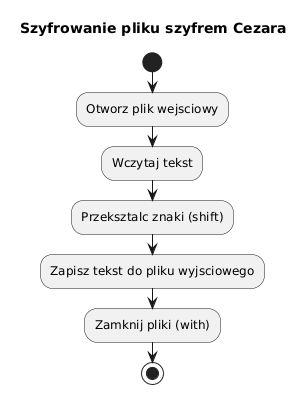

# 05 - Obsługa plików i szyfr Cezara

## Cel

Opanować pracę z plikami tekstowymi i binarnymi oraz zbudować kompletny przykład programu szyfrującego plik.

## Teoria

### Dlaczego pliki trzeba otwierać i zamykać?

Plik to zasób systemu operacyjnego. Kiedy otwieramy plik, system przydziela:
- deskryptor pliku (ograniczony zasób: typowo 1024 na proces),
- bufor danych w pamięci,
- blokadę (zależnie od systemu i trybu dostępu).

Niezamknięty plik może prowadzić do:
- utraty danych (dane w buforze nie zostają zapisane na dysk),
- wyczerpania deskryptorów,
- blokady pliku dla innych procesów.

Menedżer kontekstu `with` gwarantuje zamknięcie pliku nawet przy wyjątku:

```python
# Bezpieczna wersja z automatycznym zamknięciem:
with open("dane.txt", "r", encoding="utf-8") as f:
    content = f.read()
# Tu plik jest już zamknięty — nawet jeśli read() rzucił wyjątek
```

### Tryby otwarcia pliku

| Tryb | Opis | Tworzy plik? |
|---|---|---|
| `"r"` | Odczyt tekstu | Nie |
| `"w"` | Zapis tekstu (nadpisuje) | Tak |
| `"a"` | Dopisanie na końcu | Tak |
| `"x"` | Zapis nowego pliku (błąd jeśli istnieje) | Tak |
| `"rb"` | Odczyt binarny | Nie |
| `"wb"` | Zapis binarny (nadpisuje) | Tak |
| `"r+"` | Odczyt i zapis | Nie |

Zawsze podawaj `encoding="utf-8"` przy plikach tekstowych — domyślne kodowanie
różni się między systemami (Windows używa cp1250 lub cp1252).

### Standardowe operacje na plikach tekstowych

```python
from pathlib import Path

path = Path("wyniki.txt")

# Zapis
path.write_text("Linia 1\nLinia 2\n", encoding="utf-8")

# Odczyt całości
content = path.read_text(encoding="utf-8")

# Odczyt linia po linii (efektywny dla dużych plików)
with path.open("r", encoding="utf-8") as f:
    for line in f:
        print(line.rstrip())

# Dopisanie
with path.open("a", encoding="utf-8") as f:
    f.write("Linia 3\n")
```

### Pliki binarne

```python
from pathlib import Path

# Zapis binarny
Path("obraz.bin").write_bytes(b"\x89PNG\r\n")

# Odczyt binarny
raw = Path("obraz.bin").read_bytes()
print(raw[:4])   # b'\x89PNG'
```

Diagram: `diagrams/topic_05.png`



## Szyfr Cezara

Szyfr Cezara to jedno z najstarszych szyfrów podstawieniowych. Każdą literę alfabetu
przesuwa się o stałą liczbę pozycji `shift`. Odszyfrowanie to przesunięcie odwrotne (`-shift`).

```
plain:  A B C D ... X Y Z
shift=3:
cipher: D E F G ... A B C
```

Plik: `examples/caesar_file_cipher.py`

```python
ALPHABET = "abcdefghijklmnopqrstuvwxyz"

def shift_char(char: str, shift: int) -> str:
    lower = char.lower()
    if lower not in ALPHABET:
        return char                         # znaki spoza alfabetu bez zmian
    index = ALPHABET.index(lower)
    shifted = ALPHABET[(index + shift) % len(ALPHABET)]
    return shifted.upper() if char.isupper() else shifted

def caesar_transform(text: str, shift: int) -> str:
    return "".join(shift_char(ch, shift) for ch in text)

def encrypt_text_file(input_path: Path, output_path: Path, shift: int) -> None:
    with input_path.open("r", encoding="utf-8") as src:
        content = src.read()
    encrypted = caesar_transform(content, shift)
    with output_path.open("w", encoding="utf-8") as dst:
        dst.write(encrypted)
```

### Weryfikacja poprawności

```
szyfrowanie:  encrypt("Python 3", 3)  -> "Sbwkrq 3"
odszyfrowanie: encrypt("Sbwkrq 3", -3) -> "Python 3"
```

### Obsługa wyjątków w I/O

```python
def safe_encrypt(input_path: Path, output_path: Path, shift: int) -> str:
    try:
        encrypt_text_file(input_path, output_path, shift)
    except FileNotFoundError:
        return f"Plik wejściowy nie istnieje: {input_path}"
    except PermissionError:
        return f"Brak uprawnień do pliku: {input_path}"
    else:
        return "Zaszyfrowano pomyślnie"
```

## Mini-lab (krok po kroku)

1. Uruchom `examples/caesar_file_cipher.py` i sprawdź zawartość wygenerowanych plików.
2. Zmień `shift` na `13` (ROT13) i porównaj wynik.
3. Dodaj funkcję `count_lines(path: Path) -> int` czytającą plik linia po linii.
4. Dodaj walidację `shift` — musi być w przedziale 1–25; użyj własnego wyjątku `InvalidShiftError`.
5. Napisz test sprawdzający, że `caesar_transform(caesar_transform(text, n), -n) == text`.

### Oczekiwany efekt mini-labu

- Student potrafi pisać i czytać pliki tekstowe i binarne.
- Student rozumie, dlaczego `with` jest niezbędne przy I/O.
- Student łączy obsługę wyjątków z operacjami na plikach.

## Zadanie do samodzielnego rozwiązania

- szablon: `exercises/tasks.py`
- przykładowe rozwiązanie: `exercises/solutions_05.py`
- testy: `exercises/test_solutions.py`

Zadanie: napisz funkcję `caesar_transform(text: str, shift: int) -> str`, która:
- szyfruje litery łacińskie zachowując wielkość liter,
- zwraca bez zmian wszystkie znaki spoza alfabetu łacińskiego (cyfry, spacje, znaki diakrytyczne),
- spełnia warunek `caesar_transform(caesar_transform(t, n), -n) == t` dla dowolnego `t` i `n`.

## Pytania egzaminacyjne

1. Dlaczego `with open(...)` jest preferowane względem ręcznego `open`/`close`?
2. Co się stanie z niezapisanymi danymi jeśli plik zostanie zamknięty przez wyjątek bez `with`?
3. Czym różni się tryb `"w"` od trybu `"a"`?
4. Kiedy warto odczytywać plik linia po linii zamiast całości?
5. Dlaczego szyfr Cezara nie jest bezpieczny dla współczesnych zastosowań?

## Literatura

- https://docs.python.org/3/tutorial/inputoutput.html#reading-and-writing-files
- https://docs.python.org/3/library/pathlib.html
- https://docs.python.org/3/library/functions.html#open
- M. Lutz, *Learning Python*, rozdz. „File and Directory Tools"
