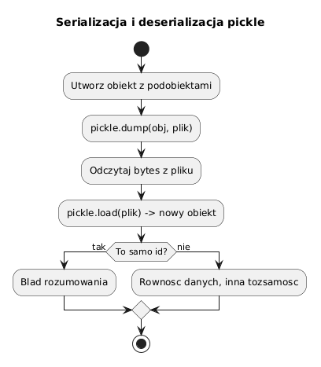

# 06 - `pickle` i serializacja

## Cel

Zrozumieć, czym jest serializacja, jak działa `pickle` i jak bezpiecznie zapisywać i odczytywać obiekty Python z obiektami zagnieżdżonymi.

## Teoria

### Czym jest serializacja?

**Serializacja** (ang. *serialization*, też *marshalling* lub *pickling*) to zamiana obiektu
istniejącego w pamięci na ciąg bajtów (lub tekst), który można:
- zapisać na dysku,
- przesłać przez sieć,
- przechować w bazie danych.

**Deserializacja** to operacja odwrotna: odtworzenie obiektu z bajtów.

Bez serializacji obiekt istnieje tylko w trakcie działania programu. Serializacja
umożliwia **trwałość danych** (ang. *persistence*).

### Przykłady zastosowań

| Zastosowanie | Technologia |
|---|---|
| Szybkie zapisanie stanu (checkpointing) | `pickle` |
| Wymiana danych z innymi systemami | `json`, `xml` |
| Modele ML / cache obliczeń | `pickle`, `joblib` |
| Komunikacja sieciowa między Pythonami | `pickle` |

### Moduł `pickle`

`pickle` jest wbudowany w bibliotekę standardową. Potrafi serializować niemal
każdy obiekt Pythona: instancje klas, słowniki, listy, zagnieżdżone struktury.

```python
import pickle

data = {"name": "Python", "year": 1991}

# Serializacja do bajtów (w pamięci)
payload: bytes = pickle.dumps(data)
print(type(payload))        # <class 'bytes'>

# Deserializacja
restored = pickle.loads(payload)
print(restored == data)     # True
print(restored is data)     # False — to nowy obiekt!
```

```python
from pathlib import Path

# Serializacja do pliku
with Path("data.pkl").open("wb") as f:
    pickle.dump(data, f)

# Deserializacja z pliku
with Path("data.pkl").open("rb") as f:
    loaded = pickle.load(f)
```

### Serializacja obiektów zagnieżdżonych

Diagram: `diagrams/topic_06.png`



Plik: `examples/pickle_demo.py`

```python
from dataclasses import dataclass
import pickle
from pathlib import Path


@dataclass
class Student:
    name: str
    year: int


@dataclass
class Course:
    title: str
    students: list[Student]


def save_course(course: Course, path: Path) -> None:
    with path.open("wb") as handle:
        pickle.dump(course, handle)


def load_course(path: Path) -> Course:
    with path.open("rb") as handle:
        return pickle.load(handle)
```

Po załadowaniu cała struktura (kurs + lista studentów) jest **niezależną kopią**:

```python
original = Course("Python 101", [Student("Ala", 1)])
save_course(original, Path("course.pkl"))
loaded = load_course(Path("course.pkl"))

original.students[0].name = "Zmienione"
print(loaded.students[0].name)   # "Ala" — kopia niezależna!
```

### Relacja do kopii głębokiej

`pickle.dumps` + `pickle.loads` w pamięci daje efekt identyczny z `copy.deepcopy`:

```python
import copy, pickle

obj = {"a": [1, 2, 3]}
by_deepcopy = copy.deepcopy(obj)
by_pickle   = pickle.loads(pickle.dumps(obj))

obj["a"].append(4)
print(by_deepcopy)   # {"a": [1, 2, 3]}
print(by_pickle)     # {"a": [1, 2, 3]}
```

`pickle` jest jednak wolniejszy dla operacji czysto pamięciowych — `copy.deepcopy` jest tu wydajniejszy.
`pickle` stosuj gdy potrzebujesz trwałości lub przesyłania przez sieć.

### Ostrzeżenie bezpieczeństwa

> **Nigdy nie deserializuj danych `pickle` z nieufnych źródeł.**
>
> `pickle.loads(bytes)` może wykonać **dowolny kod Python** zawarty w danych.
> Atakujący może spreparować bajty, które instalują złośliwe oprogramowanie.
> Dla danych z sieci lub od użytkownika używaj `json` lub dedykowanych bibliotek (np. `msgspec`, `pydantic`).

### Alternatywy

| Format | Czytelny | Przenośny | Bezpieczny | Obsługuje dowolne obiekty |
|---|---|---|---|---|
| `pickle` | Nie | Tylko Python | Nie | Tak |
| `json` | Tak | Tak | Tak | Tylko typy podstawowe |
| `csv` | Tak | Tak | Tak | Tylko tabele |
| `msgspec` | Nie | Tak | Tak | Ze schemą |

## Mini-lab (krok po kroku)

1. Uruchom `examples/pickle_demo.py` i zaobserwuj, że `original` i `loaded` są niezależne.
2. Dodaj pole `ects: int` do `Course` i zserializuj ponownie.
3. Zapisz listę 3 kursów do jednego pliku `.pkl` i odczytaj ją.
4. Porównaj czas `copy.deepcopy(obj)` vs `pickle.loads(pickle.dumps(obj))` dla dużej listy.

### Oczekiwany efekt mini-labu

- Student rozumie różnicę między obiektem oryginalnym a zdeserializowanym.
- Student wie, kiedy `pickle`, a kiedy `json` lub `copy.deepcopy`.

## Zadanie do samodzielnego rozwiązania

- szablon: `exercises/tasks.py`
- przykładowe rozwiązanie: `exercises/solutions_06.py`
- testy: `exercises/test_solutions.py`

Zadania:
1. `clone_with_pickle(obj)` — zwróć niezależną kopię obiektu przez `pickle`.
2. `save_and_load(obj, path)` — zapisz do pliku i odczytaj.

## Pytania egzaminacyjne

1. Dlaczego `pickle` bywa porównywany do kopii głębokiej?
2. Jakie ryzyko bezpieczeństwa wiąże się z `pickle.loads`?
3. Kiedy lepiej wybrać `json` zamiast `pickle`?
4. Czy `pickle` zachowuje relacje referencyjne między zagnieżdżonymi obiektami?
5. Dlaczego pliki `.pkl` muszą być otwierane w trybie binarnym (`"wb"`, `"rb"`)?

## Literatura

- https://docs.python.org/3/library/pickle.html
- https://docs.python.org/3/library/copy.html
- https://docs.python.org/3/library/json.html
- M. Lutz, *Learning Python*, rozdz. „Persistence and Databases"
- L. Ramalho, *Fluent Python*, rozdz. „Object Serialization"
