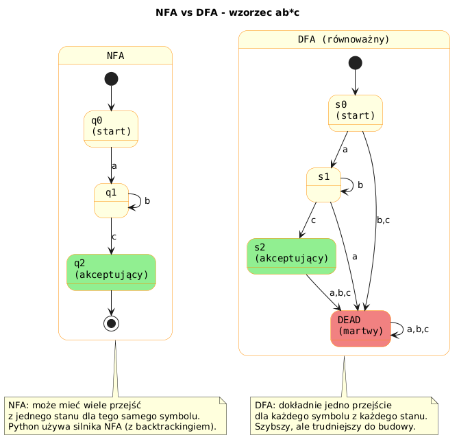

# 01 – Języki Formalne i Automaty Skończone

> **Cel:** Zrozumienie matematycznych podstaw wyrażeń regularnych: czym jest język regularny, jak działają automaty skończone NFA i DFA, oraz jak silnik `re` w Pythonie realizuje dopasowywanie.

---

## 1. Hierarchia Chomsky'ego

Noam Chomsky (1956) sklasyfikował gramatyki formalne w cztery typy:

| Typ | Nazwa | Automat | Przykład |
|---|---|---|---|
| 3 | Regularna | NFA / DFA | `\d+`, `[a-z]*` |
| 2 | Bezkontekstowa | Automat ze stosem | JSON, wyrażenia arytmetyczne |
| 1 | Kontekstowa | Automat liniowo ograniczony | niektóre języki programowania |
| 0 | Bez ograniczeń | Maszyna Turinga | dowolny algorytm |

**Wyrażenia regularne opisują języki typu 3** – najwęższą klasę, która jednak obejmuje ogromną liczbę praktycznych wzorców tekstowych.

---

## 2. Pojęcia podstawowe

- **Alfabet (Σ)** – skończony zbiór symboli, np. `{a, b}` lub Unicode.
- **Słowo** – skończony ciąg symboli z alfabetu.
- **Język** – zbiór słów nad danym alfabetem.
- **Język regularny** – język, który można opisać wyrażeniem regularnym (lub rozpoznać DFA).

### Operacje na językach regularnych

Jeśli `R` i `S` są wyrażeniami regularnymi, to:

| Operacja | Notacja | Python |
|---|---|---|
| Konkatenacja | `RS` | `ab` |
| Alternacja | `R\|S` | `a\|b` |
| Gwiazdka Kleene'go | `R*` | `a*` |

---

## 3. Automat Skończony (DFA)

**DFA (Deterministic Finite Automaton)** składa się z:
- Skończonego zbioru stanów `Q`
- Alfabetu `Σ`
- Funkcji przejścia `δ: Q × Σ → Q`
- Stanu początkowego `q₀ ∈ Q`
- Zbioru stanów akceptujących `F ⊆ Q`

### Przykład: DFA rozpoznający napisy kończące się na `ab`

```
     a        b        a
→ q0 ──→ q1 ──→ q2*   ─┐
   ↑ a        a ↓       │ b
   └──────────────────── ┘
```

Stany: `q0` (start), `q1` (widziano `a`), `q2` (akceptujący – widziano `ab`).

```python
przejscia = {
    ('q0', 'a'): 'q1', ('q0', 'b'): 'q0',
    ('q1', 'a'): 'q1', ('q1', 'b'): 'q2',
    ('q2', 'a'): 'q1', ('q2', 'b'): 'q0',
}
start = 'q0'
akceptujace = {'q2'}
```

---

## 4. NFA – Automat Niedeterministyczny

**NFA (Nondeterministic Finite Automaton)** dopuszcza:
- wiele przejść dla tego samego symbolu ze stanu,
- przejścia epsilon (ε) – bez czytania symbolu.

NFA jest równoważny DFA (twierdzenie Kleene'go / Rabin-Scott), ale łatwiejszy do konstruowania z wyrażeń regularnych.

### Silnik `re` w Pythonie używa NFA

Python kompiluje wzorzec do NFA, a następnie symuluje go techniką backtracking (cofania). To pozwala obsłużyć grupy przechwytujące, ale może prowadzić do **catastrophic backtracking** przy źle napisanych wzorcach (temat 06).



---

## 5. Od wyrażenia regularnego do DFA – przykład

Wzorzec: `a(b|c)*d`

1. Budujemy NFA z reguł Thompson Construction.
2. Za pomocą subset construction konwertujemy na DFA.
3. Minimalizujemy DFA.
4. Silnik `re` używa kroku 1 bezpośrednio (NFA z backtrackingiem).

```python
import re
pattern = r'a(b|c)*d'
print(bool(re.fullmatch(pattern, 'abcbd')))  # True
print(bool(re.fullmatch(pattern, 'ad')))     # True
print(bool(re.fullmatch(pattern, 'ab')))     # False
```

---

## Większy przykład

- [`examples/dfa_simulator.py`](examples/dfa_simulator.py) – ręczna implementacja DFA w Pythonie; symulacja krok po kroku ze śledzeniem ścieżki stanów.

```bash
python src/_06-regex/01-formal-languages/examples/dfa_simulator.py
```

---

## Zadania do samodzielnego rozwiązania

Pliki zadań:
- [`exercises/tasks.py`](exercises/tasks.py)
- [`exercises/solutions_formal.py`](exercises/solutions_formal.py)
- [`exercises/test_solutions.py`](exercises/test_solutions.py)

```bash
python -m pytest src/_06-regex/01-formal-languages/exercises/test_solutions.py -v
```

### Lista zadań

1. `czy_zawiera_cyfre(s)` – rozpoznawanie cyfry jako jednoetapowy automat.
2. `czy_ciag_binarny(s)` – DFA dla alfabetu `{0, 1}`.
3. `symuluj_dfa(przejscia, start, akceptujace, slowo)` – ogólna symulacja DFA.
4. `licz_dopasowania(pattern, text)` – zliczanie dopasowań wzorca w tekście.

---

## Referencje

### Literatura
- Sipser, M. (2012). *Introduction to the Theory of Computation*, 3rd ed. Cengage. Rozdział 1.
- Hopcroft, J., Motwani, R., Ullman, J. (2006). *Introduction to Automata Theory, Languages, and Computation*, 3rd ed. Pearson.
- Friedl, J. (2006). *Mastering Regular Expressions*, 3rd ed. O'Reilly.

### Źródła internetowe
- [Regular Expressions – Wikipedia](https://en.wikipedia.org/wiki/Regular_expression)
- [Finite Automaton – Wikipedia](https://en.wikipedia.org/wiki/Finite-state_machine)
- [re – Regular expression operations (Python Docs)](https://docs.python.org/3/library/re.html)

