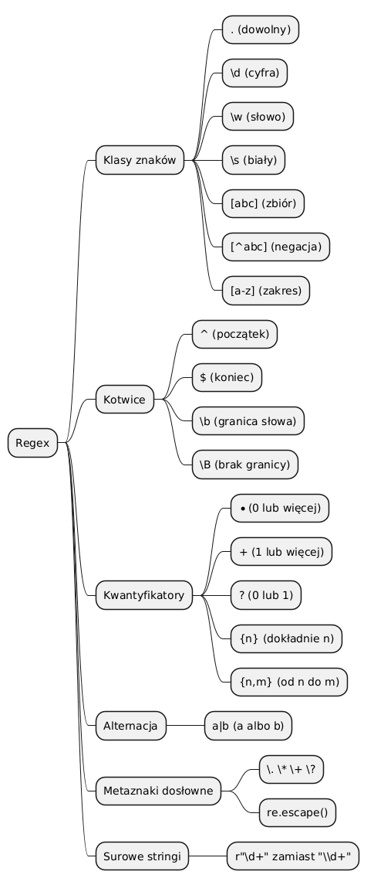

# 02 – Podstawowa Składnia Wyrażeń Regularnych

> **Cel:** Opanowanie elementarnych budulców wzorców: klas znaków, kotwic, kwantyfikatorów i alternacji. Zrozumienie, dlaczego surowe stringi `r"..."` są niezbędne.

---

## 1. Surowe stringi `r"..."`

Python traktuje `\n`, `\t` itp. jako sekwencje ucieczki. W wyrażeniach regularnych `\d`, `\w`, `\s` mają inne znaczenie. Aby uniknąć konfliktów, **zawsze** używamy surowych stringów:

```python
import re
re.search(r'\d+', 'abc 42')   # poprawnie: \d to cyfra
re.search('\\d+', 'abc 42')   # równoważne, ale trudniejsze do czytania
```

---

## 2. Klasy znaków

| Wzorzec | Znaczenie |
|---|---|
| `.` | Dowolny znak oprócz `\n` (z flagą `re.DOTALL` – również `\n`) |
| `\d` | Cyfra `[0-9]` |
| `\D` | Nie-cyfra `[^0-9]` |
| `\w` | Znak słowa `[a-zA-Z0-9_]` |
| `\W` | Nie-znak słowa |
| `\s` | Biały znak (spacja, tab, `\n`, …) |
| `\S` | Nie-biały znak |
| `[abc]` | Jeden z: `a`, `b`, `c` |
| `[^abc]` | Żaden z: `a`, `b`, `c` |
| `[a-z]` | Litera małа od `a` do `z` |

```python
re.findall(r'\d', 'a1b2c3')       # ['1', '2', '3']
re.findall(r'[aeiou]', 'Python')   # ['o']
re.findall(r'[^aeiou\s]', 'Hi!')   # ['H', '!']
```

---

## 3. Kotwice

Kotwice **nie dopasowują znaku**, lecz pozycję w tekście.

| Wzorzec | Pozycja |
|---|---|
| `^` | Początek napisu (lub linii przy `re.MULTILINE`) |
| `$` | Koniec napisu (lub linii przy `re.MULTILINE`) |
| `\b` | Granica słowa |
| `\B` | Brak granicy słowa |

```python
re.findall(r'^\d+', '123 abc')      # ['123']
re.findall(r'\bPython\b', 'Python3 Python!') # ['Python', 'Python']
```

---

## 4. Kwantyfikatory

| Wzorzec | Liczba powtórzeń |
|---|---|
| `*` | 0 lub więcej |
| `+` | 1 lub więcej |
| `?` | 0 lub 1 (opcjonalny) |
| `{n}` | Dokładnie `n` razy |
| `{n,m}` | Od `n` do `m` razy |
| `{n,}` | Co najmniej `n` razy |

```python
re.fullmatch(r'\d{4}-\d{2}-\d{2}', '2024-01-15')  # Match
re.findall(r'\d+', 'cena: 42 zl')                   # ['42']
re.findall(r'colou?r', 'color colour')               # ['color', 'colour']
```

---

## 5. Alternacja `|`

```python
re.findall(r'pies|kot', 'mam psa i kota')   # ['pies' nie pasuje] -> []
re.findall(r'psa|kota', 'mam psa i kota')   # ['psa', 'kota']
re.fullmatch(r'tak|nie', 'tak')             # Match
```



---

## 6. Metaznaki – jak je dosłownie wyszukać?

Znaki `. * + ? [ ] { } ( ) ^ $ | \` są metaznakmi. Aby je wyszukać dosłownie, poprzedź je `\` lub użyj `re.escape()`:

```python
re.findall(r'3\.14', 'pi = 3.14')    # ['3.14']
re.escape('3.14')                     # '3\\.14'
```

---

## Większy przykład

- [`examples/syntax_explorer.py`](examples/syntax_explorer.py) – systematyczny przegląd wszystkich kategorii składni na tych samych danych.

```bash
python src/_06-regex/02-basic-syntax/examples/syntax_explorer.py
```

---

## Zadania do samodzielnego rozwiązania

Pliki zadań:
- [`exercises/tasks.py`](exercises/tasks.py)
- [`exercises/solutions_syntax.py`](exercises/solutions_syntax.py)
- [`exercises/test_solutions.py`](exercises/test_solutions.py)

```bash
python -m pytest src/_06-regex/02-basic-syntax/exercises/test_solutions.py -v
```

### Lista zadań

1. `czy_tylko_litery(s)` – walidacja napisu złożonego wyłącznie z liter.
2. `znajdz_liczby_calkowite(s)` – wyciągnięcie wszystkich liczb całkowitych.
3. `czy_data_iso(s)` – sprawdzenie formatu YYYY-MM-DD.
4. `znajdz_slowa_na_wielka(s)` – słowa zaczynające się wielką literą.
5. `czy_poprawny_identyfikator(s)` – walidacja identyfikatora Pythona (bez `keyword`).

---

## Referencje

### Literatura
- Friedl, J. (2006). *Mastering Regular Expressions*, 3rd ed. O'Reilly. Rozdziały 1–2.
- Lutz, M. (2013). *Learning Python*, 5th ed. O'Reilly. Rozdział 36.

### Źródła internetowe
- [re – Regular expression syntax (Python Docs)](https://docs.python.org/3/library/re.html#regular-expression-syntax)
- [regex101.com](https://regex101.com) – interaktywny tester z objaśnieniami
- [regexr.com](https://regexr.com) – alternatywny tester

