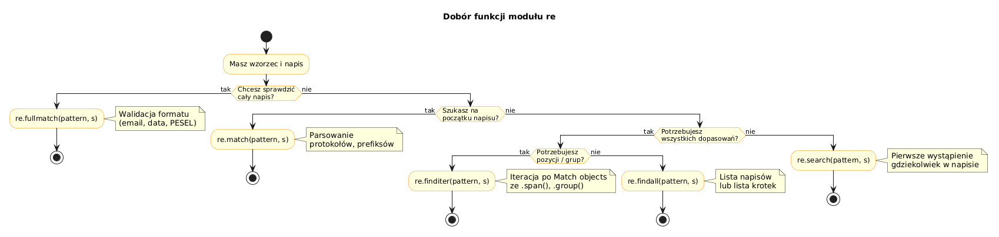

# 03 – Moduł `re` w Pythonie

> **Cel:** Poznanie pełnego API modułu `re`: kiedy używać `match` vs `search` vs `fullmatch`, jak iterować po dopasowaniach, jak zastępować i dzielić tekst, oraz dlaczego warto kompilować wzorce.

---

## 1. Funkcje – który wariant wybrać?

| Funkcja | Gdzie szuka | Zwraca |
|---|---|---|
| `re.match(p, s)` | **Tylko na początku** napisu | `Match` lub `None` |
| `re.search(p, s)` | **Pierwsze** dopasowanie gdziekolwiek | `Match` lub `None` |
| `re.fullmatch(p, s)` | Cały napis musi pasować | `Match` lub `None` |
| `re.findall(p, s)` | Wszystkie dopasowania | `list[str]` (lub `list[tuple]`) |
| `re.finditer(p, s)` | Wszystkie dopasowania | `Iterator[Match]` |

```python
import re
s = 'abc 123 def 456'
re.match(r'\d+', s)        # None – napis nie zaczyna się cyfrą
re.search(r'\d+', s)       # Match '123'
re.fullmatch(r'\d+', s)    # None – nie cały napis to cyfry
re.findall(r'\d+', s)      # ['123', '456']
```



---

## 2. Obiekt `Match`

```python
m = re.search(r'(\d{4})-(\d{2})-(\d{2})', '2024-01-15')
m.group(0)        # '2024-01-15'  (całe dopasowanie)
m.group(1)        # '2024'
m.start(), m.end()  # (0, 10)
m.span()          # (0, 10)
```

---

## 3. `re.findall` i grupy

Gdy wzorzec zawiera grupy `()`, `findall` zwraca listę krotek:

```python
re.findall(r'(\d{4})-(\d{2})', '2024-01 i 2025-03')
# [('2024', '01'), ('2025', '03')]
```

---

## 4. `re.finditer` – iterowanie po dopasowaniach

```python
for m in re.finditer(r'\d+', 'a1b22c333'):
    print(m.group(), m.span())
# 1 (1, 2)
# 22 (3, 5)
# 333 (6, 9)
```

---

## 5. `re.sub` – zamiana

```python
re.sub(r'\s+', ' ', 'za   dużo    spacji')   # 'za dużo spacji'
re.sub(r'\d+', lambda m: str(int(m.group())*2), '1 i 3')  # '2 i 6'
```

`re.subn` zwraca krotkę `(nowy_napis, liczba_zamian)`.

---

## 6. `re.split`

```python
re.split(r'[;,\s]+', 'a,b; c  d')   # ['a', 'b', 'c', 'd']
```

---

## 7. `re.compile` – kompilacja wzorca

Kompilacja opłaca się, gdy ten sam wzorzec jest używany wielokrotnie:

```python
CYFRY = re.compile(r'\d+')
CYFRY.findall('abc 123')   # ['123']
CYFRY.sub('X', 'a1b2')     # 'aXbX'
```

Skompilowany obiekt ma te same metody co moduł `re`.

---

## Większy przykład

- [`examples/re_module_tour.py`](examples/re_module_tour.py) – ten sam wzorzec testowany wszystkimi funkcjami modułu `re`.

```bash
python src/_06-regex/03-re-module/examples/re_module_tour.py
```

---

## Zadania do samodzielnego rozwiązania

Pliki zadań:
- [`exercises/tasks.py`](exercises/tasks.py)
- [`exercises/solutions_re_module.py`](exercises/solutions_re_module.py)
- [`exercises/test_solutions.py`](exercises/test_solutions.py)

```bash
python -m pytest src/_06-regex/03-re-module/exercises/test_solutions.py -v
```

### Lista zadań

1. `pierwsza_liczba(s)` – znajdź pierwszą liczbę całkowitą w napisie.
2. `wszystkie_emaile(s)` – wyciągnij wszystkie adresy e-mail.
3. `normalizuj_spacje(s)` – zastąp wielokrotne białe znaki pojedynczą spacją.
4. `podziel_na_tokeny(s)` – podziel po przecinkach, średnikach lub białych znakach.
5. `pozycje_slowa(s, slowo)` – zwróć listę pozycji `(start, end)` wszystkich wystąpień słowa.

---

## Referencje

### Literatura
- Friedl, J. (2006). *Mastering Regular Expressions*, 3rd ed. O'Reilly.

### Źródła internetowe
- [re — Regular expression operations (Python Docs)](https://docs.python.org/3/library/re.html)
- [How to Use Regex in Python (Real Python)](https://realpython.com/regex-python/)

