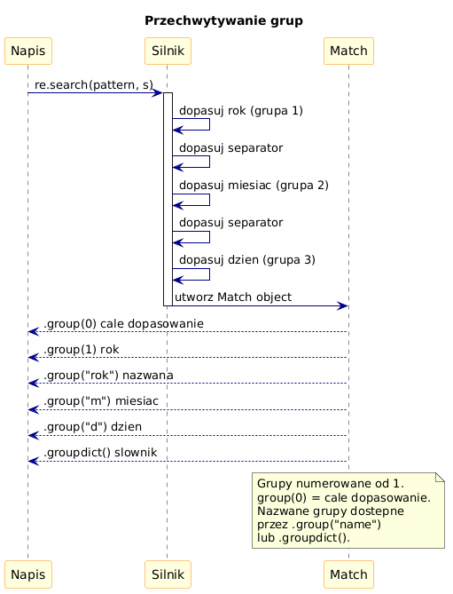

# 04 – Grupy i Przechwytywanie

> **Cel:** Zrozumienie grup przechwytujących, nieprzechwytujących i nazwanych, wstecznych odniesień oraz używania grup w funkcjach `sub` i `findall`.

---

## 1. Grupy przechwytujące `()`

Nawiasy `()` tworzą grupę i **przechwytują** dopasowany fragment:

```python
import re
m = re.search(r'(\d{4})-(\d{2})-(\d{2})', '2024-03-15')
m.group(0)   # '2024-03-15'  – całe dopasowanie
m.group(1)   # '2024'        – pierwsza grupa
m.group(2)   # '03'
m.group(3)   # '15'
m.groups()   # ('2024', '03', '15')
```

Grupy są numerowane od lewej według otwierającego nawiasu.

---

## 2. Grupy nieprzechwytujące `(?:...)`

Gdy chcemy grupować bez zapisywania, używamy `(?:...)`:

```python
# Brak grupy niepotrzebnej w groups()
m = re.search(r'(?:https?|ftp)://(\S+)', 'https://python.org')
m.group(1)   # 'python.org'
m.groups()   # ('python.org',)  – tylko jedna grupa
```

---

## 3. Grupy nazwane `(?P<name>...)`

Nazwane grupy czytelniejszy kod – dostęp przez `.group("name")`:

```python
m = re.search(
    r'(?P<rok>\d{4})-(?P<miesiac>\d{2})-(?P<dzien>\d{2})',
    '2024-03-15'
)
m.group('rok')      # '2024'
m.groupdict()       # {'rok': '2024', 'miesiac': '03', 'dzien': '15'}
```



---

## 4. Grupy w `re.findall`

Gdy wzorzec zawiera grupy, `findall` zwraca **listę krotek**:

```python
re.findall(r'(\d{4})-(\d{2})', '2024-01 2025-03')
# [('2024', '01'), ('2025', '03')]
```

---

## 5. Wsteczne odniesienia `\1` i `(?P=name)`

Wsteczne odniesienie pozwala dopasować to samo co wcześniej przechwycona grupa:

```python
# Wykrywanie powtórzonych słów
re.findall(r'\b(\w+)\s+\1\b', 'to to jest dobrze')
# ['to']

# Wersja z nazwaną grupą
re.search(r'(?P<slowo>\w+) (?P=slowo)', 'test test')
```

---

## 6. Grupy w `re.sub`

Przechwycone grupy można wstawiać w ciągu zastępującym przez `\1` lub `\g<name>`:

```python
# YYYY-MM-DD → DD.MM.YYYY
re.sub(
    r'(?P<y>\d{4})-(?P<m>\d{2})-(?P<d>\d{2})',
    r'\g<d>.\g<m>.\g<y>',
    'urodziny: 1990-05-20'
)
# 'urodziny: 20.05.1990'
```

---

## Większy przykład

- [`examples/groups_demo.py`](examples/groups_demo.py) – parsowanie dat, adresów IP i connection stringów za pomocą nazwanych grup.

```bash
python src/_06-regex/04-groups/examples/groups_demo.py
```

---

## Zadania do samodzielnego rozwiązania

Pliki zadań:
- [`exercises/tasks.py`](exercises/tasks.py)
- [`exercises/solutions_groups.py`](exercises/solutions_groups.py)
- [`exercises/test_solutions.py`](exercises/test_solutions.py)

```bash
python -m pytest src/_06-regex/04-groups/exercises/test_solutions.py -v
```

### Lista zadań

1. `wyciagnij_date(s)` – named groups `rok`, `miesiac`, `dzien`.
2. `zamien_format_daty(s)` – `re.sub` z grupami: YYYY-MM-DD → DD.MM.YYYY.
3. `znajdz_powtorzenia(s)` – wsteczne odniesienie `\1`.
4. `parsuj_wersje(s)` – krotka `(major, minor, patch)`.
5. `wyciagnij_pary_klucz_wartosc(s)` – grupy dla `klucz=wartosc`.

---

## Referencje

### Literatura
- Friedl, J. (2006). *Mastering Regular Expressions*, 3rd ed. O'Reilly. Rozdział 3.

### Źródła internetowe
- [Grouping (Python Docs)](https://docs.python.org/3/library/re.html#re.Match.group)
- [Named Groups – PEP 3101 style](https://docs.python.org/3/howto/regex.html#non-capturing-and-named-groups)

