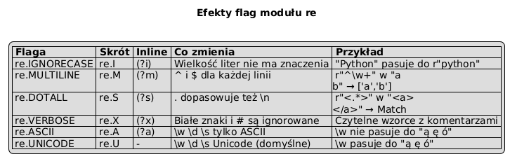

# 05 – Flagi i Tryby

> **Cel:** Opanowanie flag modułu `re`, które zmieniają zachowanie silnika: ignorowanie wielkości liter, wieloliniowe kotwice, `.` pasujące do `\n`, czytelne wzorce z komentarzami.

---

## 1. Przegląd flag

| Flaga długa | Skrót | Inline | Efekt |
|---|---|---|---|
| `re.IGNORECASE` | `re.I` | `(?i)` | Ignoruje wielkość liter |
| `re.MULTILINE` | `re.M` | `(?m)` | `^` i `$` pasują do każdej linii |
| `re.DOTALL` | `re.S` | `(?s)` | `.` dopasowuje też `\n` |
| `re.VERBOSE` | `re.X` | `(?x)` | Ignoruje białe znaki i `#`-komentarze |
| `re.ASCII` | `re.A` | `(?a)` | `\w \d \s` dopasowują tylko ASCII |
| `re.UNICODE` | `re.U` | – | Domyślne w Python 3 |

Flagi można łączyć: `re.I | re.M`.

---

## 2. `re.IGNORECASE`

```python
import re
re.findall(r'python', 'Python PYTHON python', re.I)
# ['Python', 'PYTHON', 'python']
```

---

## 3. `re.MULTILINE` – kotwice `^` i `$` dla każdej linii

Domyślnie `^` pasuje tylko do początku całego napisu, `$` – do końca.  
Z flagą `re.M` pasują do każdej **linii**:

```python
tekst = "linia1\nlinia2\nlinia3"
re.findall(r'^\w+', tekst)            # ['linia1']
re.findall(r'^\w+', tekst, re.M)      # ['linia1', 'linia2', 'linia3']
```

---

## 4. `re.DOTALL` – `.` dopasowuje `\n`

```python
html = "<div>\nzawartosc\n</div>"
re.search(r'<div>.*</div>', html)           # None  (. nie pasuje do \n)
re.search(r'<div>.*</div>', html, re.S)     # Match
```

---

## 5. `re.VERBOSE` – czytelne wzorce

Pozwala pisać wzorzec w wielu liniach z komentarzami (Python ignoruje białe znaki i tekst po `#`):

```python
DATA_VERBOSE = re.compile(r"""
    (?P<rok>   \d{4})   # 4-cyfrowy rok
    -
    (?P<m>     \d{2})   # 2-cyfrowy miesiąc
    -
    (?P<d>     \d{2})   # 2-cyfrowy dzień
""", re.VERBOSE)
```

---

## 6. Flagi inline `(?flags)`

Można umieścić flagę bezpośrednio we wzorcu – przydatne przy `re.compile` bez osobnego parametru:

```python
re.findall(r'(?i)python', 'Python PYTHON')   # ['Python', 'PYTHON']
re.findall(r'(?im)^\w+', "A\nB\nC")          # ['A', 'B', 'C']
```



---

## Większy przykład

- [`examples/flags_demo.py`](examples/flags_demo.py) – ten sam wzorzec z różnymi flagami na wieloliniowym tekście; w pełni czytelny wzorzec VERBOSE.

```bash
python src/_06-regex/05-flags/examples/flags_demo.py
```

---

## Zadania do samodzielnego rozwiązania

Pliki zadań:
- [`exercises/tasks.py`](exercises/tasks.py)
- [`exercises/solutions_flags.py`](exercises/solutions_flags.py)
- [`exercises/test_solutions.py`](exercises/test_solutions.py)

```bash
python -m pytest src/_06-regex/05-flags/exercises/test_solutions.py -v
```

### Lista zadań

1. `szukaj_bez_wielkosci(tekst, wzorzec)` – `re.IGNORECASE`.
2. `znajdz_naglowki_markdown(tekst)` – `re.MULTILINE` dla linii `##+ Tytuł`.
3. `wyciagnij_bloki_html(tekst, tag)` – `re.DOTALL` dla `<tag>...</tag>`.
4. `waliduj_numer_verbose(s)` – wzorzec numeru telefonu napisany z `re.VERBOSE`.

---

## Referencje

### Literatura
- Friedl, J. (2006). *Mastering Regular Expressions*, 3rd ed. O'Reilly. Rozdział 3.

### Źródła internetowe
- [Flags (Python Docs)](https://docs.python.org/3/library/re.html#flags)
- [Python Regex Flags (Real Python)](https://realpython.com/regex-python/#flags)

