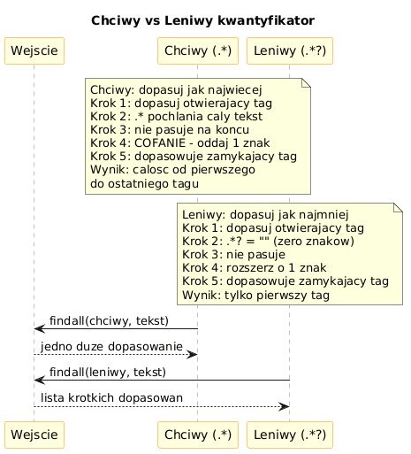

# 06 – Zaawansowane Wzorce

> **Cel:** Zrozumienie kwantyfikatorów leniwych, asercji lookahead/lookbehind oraz mechanizmu cofania (backtracking). Nauka unikania pułapek wydajnościowych.

---

## 1. Chciwe vs leniwe kwantyfikatory

Domyślnie kwantyfikatory są **chciwe** – próbują dopasować jak **najwięcej**:

```python
import re
re.search(r'<.*>', '<b>tekst</b>').group()    # '<b>tekst</b>'  (za dużo!)
```

Dodanie `?` tworzy wersję **leniwą** – dopasowuje jak **najmniej**:

```python
re.search(r'<.*?>', '<b>tekst</b>').group()   # '<b>'  (poprawnie)
re.findall(r'<.*?>', '<b>tekst</b>')          # ['<b>', '</b>']
```

| Chciwy | Leniwy | Opis |
|---|---|---|
| `*` | `*?` | 0 lub więcej, jak najmniej |
| `+` | `+?` | 1 lub więcej, jak najmniej |
| `?` | `??` | 0 lub 1, preferuje 0 |
| `{n,m}` | `{n,m}?` | od n do m, jak najmniej |

---

## 2. Lookahead – asercja wyprzedzająca

Sprawdza co jest **za** bieżącą pozycją, **bez** wliczania w dopasowanie:

```python
# Pozytywny (?=...): cyfry poprzedzające 'zł'
re.findall(r'\d+(?=\s?zł)', 'kosztuje 42 zł i 10 euro')   # ['42']

# Negatywny (?!...): słowa NIE poprzedzające cyfry
re.findall(r'\w+(?!\d)', 'abc 123 xyz')   # wyklucza 'abc' przed '123'?
```

---

## 3. Lookbehind – asercja wsteczna

Sprawdza co jest **przed** bieżącą pozycją:

```python
# Pozytywny (?<=...): cyfry PO 'PLN '
re.findall(r'(?<=PLN )\d+', 'PLN 42 i EUR 100')   # ['42']

# Negatywny (?<!...): słowa NIE poprzedzone cyfrą
re.findall(r'(?<!\d)\b[a-z]+\b', 'abc 3xyz def')  # ['abc', 'def']
```

> ⚠️ Lookbehind wymaga wzorca o **stałej szerokości** w Pythonie < 3.11.

---

## 4. Cofanie (Backtracking) i jego pułapki

Silnik NFA wraca do wcześniejszych pozycji, gdy gałąź nie pasuje. Przy źle napisanych wzorcach może to prowadzić do **wykładniczego czasu** działania:

```python
# NIEBEZPIECZNY wzorzec (catastrophic backtracking):
import re, timeit
bad = re.compile(r'(a+)+$')
# bad.match('aaaaaaaaaaaaaaaaaaaab')  # zawiesza się!

# BEZPIECZNY odpowiednik:
good = re.compile(r'a+$')
```

**Zasada:** unikaj zagnieżdżonych kwantyfikatorów na tym samym obszarze.

---

## 5. `re.escape` – bezpieczne wyszukiwanie tekstu użytkownika

```python
user_input = "3.14 (pi)"
safe = re.escape(user_input)     # '3\\.14\\ \\(pi\\)'
re.findall(safe, "wynosi 3.14 (pi) przybliżenie")   # ['3.14 (pi)']
```



---

## Większy przykład

- [`examples/advanced_patterns.py`](examples/advanced_patterns.py) – lookahead do walidacji hasła, lookbehind do ekstrakcji cen, demo cofania z `timeit`.

```bash
python src/_06-regex/06-advanced-patterns/examples/advanced_patterns.py
```

---

## Zadania do samodzielnego rozwiązania

Pliki zadań:
- [`exercises/tasks.py`](exercises/tasks.py)
- [`exercises/solutions_advanced.py`](exercises/solutions_advanced.py)
- [`exercises/test_solutions.py`](exercises/test_solutions.py)

```bash
python -m pytest src/_06-regex/06-advanced-patterns/exercises/test_solutions.py -v
```

### Lista zadań

1. `znajdz_tagi_html(s)` – leniwy kwantyfikator `<.*?>`.
2. `liczby_przed_jednostka(s, jednostka)` – lookahead.
3. `waliduj_haslo(s)` – wielokrotny lookahead (cyfra + wielka + 8+ znaków).
4. `slowa_nie_poprzedzone_liczba(s)` – negatywny lookbehind.
5. `bezpieczne_wyszukaj(wzorzec_uzytkownika, tekst)` – `re.escape`.

---

## Referencje

### Literatura
- Friedl, J. (2006). *Mastering Regular Expressions*, 3rd ed. O'Reilly. Rozdziały 4, 6.

### Źródła internetowe
- [Lookahead and Lookbehind (Python Docs)](https://docs.python.org/3/library/re.html#re.compile)
- [Catastrophic Backtracking (regular-expressions.info)](https://www.regular-expressions.info/catastrophic.html)

