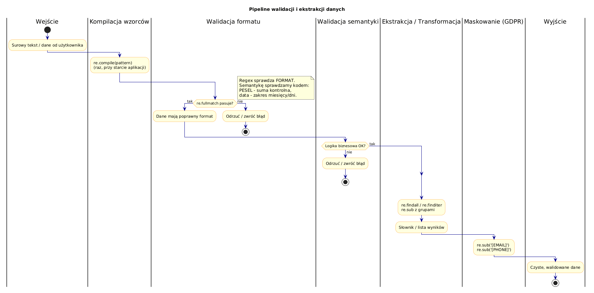

# 07 – Praktyczne Zastosowania

> **Cel:** Zastosowanie wyrażeń regularnych do realnych problemów: walidacja danych wejściowych, parsowanie logów serwera i maskowanie danych osobowych.

---

## 1. Walidacja danych – zasady

- **Kompiluj wzorce raz** (`re.compile`) – przy wielokrotnym użyciu to duże przyspieszenie.
- **Używaj `re.fullmatch`** do walidacji – cały napis musi pasować.
- **Dokumentuj wzorce** z `re.VERBOSE`.
- Regex to narzędzie do sprawdzania **formatu**, nie semantyki (np. `29-02-2023` może przejść wzorzec daty, ale jest niepoprawna).

---

## 2. Walidacja e-mail (uproszczona)

```python
import re

EMAIL_RE = re.compile(r"""
    ^
    [a-zA-Z0-9._%+\-]+   # część lokalna
    @
    [a-zA-Z0-9.\-]+      # domena
    \.
    [a-zA-Z]{2,}         # TLD (co najmniej 2 znaki)
    $
""", re.VERBOSE)

EMAIL_RE.fullmatch("jan@example.com")   # Match
EMAIL_RE.fullmatch("brak_malpy")        # None
```

> Pełna walidacja RFC 5322 jest znacznie bardziej złożona – w praktyce użyj biblioteki `email-validator`.

---

## 3. Walidacja PESEL

PESEL to 11-cyfrowy numer. Poprawność sprawdzamy **algorytmem sum kontrolnych**:

```
wagi = [1, 3, 7, 9, 1, 3, 7, 9, 1, 3, 1]
suma = Σ(cyfra_i × waga_i)  dla i=0..10
suma % 10 == 0
```

```python
def waliduj_pesel(s: str) -> bool:
    if not re.fullmatch(r'\d{11}', s):
        return False
    wagi = [1, 3, 7, 9, 1, 3, 7, 9, 1, 3, 1]
    return sum(int(c) * w for c, w in zip(s, wagi)) % 10 == 0
```

---

## 4. Parsowanie logów Apache (Combined Log Format)

```
127.0.0.1 - frank [10/Oct/2000:13:55:36 -0700] "GET /index.html HTTP/1.1" 200 1234
```

```python
LOG_RE = re.compile(r"""
    ^(\S+)              # IP klienta
    \s+\S+\s+           # ident i użytkownik (pomijamy)
    (\S+)               # użytkownik auth
    \s+\[([^\]]+)\]     # czas żądania
    \s+"(\S+)           # metoda HTTP
    \s+(\S+)            # ścieżka
    \s+(\S+)"           # protokół
    \s+(\d{3})          # kod statusu
    \s+(\d+|-)          # rozmiar odpowiedzi
    $
""", re.VERBOSE)
```

---

## 5. Maskowanie danych osobowych (GDPR)

Automatyczne zastępowanie wrażliwych danych przed logowaniem lub wyeksportowaniem:

```python
def maskuj(tekst: str) -> str:
    tekst = EMAIL_RE.sub('[EMAIL]', tekst)
    tekst = PHONE_RE.sub('[PHONE]', tekst)
    return tekst
```



---

## Większy przykład

- [`examples/data_validator.py`](examples/data_validator.py) – kompletna biblioteka walidatorów z `re.compile`.
- [`examples/log_parser.py`](examples/log_parser.py) – parsowanie pliku logów Apache do listy słowników.

```bash
python src/_06-regex/07-practical-use/examples/data_validator.py
python src/_06-regex/07-practical-use/examples/log_parser.py
```

---

## Zadania do samodzielnego rozwiązania

Pliki zadań:
- [`exercises/tasks.py`](exercises/tasks.py)
- [`exercises/solutions_practical.py`](exercises/solutions_practical.py)
- [`exercises/test_solutions.py`](exercises/test_solutions.py)

```bash
python -m pytest src/_06-regex/07-practical-use/exercises/test_solutions.py -v
```

### Lista zadań

1. `waliduj_email(s)` – format adresu e-mail.
2. `waliduj_pesel(s)` – format + algorytm sumy kontrolnej.
3. `waliduj_url(s)` – http/https z domeną i opcjonalną ścieżką.
4. `parsuj_linie_logu(linia)` – Apache Combined Log → `dict`.
5. `maskuj_dane_osobowe(tekst)` – zamiana e-maili i numerów telefonów na `[REDACTED]`.

---

## Referencje

### Literatura
- Friedl, J. (2006). *Mastering Regular Expressions*, 3rd ed. O'Reilly. Rozdział 7.

### Źródła internetowe
- [RFC 5322 – Internet Message Format](https://datatracker.ietf.org/doc/html/rfc5322)
- [Apache Log Files](https://httpd.apache.org/docs/current/logs.html)
- [PESEL – Wikipedia](https://pl.wikipedia.org/wiki/PESEL)

