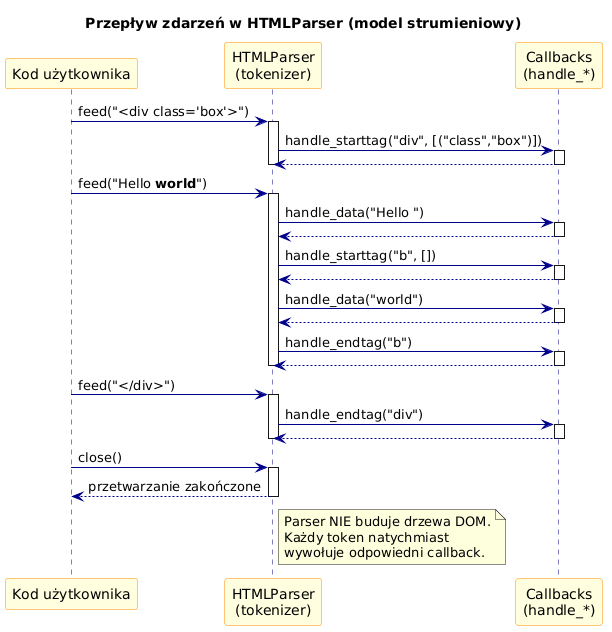

# 01 – Analizator Strumieniowy i Model Zdarzeń

> **Cel:** Zrozumienie, czym jest `html.parser.HTMLParser`, jak działa model strumieniowy (SAX-like) oraz jakie zdarzenia generuje parser podczas przetwarzania dokumentu HTML.

---

## 1. Czym jest HTMLParser?

`html.parser.HTMLParser` to klasa z **biblioteki standardowej** Pythona 3 (moduł `html.parser`), która realizuje **strumieniowy analizator HTML**.

Kluczowe cechy:
- **Nie buduje drzewa DOM** – przetwarza HTML sekwencyjnie, token po tokenie.
- **Model zdarzeniowy (SAX-like)** – przy napotkaniu tagu otwierającego, zamykającego, tekstu itd. wywołuje odpowiednią metodę (callback).
- **Czysty Python** – brak zależności zewnętrznych, działa na każdej platformie.
- **Import:** `from html.parser import HTMLParser`

### Analogia: parser strumieniowy vs DOM

| Cecha | Parser strumieniowy (HTMLParser) | Parser DOM (np. lxml) |
|---|---|---|
| Zużycie pamięci | Niskie – nie buduje drzewa | Wysokie – cały dokument w pamięci |
| Nawigacja | Tylko do przodu | Dowolna (parent, children, siblings) |
| Szybkość | Szybki dla dużych plików | Wolniejszy start, szybkie zapytania |
| API | Callbacks (nadpisz metody) | Zapytania (XPath, CSS selectors) |

---

## 2. Metoda `feed()` – karmienie parsera danymi

Parser nie oczekuje całego dokumentu naraz. Możemy „karmić" go **fragmentami**:

```python
from html.parser import HTMLParser

class DebugParser(HTMLParser):
    def handle_starttag(self, tag, attrs):
        print(f"  START: <{tag}> attrs={attrs}")

    def handle_endtag(self, tag):
        print(f"  END:   </{tag}>")

    def handle_data(self, data):
        print(f"  DATA:  {data!r}")

parser = DebugParser()

# Karmienie jednym kawałkiem:
parser.feed("<p>Hello</p>")

# Karmienie fragmentami (streaming):
parser.feed("<div>")
parser.feed("Tekst")
parser.feed("</div>")
```

**Wyjście:**
```
  START: <p> attrs=[]
  DATA:  'Hello'
  END:   </p>
  START: <div> attrs=[]
  DATA:  'Tekst'
  END:   </div>
```

> ⚠️ `feed()` **nie resetuje** stanu parsera – kolejne wywołania kontynuują przetwarzanie.

---

## 3. Sekwencja zdarzeń

Gdy parser przetwarza HTML, generuje **zdarzenia** w kolejności napotkania tokenów:

```html
<!-- komentarz -->
<div class="box">
    <p>Tekst <b>pogrubiony</b></p>
</div>
```

Sekwencja zdarzeń:

| # | Zdarzenie | Metoda | Argumenty |
|---|---|---|---|
| 1 | Komentarz | `handle_comment` | `" komentarz "` |
| 2 | Tag otwierający | `handle_starttag` | `"div"`, `[("class", "box")]` |
| 3 | Dane tekstowe | `handle_data` | `"\n    "` |
| 4 | Tag otwierający | `handle_starttag` | `"p"`, `[]` |
| 5 | Dane tekstowe | `handle_data` | `"Tekst "` |
| 6 | Tag otwierający | `handle_starttag` | `"b"`, `[]` |
| 7 | Dane tekstowe | `handle_data` | `"pogrubiony"` |
| 8 | Tag zamykający | `handle_endtag` | `"b"` |
| 9 | Tag zamykający | `handle_endtag` | `"p"` |
| 10 | Dane tekstowe | `handle_data` | `"\n"` |
| 11 | Tag zamykający | `handle_endtag` | `"div"` |



---

## 4. `reset()` i `close()`

```python
parser.reset()   # Resetuje stan wewnętrzny – przygotowuje do nowego dokumentu
parser.close()   # Sygnalizuje koniec danych – wymusza przetworzenie bufora
```

- **`reset()`** – wywołaj, gdy chcesz przetworzyć nowy dokument tym samym parserem.
- **`close()`** – wywołaj po ostatnim `feed()`, aby upewnić się, że bufor został przetworzony.

---

## 5. Atrybuty tagów

Atrybuty są przekazywane do `handle_starttag` jako **lista krotek** `(nazwa, wartość)`:

```python
# HTML: <a href="https://python.org" class="link">
# attrs = [("href", "https://python.org"), ("class", "link")]
```

Jeśli atrybut nie ma wartości (np. `<input disabled>`), wartość wynosi `None`:

```python
# HTML: <input disabled>
# attrs = [("disabled", None)]
```

---

## 6. Tagi samozamykające (void elements)

HTML5 definiuje tzw. **void elements** (`<br>`, ``, `<hr>`, `<input>`, …), które nie mają tagu zamykającego.

```python
class VoidDemo(HTMLParser):
    def handle_startendtag(self, tag, attrs):
        print(f"  STARTEND: <{tag}/> attrs={attrs}")

    def handle_starttag(self, tag, attrs):
        print(f"  START: <{tag}>")

parser = VoidDemo()
parser.feed("<br/>")          # → handle_startendtag
parser.feed("<br>")           # → handle_starttag (HTML5 style)
parser.feed("")  # → handle_starttag
```

> `handle_startendtag` jest wywoływany dla tagów XHTML-style (`<br/>`). Dla HTML5 `<br>` wywoływany jest `handle_starttag`.

---

## Większy przykład

- [`examples/streaming_demo.py`](examples/streaming_demo.py) – kompletny skrypt demonstrujący karmienie parsera fragmentami i logowanie wszystkich zdarzeń.

## Referencje

- [Dokumentacja html.parser](https://docs.python.org/3/library/html.parser.html)
- [HTML5 void elements](https://html.spec.whatwg.org/multipage/syntax.html#void-elements)

