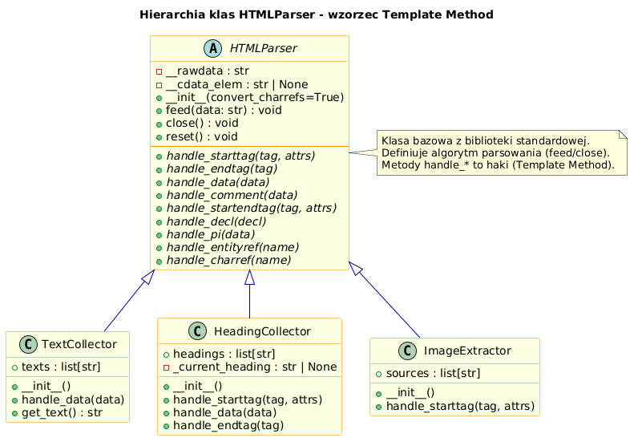

# 02 – Rozszerzanie Parsera (Subclassing)

> **Cel:** Nauczyć się tworzyć własne podklasy `HTMLParser` przez dziedziczenie, korzystając ze wzorca Template Method. Zrozumienie `__init__`, `reset()` oraz projektowanie klas zbierających dane.

---

## 1. Wzorzec Template Method

`HTMLParser` implementuje wzorzec **Template Method**:
- Klasa bazowa definiuje **algorytm parsowania** (tokenizacja, rozpoznawanie tagów).
- Podklasa **nadpisuje metody-haki** (`handle_starttag`, `handle_data`, …), aby zdefiniować własne zachowanie.

```
HTMLParser (klasa bazowa)
│
├── feed(data)          ← algorytm parsowania (NIE nadpisujemy)
├── close()             ← finalizacja (NIE nadpisujemy)
│
├── handle_starttag()   ← HAK – nadpisujemy w podklasie
├── handle_endtag()     ← HAK – nadpisujemy w podklasie
├── handle_data()       ← HAK – nadpisujemy w podklasie
├── handle_comment()    ← HAK – nadpisujemy w podklasie
└── ...
```

---

## 2. Minimalna podklasa

```python
from html.parser import HTMLParser

class TextCollector(HTMLParser):
    """Zbiera caly tekst z dokumentu HTML."""

    def __init__(self):
        super().__init__()          # ZAWSZE wywolaj super().__init__()
        self.texts: list[str] = []

    def handle_data(self, data: str) -> None:
        self.texts.append(data)

    def get_text(self) -> str:
        return " ".join(self.texts).strip()
```

> ⚠️ **Zawsze wywołuj `super().__init__()`** – `HTMLParser.__init__` inicjalizuje wewnętrzny stan tokenizera.

---

## 3. Przechowywanie stanu w podklasie

Podklasy mogą przechowywać dowolny stan jako atrybuty instancji:

```python
class HeadingCollector(HTMLParser):
    """Zbiera tresc naglowkow <h1>...<h6>."""

    def __init__(self):
        super().__init__()
        self.headings: list[str] = []
        self._current_heading: str | None = None   # stan wewnetrzny

    def handle_starttag(self, tag: str, attrs: list) -> None:
        if tag in ("h1", "h2", "h3", "h4", "h5", "h6"):
            self._current_heading = ""              # zaczynamy zbierac

    def handle_data(self, data: str) -> None:
        if self._current_heading is not None:
            self._current_heading += data

    def handle_endtag(self, tag: str) -> None:
        if tag in ("h1", "h2", "h3", "h4", "h5", "h6") and self._current_heading is not None:
            self.headings.append(self._current_heading.strip())
            self._current_heading = None
```

Wzorzec: flaga/stan `_current_heading` przełącza się między `None` (nie zbieramy) a ciągiem znaków (zbieramy).

---

## 4. Reset stanu między dokumentami

Jeśli parser będzie przetwarzał wiele dokumentów, pamiętaj o resecie stanu:

```python
class ReusableCollector(HTMLParser):
    def __init__(self):
        super().__init__()
        self.tags: list[str] = []

    def reset(self):
        super().reset()            # ZAWSZE wywolaj super().reset()
        self.tags = []             # wyczysc wlasny stan

    def handle_starttag(self, tag, attrs):
        self.tags.append(tag)
```

---

## 5. Dostęp do atrybutów tagów

Atrybuty tagów to lista krotek – łatwo zamienić na słownik:

```python
class AttrParser(HTMLParser):
    def handle_starttag(self, tag: str, attrs: list[tuple[str, str | None]]) -> None:
        attrs_dict = dict(attrs)
        if tag == "img" and "src" in attrs_dict:
            print(f"Obraz: {attrs_dict['src']}")
        if tag == "a" and "href" in attrs_dict:
            print(f"Link: {attrs_dict['href']}")
```

---



## Większy przykład

- [`examples/custom_parser.py`](examples/custom_parser.py) – kilka podklas parsera: `TextCollector`, `HeadingCollector`, `ImageExtractor`.

