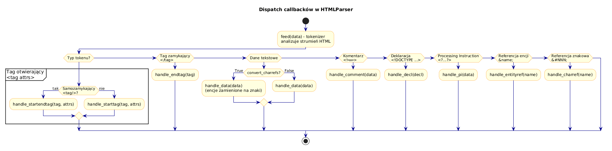

# 03 – Obsługa Zdarzeń i Wywołania Zwrotne (Callbacks)

> **Cel:** Poznanie pełnego zestawu metod-callbacków klasy `HTMLParser`, zrozumienie kiedy i z jakimi argumentami są wywoływane, oraz umiejętność ich praktycznego wykorzystania.

---

## 1. Pełna lista callbacków HTMLParser

| Metoda | Kiedy wywoływana | Argumenty | Przykładowy HTML |
|---|---|---|---|
| `handle_starttag(tag, attrs)` | Tag otwierający | `tag`: nazwa, `attrs`: lista krotek | `<div class="x">` |
| `handle_endtag(tag)` | Tag zamykający | `tag`: nazwa | `</div>` |
| `handle_data(data)` | Dane tekstowe | `data`: tekst | `Hello World` |
| `handle_comment(data)` | Komentarz HTML | `data`: treść komentarza | `<!-- uwaga -->` |
| `handle_decl(decl)` | Deklaracja | `decl`: treść deklaracji | `<!DOCTYPE html>` |
| `handle_pi(data)` | Processing instruction | `data`: treść PI | `<?xml version="1.0"?>` |
| `handle_startendtag(tag, attrs)` | Tag samozamykający (XHTML) | `tag`, `attrs` | `<br/>` |
| `handle_entityref(name)` | Referencja encji | `name`: nazwa encji | `&amp;` |
| `handle_charref(name)` | Referencja znakowa | `name`: kod znaku | `&#65;`, `&#x41;` |

---

## 2. `handle_starttag(tag, attrs)` – tag otwierający

Najczęściej nadpisywana metoda. Atrybuty to lista krotek `(nazwa, wartość)`:

```python
from html.parser import HTMLParser

class AttrInspector(HTMLParser):
    def handle_starttag(self, tag, attrs):
        print(f"<{tag}>")
        for name, value in attrs:
            print(f"  {name} = {value!r}")

parser = AttrInspector()
parser.feed('<a href="https://python.org" class="link" target="_blank">Python</a>')
```

**Wyjście:**
```
<a>
  href = 'https://python.org'
  class = 'link'
  target = '_blank'
```

### Konwersja attrs na słownik

```python
attrs_dict = dict(attrs)
href = attrs_dict.get("href", "")
```

> ⚠️ Jeśli atrybut powtarza się, `dict(attrs)` zachowa **ostatnią** wartość. Dla zduplikowanych atrybutów iteruj po liście.

---

## 3. `handle_endtag(tag)` – tag zamykający

Otrzymuje **tylko nazwę tagu** (bez atrybutów):

```python
def handle_endtag(self, tag):
    print(f"Zamknięto: </{tag}>")
```

> HTMLParser **nie waliduje** poprawności zagnieżdżenia. `<p><b></p></b>` nie wygeneruje błędu – parser wywoła callbacki w kolejności napotkania.

---

## 4. `handle_data(data)` – dane tekstowe

Wywoływana dla każdego fragmentu tekstu między tagami:

```python
class DataDemo(HTMLParser):
    def handle_data(self, data):
        # data moze zawierac biale znaki (\n, \t, spacje)
        if data.strip():
            print(f"Tekst: {data.strip()!r}")
```

> **Uwaga:** Jeśli `convert_charrefs=True` (domyślnie od Pythona 3.4), referencje encji (`&amp;`) i znakowe (`&#65;`) są automatycznie konwertowane na znaki i trafiają do `handle_data`.

---

## 5. `handle_comment(data)` – komentarze HTML

```python
class CommentCollector(HTMLParser):
    def __init__(self):
        super().__init__()
        self.comments: list[str] = []

    def handle_comment(self, data):
        self.comments.append(data.strip())

p = CommentCollector()
p.feed("<!-- TODO: fix this --><p>Tekst</p><!-- v2.0 -->")
print(p.comments)  # ['TODO: fix this', 'v2.0']
```

---

## 6. `handle_decl(decl)` – deklaracje

Głównie dla `<!DOCTYPE html>`:

```python
def handle_decl(self, decl):
    print(f"Deklaracja: {decl}")
# <!DOCTYPE html>  →  "DOCTYPE html"
```

---

## 7. `handle_entityref(name)` i `handle_charref(name)`

Wywoływane **tylko gdy `convert_charrefs=False`**:

```python
class EntityDemo(HTMLParser):
    def __init__(self):
        super().__init__(convert_charrefs=False)

    def handle_entityref(self, name):
        print(f"Encja: &{name};")     # np. &amp; → name="amp"

    def handle_charref(self, name):
        print(f"Charref: &#{name};")   # np. &#65; → name="65"
```

---

## 8. `convert_charrefs` – parametr konstruktora

```python
# Domyślnie True od Python 3.4:
parser = HTMLParser(convert_charrefs=True)
# &amp; → handle_data otrzymuje "&"

parser = HTMLParser(convert_charrefs=False)
# &amp; → handle_entityref otrzymuje "amp"
```

---

## 9. Kompletny przykład: logger wszystkich zdarzeń

```python
class FullEventLogger(HTMLParser):
    def __init__(self):
        super().__init__(convert_charrefs=False)

    def handle_starttag(self, tag, attrs):
        print(f"STARTTAG:    <{tag}> {attrs}")

    def handle_endtag(self, tag):
        print(f"ENDTAG:      </{tag}>")

    def handle_data(self, data):
        print(f"DATA:        {data!r}")

    def handle_comment(self, data):
        print(f"COMMENT:     {data!r}")

    def handle_decl(self, decl):
        print(f"DECL:        {decl!r}")

    def handle_pi(self, data):
        print(f"PI:          {data!r}")

    def handle_entityref(self, name):
        print(f"ENTITYREF:   &{name};")

    def handle_charref(self, name):
        print(f"CHARREF:     &#{name};")

    def handle_startendtag(self, tag, attrs):
        print(f"STARTEND:    <{tag}/> {attrs}")
```



---

## Większy przykład

- [`examples/callbacks_demo.py`](examples/callbacks_demo.py) – uruchamialny skrypt logujący wszystkie typy zdarzeń na różnych fragmentach HTML.

